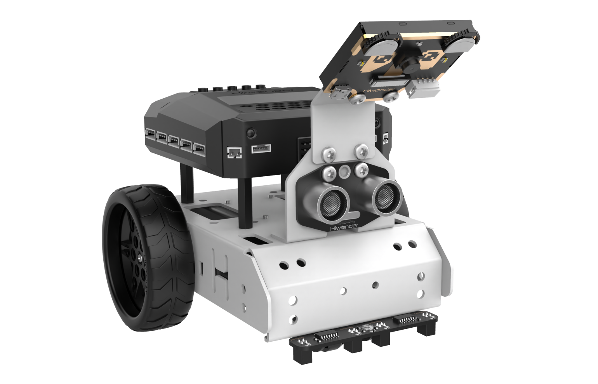
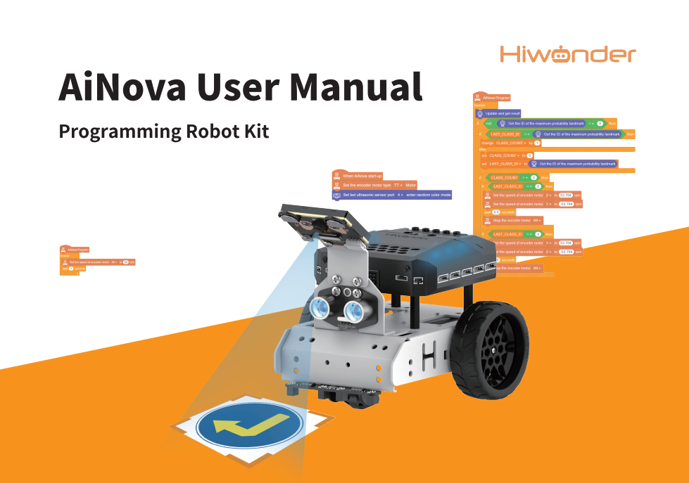
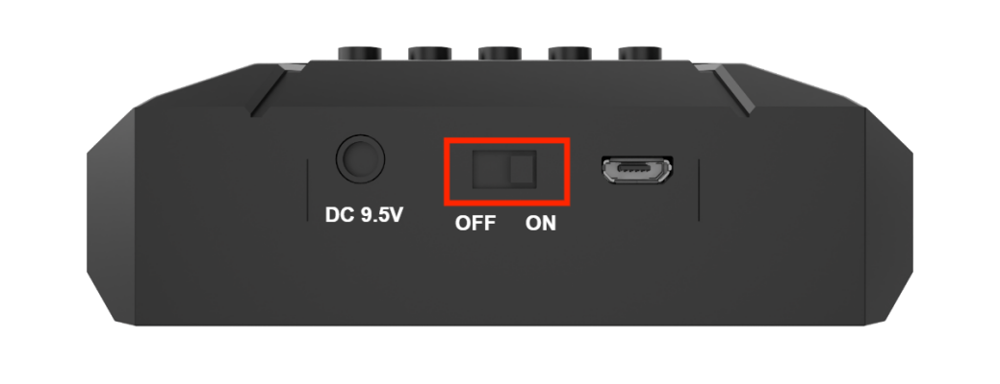

# 1. Read First

## 1.1 AiNova Intelligent Vision Robot

**1.1.1 Introduction**

AiNova, powered by CoreX controller, supports both Scratch and Python programming. Loading with CoreX controller, encoder motors, 4-channel line follower and glowing ultrasonic sensor, it can perform cruise control, line follow, obstacle avoidance, etc.

AiNova is also equipped with a powerful AI vision module that enables a variety of engaging AI-powered functions, including color recognition, digit recognition, color block tracking, tag tracking, road sign recognition, and visual line following.

**1.1.2 Precautions for Use**

When using and storing this product, please note the following:

(1) This product contains small parts and sharp pins; handle with care to avoid injury.

(2) Minors should use this product only under the supervision and guidance of an adult.

(3) Do not swallow or press on small and sharp components to avoid choking or injury.

(4) This product contains conductive components; do not touch with metal objects while powered on.

(5) Do not forcibly twist or bend the machine after powering it on, as this may cause damage.

(6) If the product will not be used for an extended period, please fully charge the battery, remove it, and store it in a cool, dry place.

**1.1.3 Copyright Notice**

This manual is the intellectual property of Shenzhen Hiwonder Technology Co., Ltd. No part of this document may be copied, reproduced, translated, or distributed without prior written permission.

Any unauthorized use or infringement will be subject to legal action.

**1.1.4 Disclaimer**

The products described in this manual are provided on an **"as-is"** basis, including hardware, software, etc. While every effort has been made to ensure the accuracy of the content at the time of writing, we do not guarantee that the manual is completely free of errors or omissions. The material will be periodically reviewed, and we encourage users to provide feedback for improvements.

As the product is updated with new versions, its features and specifications may change. Please contact customer service at the time of purchase for the latest product information.

Furthermore, Hiwonder is not responsible for any malfunctions or damages caused by using the product in extreme conditions unless explicitly stated by Hiwonder as suitable for such use.

## 1.2 Packing List

(1) AiNova Starter Packing List

| **No.** |     **Components**      | **Quantity** |                         **Picture**                          |
| :-----: | :---------------------: | :----------: | :----------------------------------------------------------: |
|    1    |     AiNova Brackets     |      2       |   |
|    2    |    CoreX controller     |      1       |   |
|    3    | Glowy ultrasonic sensor |      1       |   |
|    4    |   4-ch line follower    |      1       |   |
|    5    |      Encoder motor      |      2       |   |
|    6    |      Battery case       |      1       |   |
|    7    |     Battery charger     |      1       |   |
|    8    |      Silisone tyre      |      2       |   |
|    9    |     Universal wheel     |      1       |   |
|   10    |  USB cable + 4PIN wire  |      3       |  |
|   11    |      18650 battery      |      2       |  |
|   12    |    Map + Motor wire     |      3       |  |
|   13    |      Accessory bag      |      1       |   |
|   14    |         Manual          |      1       |  |

(2) AiNova Standard Packing List

| **No.** | **Components**             | **Quantity** | **Picture**                                                  |
| ------- | -------------------------- | ------------ | ------------------------------------------------------------ |
| 1       | AiNova Brackets            | 3            |   |
| 2       | CoreX controller           | 1            |   |
| 3       | Glowy ultrasonic sensor    | 1            |   |
| 4       | 4-ch line folllower        | 1            |   |
| 5       | Encoder motor              | 2            |   |
| 6       | Battery case               | 1            |   |
| 7       | Battery charger            | 1            |   |
| 8       | Silicone tyre              | 2            |   |
| 9       | Universal wheel            | 1            |   |
| 10      | USB cable                  | 2            |  |
| 11      | 4PIN wires                 | 3            |  |
| 12      | Map+Motor wire             | 3            |  |
| 13      | Accessory bag              | 1            |  |
| 14      | 18650 battery              | 2            |  |
| 15      | WonderCam AI vision module | 1            |  |
| 16      | Mental protective shell    | 2            |  |
| 17      | Waste cards                | 12           |  |
| 18      | Number cards               | 5            |  |
| 19      | Tags                       | 3            |  |
| 20      | Traffic signs              | 6            |  |
| 21      | Manual                     | 1            |  |

(3) AiNova Auto Driving Packing List

| **No.** | **Components**                    | **Quantity** | **Picture**                                                  |
| ------- | --------------------------------- | ------------ | ------------------------------------------------------------ |
| 1       | AiNova Brackets                   | 3            |   |
| 2       | CoreX controller                  | 2            |   |
| 3       | Glowy ultrasonic sensor           | 1            |   |
| 4       | 4-ch line folllower               | 1            |   |
| 5       | Encoder motor                     | 2            |   |
| 6       | Battery case                      | 2            |   |
| 7       | Battery charger                   | 2            |   |
| 8       | Silicone tyre                     | 2            |   |
| 9       | Universal wheel                   | 1            |   |
| 10      | USB cable                         | 3            |  |
| 11      | 4PIN wires                        | 3            |  |
| 12      | Map+Motor wire                    | 3            |  |
| 13      | Accessory bag1                    | 1            |  |
| 14      | 18650 battery                     | 4            |  |
| 15      | WonderCam AI vision module        | 1            |  |
| 16      | Mental protective shell           | 2            |  |
| 17      | Waste cards                       | 12           |  |
| 18      | Number cards                      | 5            |  |
| 19      | Tags                              | 3            |  |
| 20      | Traffic signs                     | 6            |  |
| 21      | Manual                            | 1            |  |
| 22      | Traffic light bracket             | 1            |  |
| 23      | End cover                         | 6            |  |
| 24      | RGB sensor                        | 1            |  |
| 25      | 4PIN wire                         | 4            |  |
| 26      | 1.2 *0.8m map                     | 1            |  |
| 27      | Turning sign bracket              | 1            |  |
| 28      | MP3 module(128M TF card included) | 1            |  |
| 29      | MP3 module bracket                | 1            |  |
| 30      | Double-sided tape                 | 1            |  |
| 31      | Accessory bag2                    | 1            |  |

## 1.3 Assembly and Wiring Guide

### 1.3.1 Assembly GIF for AiNova Starter

Step1:

Step2:

Step3:

Step4:

Step5:

Step6:

Step7:

Step8:

Step9:

Step10:

Step11:

Post installation:

### 1.3.2 Flat View Assembly for AiNova Standard

Step1:

Step2:

Step3:

Step4:

Step5:

Step6:

Step7:

Step8:

Step9:

Step10:

Step11:

Step12:

Post installation:

### 1.3.3 Top View Assembly GIF for AiNova Standard

Step1:

Step2:

Step3:

Step4:

Step5:

Step6:

Step7:

Step8:

Step9:

Step10:

Step11:

Step12:

Post installation:

### 1.3.4 Assembly for WonderCam Metal Bracket

## 1.4 Battery Charging and Usage Precautions

**1.4.1 Battery Charging and Installation**

Lithium batteries are not fully charged during transportation. Please charge the battery before first use. The recommended charging time is approximately 1 hour.

Charging Steps:

(1) Insert two 18650 batteries into the charger as shown in the diagram. The indicator light will turn from red to green when charging is complete.

Caution: Do not reverse the battery polarity! If using a power adapter, ensure it supplies 5V 1–2A.

(2) After installing the batteries, switch the battery holder to the **"ON"** position.

**1.4.2 Battery Usage Guidelines**

(1) Use only the charger included with the kit to charge the battery.

(2) While charging, the indicator light of the adapter will be red, and it will turn green when fully charged. Please unplug the charger promptly after the battery is fully charged to avoid overcharging.

(3) If the robot will not be used for an extended period, fully charge the battery, switch the battery holder to the **"OFF"** position, and store it in a cool, dry place.

(4) Do not attempt to modify, solder, or alter the battery or charger in any way.

(5) Keep batteries away from high temperatures and liquids to avoid overheating, fire hazards, or moisture-related damage.

:::{Note}

Hiwonder is not responsible for any damage, economic loss, or safety incidents resulting from improper use of the product that does not follow the instructions outlined in this manual.

:::

**1.4.3 Usage Guidelines**

(1) Please use the dedicated AiNova app for connection. Do not pair the device via your phone's Bluetooth settings using a passcode.

(2) When downloading programs, be sure to remove the Bluetooth module first, as it occupies the UART port and may cause download failures. If program burning still fails after removal, please contact our technical support team for assistance.

(3) Do not continuously use the ultrasonic sensor to detect objects at very close range.

(4) If the battery level is too low, the robot may not function properly. Please ensure the battery voltage remains above 7V.

(5) If the line-following performance is poor, try adjusting the sensitivity of the line-following sensor. You can refer to the tutorial in section "**Extended Learning Materials**".

(6) If the robot cannot move sideways, please check the [1.3 Assembly and Wiring Guide](#anchor_1_3) in the same directory of this document to ensure the Mecanum wheels and wiring are correctly installed.

(7) Additional Notes for Advance Version Users:

① Do not forcibly twist or move the servos after powering on the robot, as this may damage the servo motors.

② Avoid keeping the servos at their limit positions for extended periods to prevent stalling or burnout.

③ Keep your fingers away from the robotic arm's joint areas during operation to avoid potential injury.

④ Servos are precision components and subject to wear; long-term or excessive use may require replacement.