# 2. Programming Software Installation

## 2.1 WonderCode Software Installation

:::{Note}

You can refer to the demonstration video in this section's folder.

:::

###  2.1.1 Introduction to the Programming Software

WonderCode is a dedicated Scratch-based programming tool designed specifically for the AiNova robot for use with the CoreX controller. This software supports automatic conversion of graphical instruction blocks to Python code, making it ideal for beginners. Programming is done by simply dragging and dropping command blocks.

###  2.1.2 Software Installation

(1) Locate and open the installation file **WonderCode setup.exe** in the same directory as this document or in "[Apenndix ->Software Installation Package & Program Collection](Appendix.md)".

(2) In the language selection window, choose English and click **"OK".**

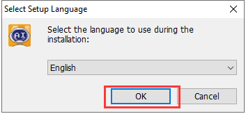

(3) Choose the installation location. You can either keep the default path or select a custom one, then click **"Next".**

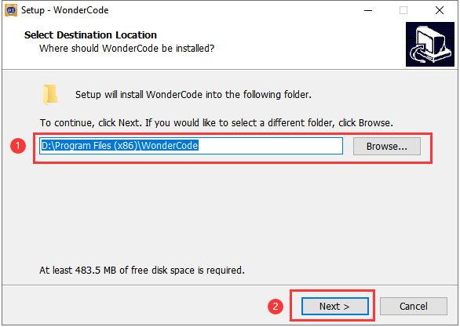

(4) In the Additional Tasks window, keep the default setting "**Create a desktop shortcut"** checked, then proceed.

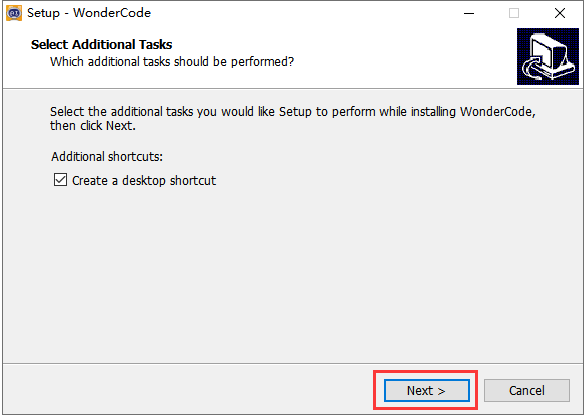

(5) Click **"Install"** to begin installation.

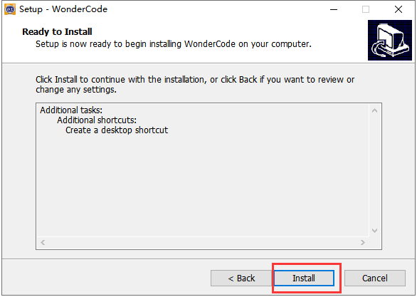

(6) The software will begin installing and a progress bar will appear.

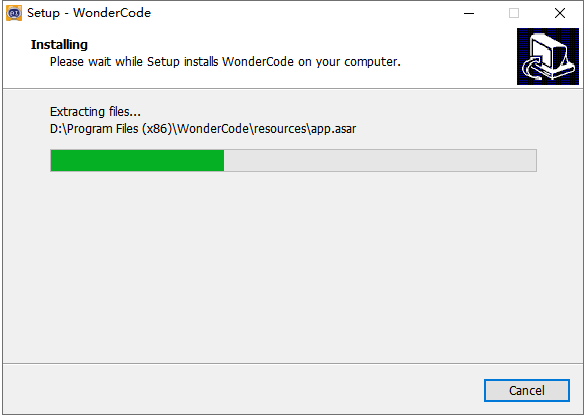

(7) Once the installation is complete, a prompt will appear. Click **"Finish".**

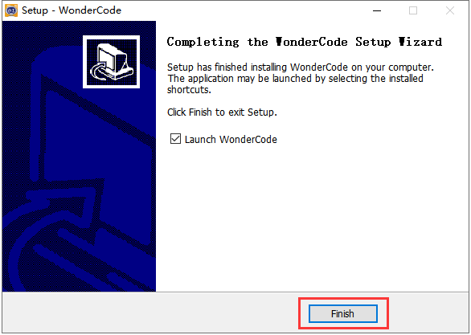

(8) A new WonderCode icon will appear on your desktop.

###  2.1.3 Device Connection

(1) Use a USB data cable to connect the CoreX controller to your computer.

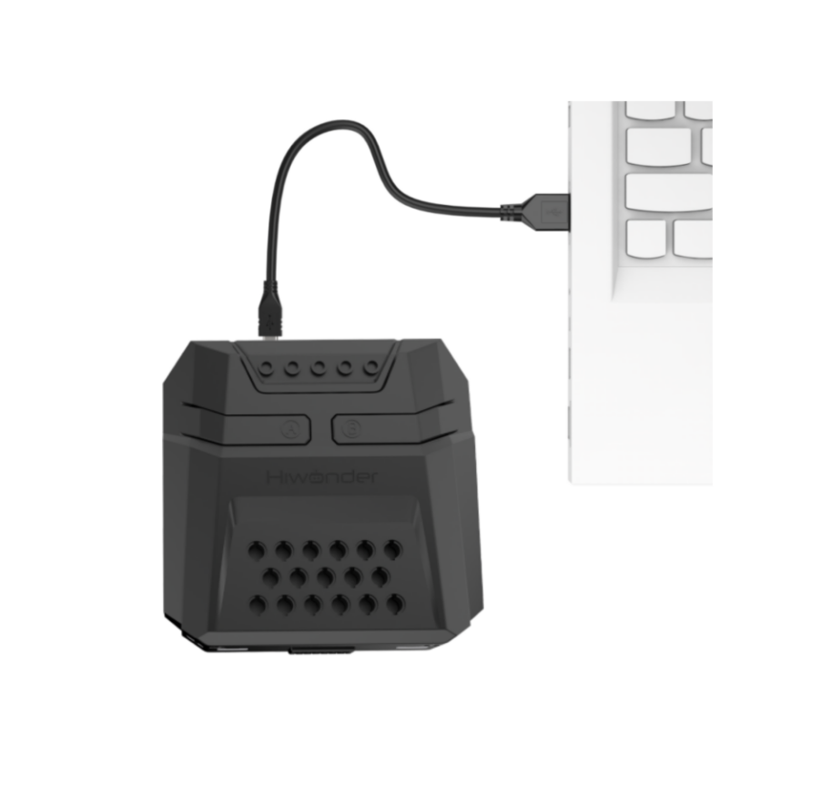

(2) Double-click the WonderCode icon to launch the software. The main interface will appear.

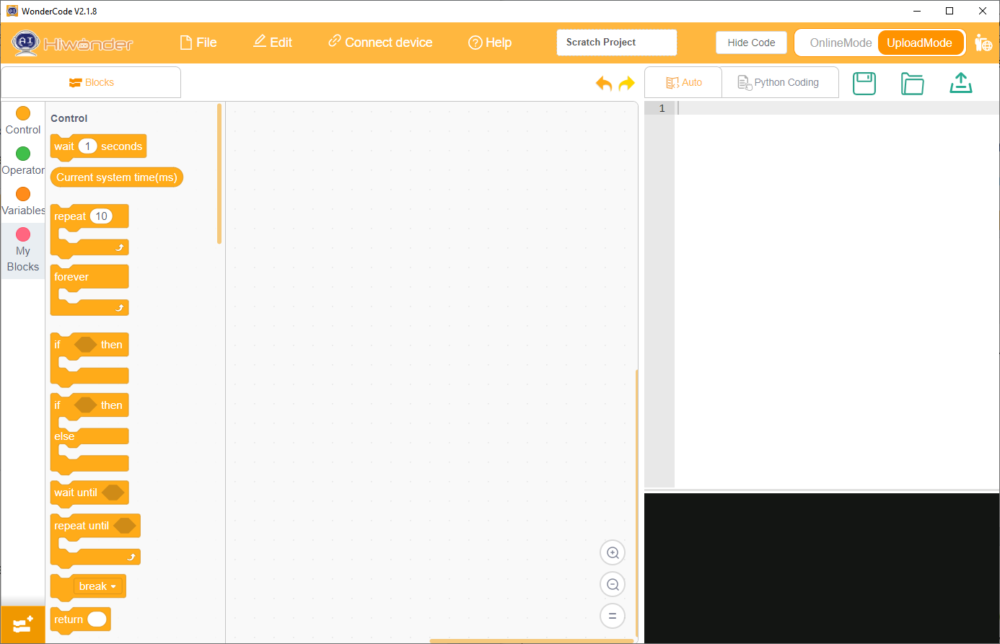

(3) Before connecting the device, you must add the device extension pack. Otherwise, the connection will fail. Click the button  in the bottom-left corner of the interface. In the pop-up window, navigate to and select **"Robot" -&gt; "AiNova".**

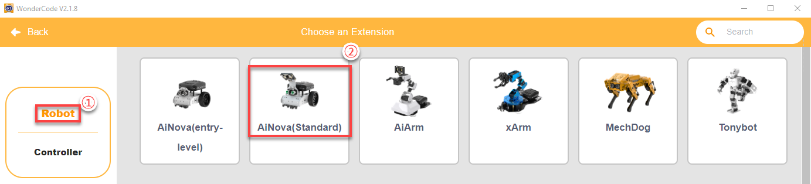

(4) Then click the **"Connect"** button on the main interface, and select the correct COM port.

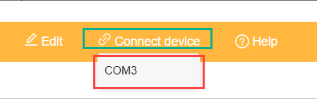

:::{Note}

The COM port number varies depending on your computer. For example, in this tutorial, the port is COM3. Do not select COM1, as it is typically reserved for system communication.

:::

If multiple USB devices are connected and you're unsure of the correct port: Go to your desktop, right-click **"This PC"**, choose **"Properties"**, then open **"Device Manager"**. Check the AiNova robot controller under Ports (COM & LPT). The correct port usually includes **"CH340"** in its name.

(5) When the device is successfully connected, a **"Connect Success"** message will appear.

## 2.2 Interface Overview and Program Download

:::{Note}

You can refer to the demonstration video in this section's folder.

:::

### 2.2.1 Function Button Introduction

The main interface of WonderCode is divided into four key sections, as shown in the figure below:

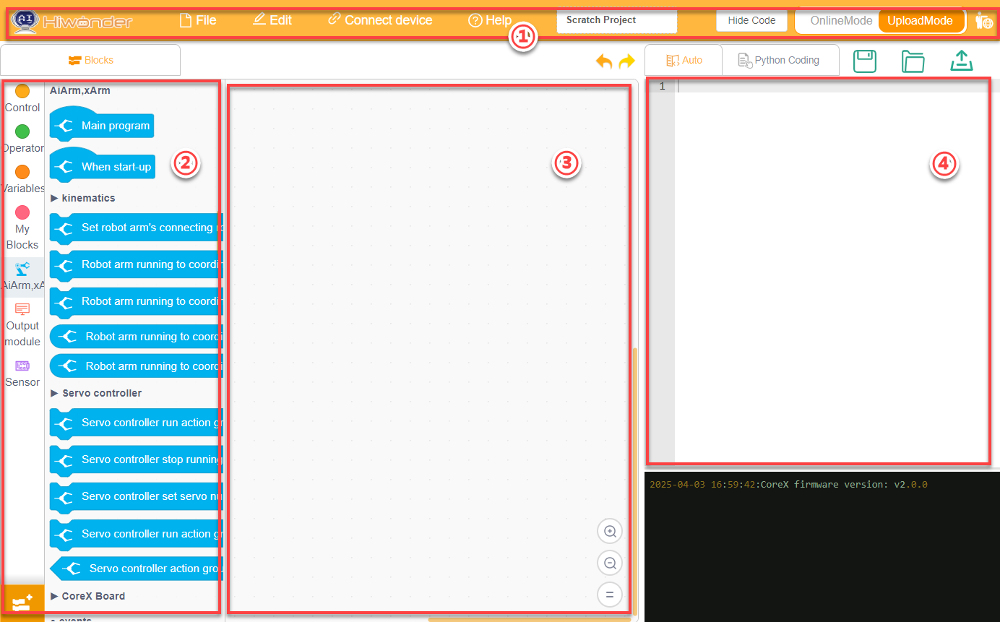

The corresponding functional areas for each number are shown in the table below：

| **No.** |      **Function**       |
| :-----: | :---------------------: |
|    ①    |          Menu           |
|    ②    |      Command block      |
|    ③    |        Workspace        |
|    ④    | Code Display and Upload |

The buttons and their corresponding functions on the interface are shown in the table below:

<table  class="docutils-nobg" border="1">
<colgroup>
<col  />
<col  />
</colgroup>
<tbody>
<tr>
<td ><strong>Icon</strong></td>
<td ><strong>Function</strong></td>
</tr>
<tr>
<td ></td>
<td >Build new file, save and open.</td>
</tr>
<tr>
<td ></td>
<td >Only used for the online mode.</td>
</tr>
<tr>
<td ></td>
<td >Determine whether to connect the device and software, and specify the connection port.</td>
</tr>
<tr>
<td ></td>
<td >Check tutorial, update and install drier.</td>
</tr>
<tr>
<td ></td>
<td >Display the program file name. If programming has not started or the file has not been saved, it shows Scratch Project.</td>
</tr>
<tr>
<td ></td>
<td >
Interface Switching Button: Allows switching between "<strong>Online Mode</strong>" and "<strong>Upload Mode</strong>".

Be sure to save the edited program file before switching; otherwise, unsaved changes may be lost.

Note: Online Mode is suitable for animations and games—features native to Scratch. Upload Mode must be used in conjunction with our hardware to enable various functional applications.
</td>
</tr>
<tr>
<td ></td>
<td >Select the display language of the interface. You can switch between English, Simplified Chinese, and Traditional Chinese.</td>
</tr>
<tr>
<td ></td>
<td >Undone or redone during programming.</td>
</tr>
<tr>
<td >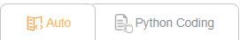</td>
<td >Switch programming method. "<strong>Auto</strong>" converts the instruction block into Python form. Switch to "<strong>Python Programming</strong>" to directly use Python to edit the program.</td>
</tr>
<tr>
<td ></td>
<td >Save the program in the form of Python code.</td>
</tr>
<tr>
<td ></td>
<td >Open the saved Python file.</td>
</tr>
<tr>
<td ></td>
<td >Upload the programming into the controller.</td>
</tr>
<tr>
<td ></td>
<td >Used to add extension packages for devices.</td>
</tr>
<tr>
<td ></td>
<td >From top to bottom, the buttons control zooming in, zooming out, and resetting the code editor to its default size.</td>
</tr>
</tbody>
</table>

### 2.2.2 Programming Operation Method

This section explains how to use the WonderCode software by editing a program that makes the LED light on the main controller stay solid red. Steps:

(1) After the device is successfully connected, you can start writing the program. First, find the **"AiNova Program"** block in the AiNova command set and drag it into the code editing area.

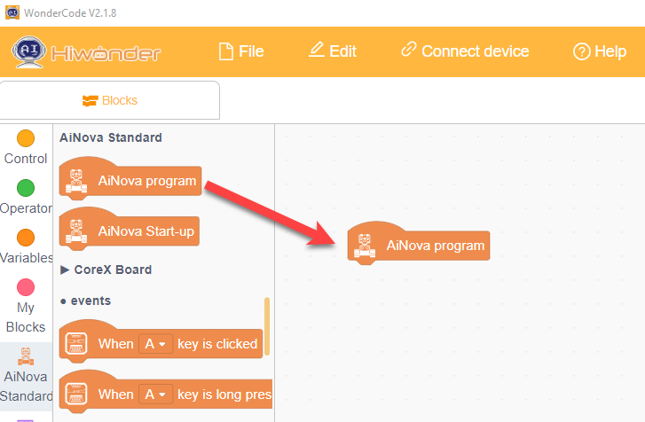

To delete a command block, drag it backward from the code editing area back to the command set area.

(2) Then drag the **"Forever"** block from the control commands set and attach it after the previous block.

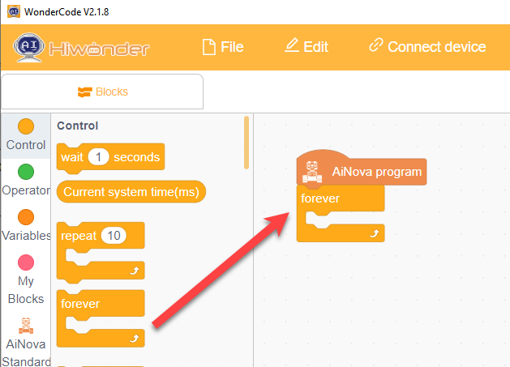

(3) Next, drag the block to set LED color from the AiNova command and set into the **"Forever"** block. Select to set all LEDs to solid red.

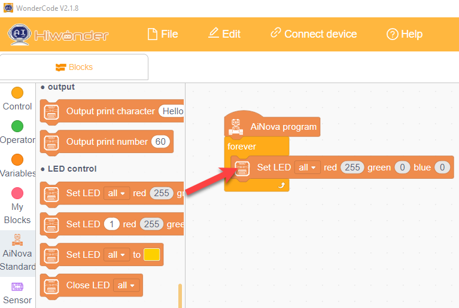

According to the RGB color principle, different combinations of the thresholds for red, green, and blue can produce various colors. The threshold range for each color is 0–255.

When one of the colors has a threshold of 255 and the other two are 0, the resulting color is that pure color. For example, in this section, to make the LED red, set the red threshold to 255, and blue and green thresholds to 0.

### 2.2.3 Program Download

(1) Import the [AiNova Bluetooth Control.sb3]() program , or simply drag it onto the main interface of the programming software.

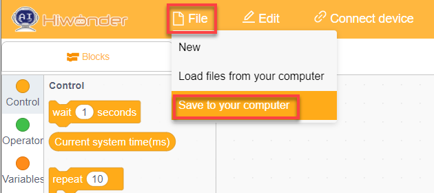

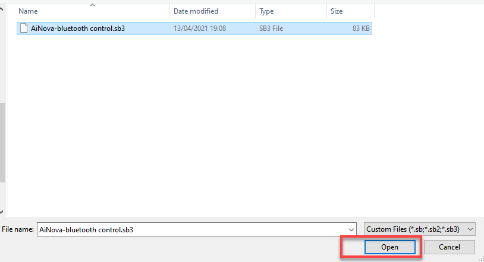

(2) After importing the program, click the **"Upload"** icon in the upper right corner of the interface.

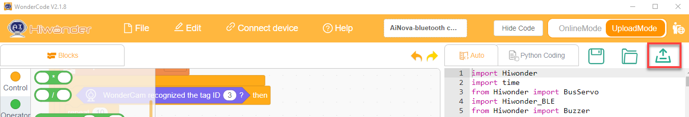

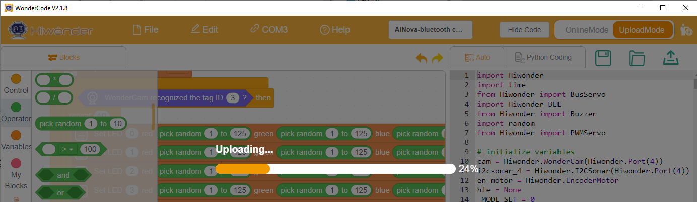

(3) Wait for the download to complete; then you will see an **"Successful"** message.

(4) You can then proceed to "[4.APP Remote Control](4.app_remote_control.md)" to experience the feature.