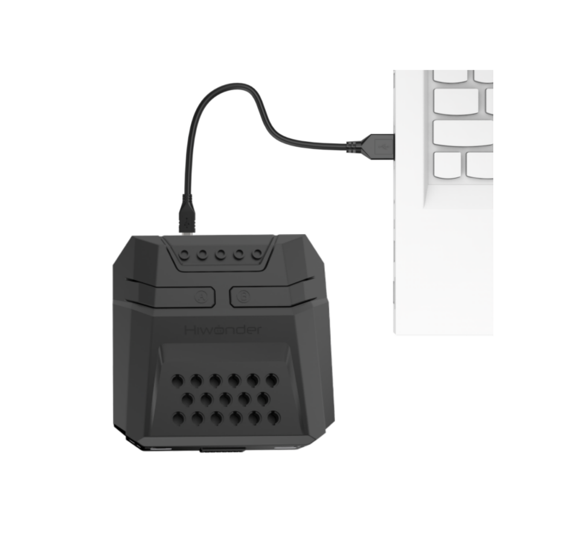
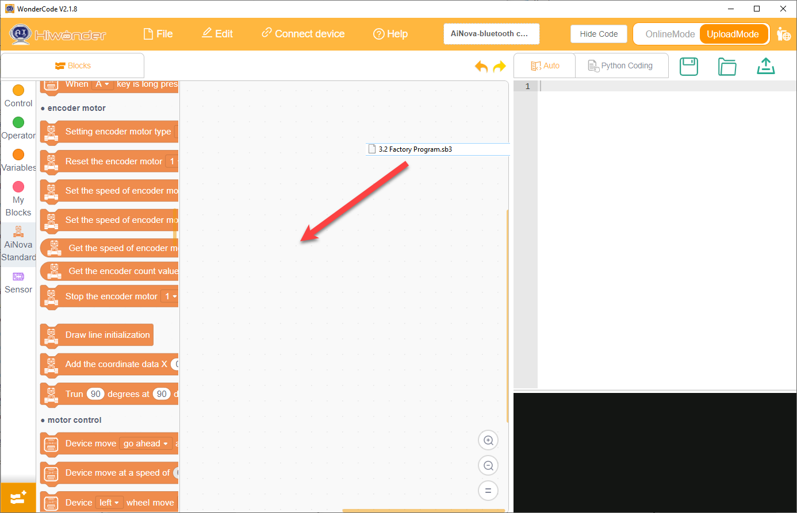

# 3. Factory Program Download Instructions

The factory default does not include a pre-flashed program. The program to be downloaded—"APP Remote Control"—includes basic functions such as motion control and ultrasonic features.

## 3.1 Getting Started

First, follow the instructions in [1. Read First](1.Read_first.md) to assemble the AiNova robot. Also, install the WonderCode programming software according to [2. Programming Software Installation](2.programming_software_installation.md).

## 3.2 Program Download

(1) Connect the AiNova robot to your computer using a USB data cable.

(2) In the WonderCode main interface, click **"Connect"**, and select the corresponding port. The port number varies based on your computer. In the example below, it is COM3.

:::{Note}

Avoid selecting COM1, which is usually reserved for system communication.

:::

(3) Drag the file [Factory Program.sb3](../_static/source_code/Factory%20Program.zip) into the WonderCode interface.

(4) Click "**Upload**" button under upload mode in the right side.

(5) Wait for the upload to complete.

## 3.3 Program Execution

You can go to [4. APP Remote Control](4.app_remote_control.md) to view a demo of the program in action.
