# 4. APP Remote Control

## 4.1 APP Installation and Connection Instructions

### 4.1.1 APP Installation

For Android Users: You can find the installation package in this section's directory or click [WonderCom](https://play.google.com/store/apps/details?id=com.hiwonder.wondercom). Transfer it to your phone and install it.

:::{Note}

Make sure to enable all required permissions for the app in your phone settings to ensure proper functionality.

:::

For iOS Users: Search for [WonderCom](https://apps.apple.com/us/app/wondercom/id6446349138) in the App Store and install it.

Before using the app, please enable GPS location and Bluetooth on your phone.

### 4.1.2 Device Connection

(1) Place the AiNova robot on a flat surface and turn it off and then back on.

(2) Open the WonderCom app on your phone and tap on **"AiNova".**

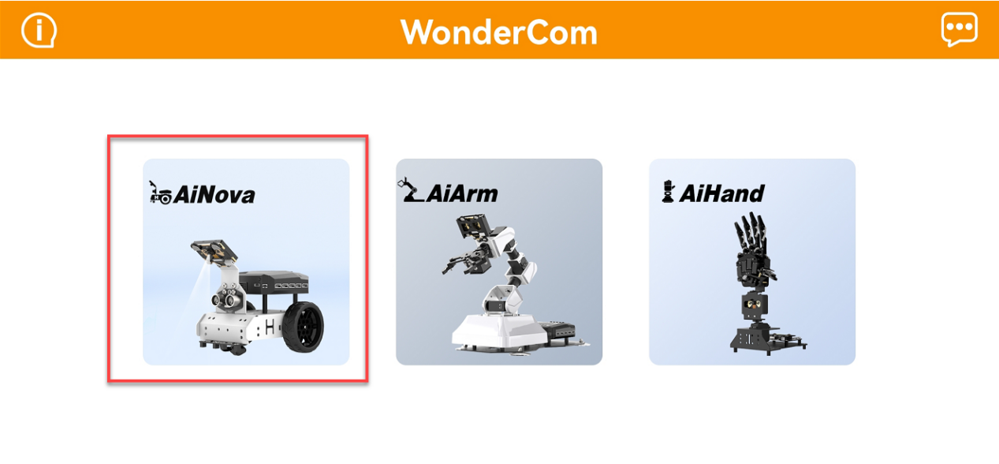

(3) Tap the blinking Bluetooth icon in the top-right corner of the main interface. On the search screen, select the device labeled "**AiNova-**". As shown below:

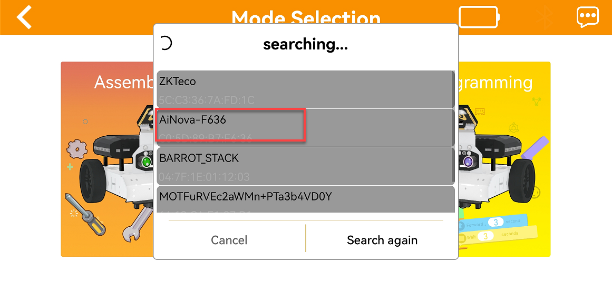

(4) Once connected successfully, the Bluetooth icon will remain lit and display the battery level indicator.

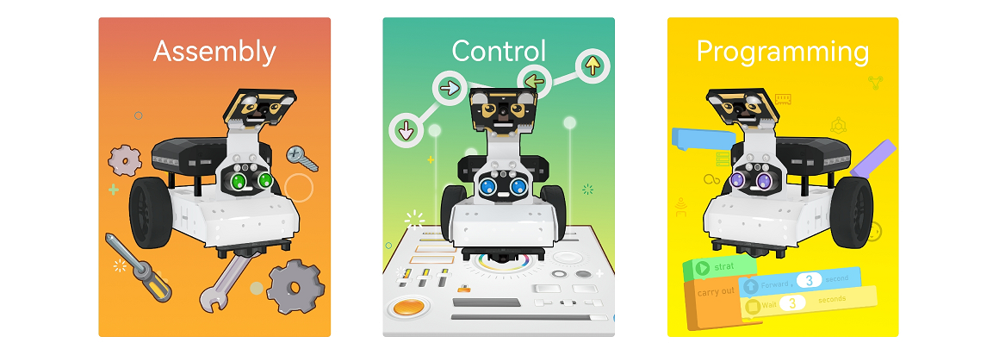

|  **Mode**   |                        **Function**                        |
| :---------: | :--------------------------------------------------------: |
|  Assembly   |    Provides tutorials for assembling the AiNova robot.     |
|   Control   |     Enables quick control and AI vision feature demo.      |
| Programming | Allows block-based programming using built-in code blocks. |

## 4.2 APP User Guide

:::{Note}

Before using the APP to control AiNova, please ensure the factory program has been downloaded. Without it, the robot cannot be controlled.

:::

### 4.2.1 Robot Control

(1) Tap the corresponding icon 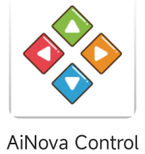 on the main screen to enter the **"AiNova Control"** interface.

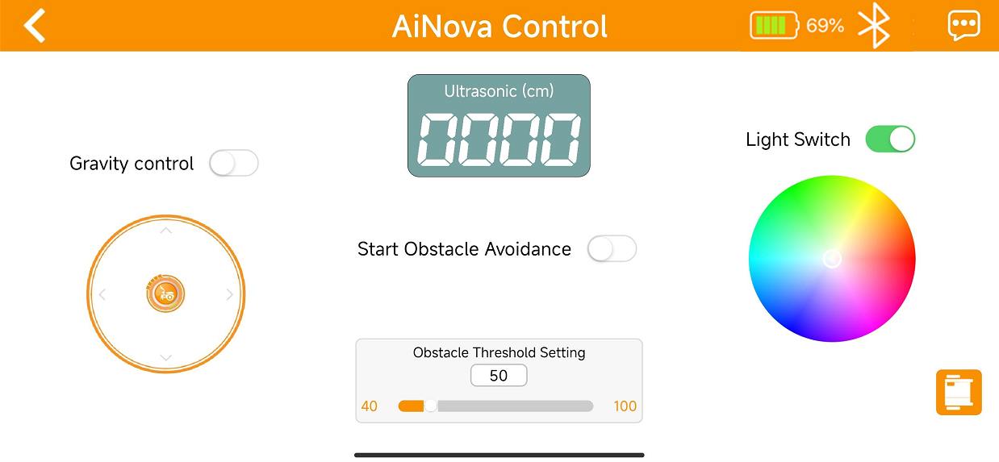

(2) Function descriptions for each icon are listed below:

|                           **Icon**                           |                         **Function**                         |
| :----------------------------------------------------------: | :----------------------------------------------------------: |
| 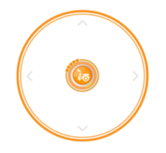 |      Control AiNova to move forward, backward, or turn.      |
| 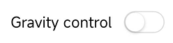 | When enabled, AiNova can be moved using the phone's gravity sensing. |
| 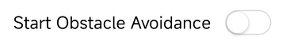 | When enabled, AiNova will perform obstacle avoidance using the ultrasonic sensor. |
| 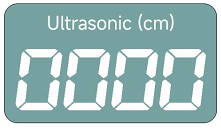 | Displays the distance between the ultrasonic sensor and the object in front of it. Only works when obstacle avoidance is enabled. |
| 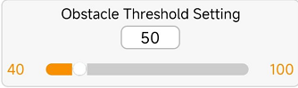 | Used to adjust the threshold for obstacle avoidance. Only works when obstacle avoidance is enabled. |
| 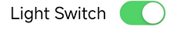 |               Turns the RGB lights on or off.                |
| 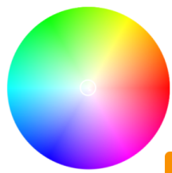 |   Use the slider to change the RGB light color on AiNova.    |
|  | Tap to connect/disconnect the Bluetooth device. Once connected, it also displays the battery level. |

### 4.2.2 Line tracking

(1) Tap the corresponding icon 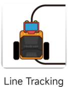 on the main screen to enter the **"Line tracking"** interface.

:::{Note}

The robot may deviate when moving in a straight line. This is due to mechanical bias and is a normal phenomenon. You can reduce the deviation by adjusting the differential speed between the left and right motors. See the document in the same directory: Solution to Not Move Straight

:::

(2) Place the AiNova robot on the line-following map and tap the icon  on the screen to start the function.

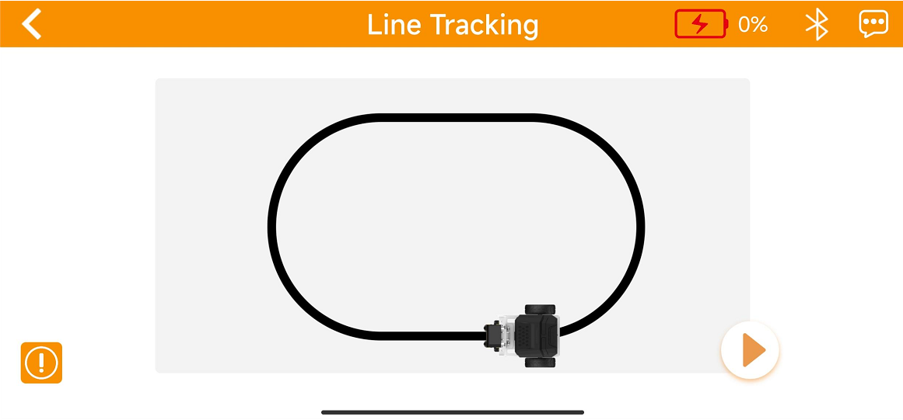

If the result is unsatisfactory, refer to "[**Debugging and Instructional Guidance**]()" for "[**Line-Following Sensor Sensitivity Adjustment**]()."

### 4.2.3 Draw to Follow

(1) Tap the corresponding icon 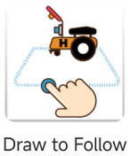 on the main screen to enter the "**Draw to Follow**" interface.

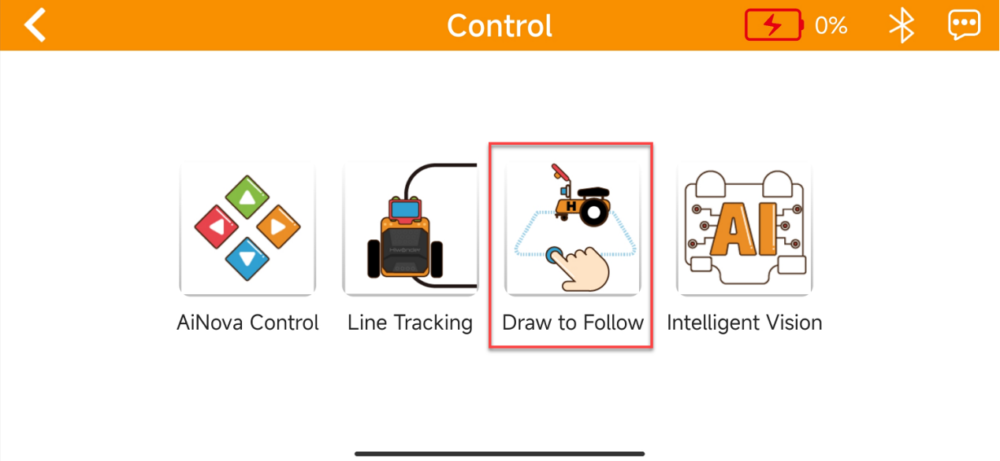

(2) Select a shape you want the robot to follow, for example, Triangle. As shown in the image below. Then tap the icon  to run the program.

:::{Note}

The robot may deviate when moving in a straight line. This is due to mechanical bias and is a normal phenomenon. You can reduce the deviation by adjusting the differential speed between the left and right motors. See the document in the same directory: Solution to Not Move Straight

:::

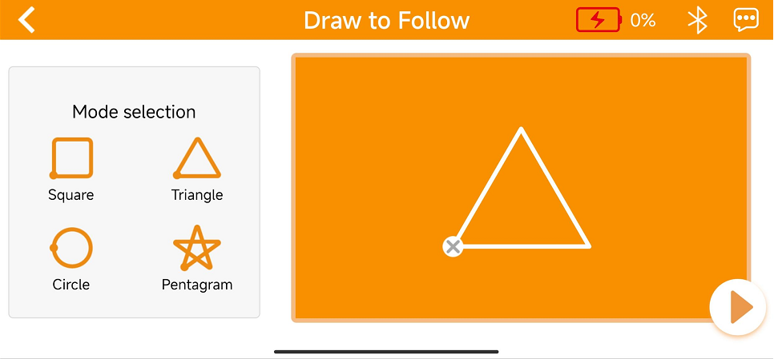

### 4.2.4 Intelligent Vision

Tap the corresponding icon  on the main screen to enter the "**Intelligent Vision**" interface.

Games and function descriptions for each icon are listed below:

<table  class="docutils-nobg" border="1">
<colgroup>
<col  />
<col  />
<col  />
</colgroup>
<tbody>
<tr>
<td ><strong>Game</strong></td>
<td ><strong>Function</strong></td>
<td ><strong>Note</strong></td>
</tr>
<tr>
<td >Color Tracking</td>
<td >Run to follow the color block trained in the WonderCam.</td>
<td >

Keep the card in the detect range.

Do not move the card too fast.

</td>
</tr>
<tr>
<td >Tag Recognition</td>
<td >
Recognize the provided AprilTag to run the corresponding actions.

ID1：Sway left and right

ID2: Spin around

ID3: RGB lights blink
</td>
<td >

Ensure good lighting.

Tags must be undamaged and unfolded.

</td>
</tr>
<tr>
<td >Road Sign Recognition</td>
<td >Recognize road sign cards and performs specific responses.</td>
<td >

Keep the card still and within the robot's vision.

Refer to the example below for correct card orientation.

</td>
</tr>
</tbody>
</table>

## 4.3 Solution to Not Move Straight

### 4.3.1 Reason 

The motor itself has deviations. Though two motors are set to the same speed in the program, their actual speeds may deffer due to the slight deviations caused by internal gear reduction ration. If the left wheel is faster than the right wheel, the robot will veer to the the right. Conversely, if the left wheel is slower than the right wheel, the robot will veer to the left.

### 4.3.2 Solution

Try to adjust the wheels to have an equal spacing during assembly. When writing the control program, set different speeds for the two wheels to compensate for the inherent errors of the deceleration motor by utilizing the speed difference. The specific method is as follow: when the robot veers to one side, slowly increase the speed of the motor on that side without changing the speed of the other motor until the robot can move in a straight line.

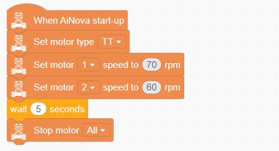