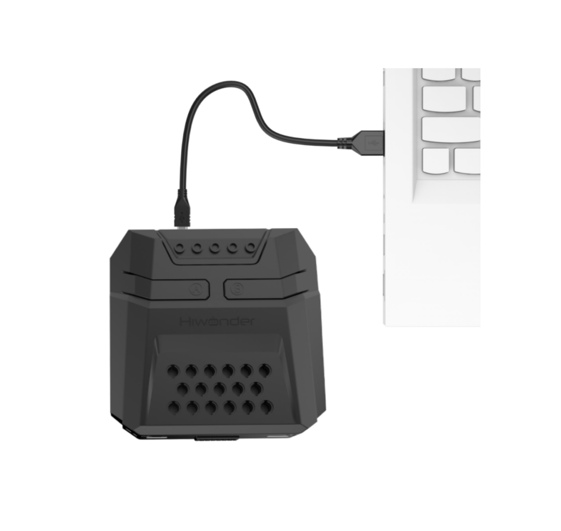

# 5. AiNova Basic Feature Courses

## 5.1 RGB Light Blinking

### 5.1.1 Project Process

### 5.1.2 Module Introduction

The RGB light is an electronic module that emits light. By combining red, green, and blue colors, it can produce various colors. The CoreX controller has 6 built-in RGB lights.

### 5.1.3 Program Download

[RGB Light Blinking Program.sb3]()

(1) Connect the AiNova robot to your computer using a USB data cable.

(2) In the WonderCode main interface, click **“Connect”,** and select the corresponding port. The port number varies based on your computer. In the example below, it is COM3.

:::{Note}

Avoid selecting COM1, which is usually reserved for system communication.

:::

(3) After successfully connecting, click "**Upload**” button under upload mode in the right side.

(4) Wait for the upload to complete.

### 5.1.4 Project Outcome

The RGB lights on the AiNova controller will blink sequentially according to the preset flashing mode, then loop the breathing gradual flashing mode continuously.

### 5.1.5 Program Brief Analysis

(1\) Function **“Flash one by one”**. Create a variable called **“Count”.** LEDs numbered from 1 to 6 light up one by one in order. Each LED lights up for 0.1 seconds before turning off.

(2\) Function **“Light one by one”.** Similar to the sequential blink function, but before lighting each LED, all RGB lights are turned off first. Then LEDs numbered 1 to 6 are turned on one by one.

(3\) Function **“Flash all”**. All RGB LEDs light up simultaneously, then turn off after 0.3 seconds.

(4\) Function **“Random color”.** In this function, three variables—“**Red,” “Green,” and “Blue”**—are created. Each variable is assigned a random number between 1 and 255. A random number between 1 and 6 is generated to randomly light one of the 6 RGB LEDs.

(5\) Function **“Flash gradually”**.

First, create variables **“Red,” “Green,”** and **“Blue,”** and set them to random values between 5 and 250 to control the LED colors. Then create variables **“Red Change,”** **“Green Change,”** and **“Blue Change”** to control the change rate of each color.

Within a loop, when any of **“Red,”** **“Green,”** or **“Blue”** exceeds 245 or falls below 10, the corresponding **“Change”** variable reverses its sign.

Finally, the values of **“Red,”** **“Green,”** and “**Blue”** are incremented by their respective **“Change”** variables. The rates of change are 3, 5, and 7 respectively. Because the increments are small, the combined effect produces a smooth gradual color change perceived as a breathing gradient effect by human.

### 5.1.6 Feature Extensions

- **Modifying the Number of Blinks in a Mode**

The default blink counts for each mode in the program are shown in the table below. This section uses changing the blink count of the **“Light one by one”** mode to 4 times as an example.

|     **Mode**     |                       **Blink Count**                        |
| :--------------: | :----------------------------------------------------------: |
| Flash one by one |                              3                               |
| Light one by one |                              1                               |
|    Flash all     |                              5                               |
|   Random color   |                              50                              |
| Flash gradually  | Starts blinking after Random color and continues until stopped. |

(1) Open the program file named **“RGB Light Blinking”** and locate the part of the code controlling the blink count.

(2) To make **“Light one by one”** execute 4 times, first add a loop control block. From the **“Control”** instruction set on the left, find the block labeled **“Repeat ... times”** and drag it into the code editing area on the right.

(3) Drag the blocks for **“Light one by one”** and **“Turn Off All LEDs”** from the original program into this new repeat block.

|  |      |  |
| :----------------------------------------------------------- | :--- | :----------------------------------------------------------- |

(4) Change the repeat count from 10 to 4 and place this repeat block immediately after the **“Flash one by one”** in the main program.

|  |      |  |
| :----------------------------------------------------------- | :--- | :----------------------------------------------------------- |

(5) Download the modified program to the controller following the steps in section 3. Program Download. Now, the **“Light one by one”** mode in the RGB light blinking routine will execute 4 times.

## 5.2 Straight-Line Movement

### 5.2.1 Project Process

### 5.2.2 Module Introduction

The encoder motor is a DC gear motor equipped with a Hall encoder. The encoder can detect both the speed and rotation direction of the motor, allowing for precise movement control.

### 5.2.3 Program Download

[Straight-Line Movement Program.sb3]()

(1) Connect the AiNova robot to your computer using a USB data cable.

(2) In the WonderCode main interface, click **“Connect”,** and select the corresponding port. The port number varies based on your computer. In the example below, it is COM3.

:::{Note}

Avoid selecting COM1, which is usually reserved for system communication.

:::

(3) After successfully connecting, click "**Upload**” button under upload mode in the right side.

(4) Wait for the upload to complete.

### 5.2.4 Project Outcome

The AiNova robot will continuously drive forward.

### 5.2.5 Program Brief Analysis

(1\) When the AiNova robot starts up, it initializes the encoder motor type as TT motors, sets the RGB ultrasonic sensor to port 4, and configures it to rainbow mode.

(2\) In the main loop, all encoder motors are set to a speed of 50 RPM, driving the robot forward.

### 5.2.6 Feature Extensions

If you want the AiNova robot to move faster or slower, you can modify the program as follows:

Acceleration: To make the robot accelerate, simply increase the motor speed value. The default motor speed is 50 RPM, but here we will increase it to 70 RPM. As shown below:

Deceleration: To make the robot decelerate, simply decrease the motor speed value. The default motor speed is 50 RPM, but here we will decrease it to 30 RPM. As shown below:

## 5.3 Right-Angle Turn

### 5.3.1 Project Process

### 5.3.2 Module Introduction

The encoder motor is a DC gear motor equipped with a Hall encoder. The encoder can detect both the speed and rotation direction of the motor, allowing for precise movement control.

### 5.3.3 Program Download

[Right-Angle Turn Program.sb3]()

(1) Connect the AiNova robot to your computer using a USB data cable.

In the WonderCode main interface, click **“Connect”,** and select the corresponding port. The port number varies based on your computer. In the example below, it is COM3.

:::{Note}

Avoid selecting COM1, which is usually reserved for system communication.

:::

(3) After successfully connecting, click "**Upload**” button under upload mode in the right side.

(4) Wait for the upload to complete.

### 5.3.4 Project Outcome

The AiNova robot will first move straight forward, then make a right turn, and repeat this cycle continuously.

### 5.3.5 Program Brief Analysis

(1\) The program begins with initialization settings. It first configures the motor type as TT motors, which is necessary before setting the motor parameters. The ultrasonic sensor is then defined to be connected to port 4 on the controller, as shown in the figure below.

(2) Next, the speed of both motors is set to 50, allowing the robot to move forward. The forward movement lasts for 3 seconds.

(3) Afterward, both motors are stopped, which causes the robot to stop moving. The pause duration is set to 0.1 seconds. This brief stop is for the transition to the turning operation, so it doesn't need to be long.

The next step is the turning setup. To achieve a turn, the motor speeds are set such that one motor's speed is positive and the other is negative.

Turning can be either left or right, with different settings for each direction. When motor 1 is set to a positive value and motor 2 is set to a negative value, the car turns right. Conversely, when motor 1 is set to a negative value and motor 2 is set to a positive value, the car turns left. Finally, a loop is used to continuously repeat the turning motion, as shown in the figure below:

### 5.3.6 Feature Extensions

If you want the AiNova robot to turn left after moving forward, here are two ways to modify the program:

Swap the motor IDs as shown in the diagram below:

Swap the motor speed values as shown in the diagram below:

## 5.4  Variable Speed Operation

### 5.4.1 Project Process

### 5.4.2 Module Introduction

The encoder motor is a DC gear motor equipped with a Hall encoder. The encoder can detect both the speed and rotation direction of the motor, allowing for precise movement control.

### 5.4.3 Program Download

[Variable Speed Operation Program.sb3]()

Connect the AiNova robot to your computer using a USB data cable.

In the WonderCode main interface, click “Connect”, and select the corresponding port. The port number varies based on your computer. In the example below, it is COM3.

:::{Note}

Avoid selecting COM1, which is usually reserved for system communication.

:::

 

(3) After successfully connecting, click "**Upload**” button under upload mode in the right side.

(4) Wait for the upload to complete.

### 5.4.4 Project Outcome

After powering on the AiNova robot, you will see it first move forward and then make a right turn. This process repeats continuously.

### 5.4.5 Program Brief Analysis

(1\) The program begins with initialization settings. It first configures the motor type as TT motors, which is necessary before setting the motor parameters. The ultrasonic sensor is then defined to be connected to port 4 on the controller, as shown in the figure below.

(2) Next, two variables are created in the main program: Speed Change and Speed. Speed Change controls the increment by which the speed changes. Speed controls the actual movement speed of the robot.

(3) Finally, the program repeatedly increases the Speed by the Speed Change value to make the robot move forward. When the speed becomes less than or equal to 20, or greater than 120, the program reverses the Speed Change value. This creates a smooth acceleration and deceleration effect. The robot gradually speeds up from its minimum speed, then gradually slows down after reaching the maximum speed.

### 5.4.6 Feature Extensions

* **Adjusting Speed Thresholds**

In this program, the adjustable speed range is set between 20 and 120. To demonstrate how to modify it, we’ll change the range to 45 to 150.

Open the **“Variable Speed Movement”** program file, then locate the following block of instructions outlined below:

The parameter 20 represents the minimum speed value, and 120 represents the maximum value. To modify the speed range, simply change these two values. After modification:

* **Modifying Initial Speed**

The program sets the initial speed to 50. Here, we will modify it to 60 as an example:

Open the "Variable Speed Movement" program file, then locate the instruction block highlighted below:

Simply replace the **"50"** with **"60".**

## 5.5 Sound Control

### 5.5.1 Project Process

### 5.5.2  Module Introduction

The onboard sound sensor is designed to detect the level of external sound. It can read the sound level by using the ADC pin to get the pin value. The main working principle is that sound vibrations at the microphone's sensor cause the diaphragm inside the microphone to vibrate. These vibrations lead to changes in capacitance, which then generate a small voltage corresponding to these changes. This voltage is then converted into an electrical signal output.

### 5.5.3 Program Download

[Sound Control Program.sb3]()

(1) Connect the AiNova robot to your computer using a USB data cable.

(2) In the WonderCode main interface, click **“Connect”**, and select the corresponding port. The port number varies based on your computer. In the example below, it is COM3.

:::{Note}

Avoid selecting COM1, which is usually reserved for system communication.

:::

 

(3) After successfully connecting, click "**Upload**” button under upload mode in the right side.

(4) Wait for the upload to complete.

### 5.5.4 Project Outcome

Please conduct the test in a quiet environment. If the surroundings are noisy, the sound sensor may pick up ambient sounds and cause incorrect detections. Additionally, when clapping your hands to trigger the sensor, make sure to do so close to the controller to ensure the volume is high enough to meet the detection threshold set in the program.

When you clap once near the main controller, the AiNova robot will detect the sound and start moving straight forward. If you clap twice quickly, the robot will perform a U-turn.

### 5.5.5 Program Brief Analysis

(1\) The program begins with initialization settings. It first configures the motor type as TT motors, which is necessary before setting the motor parameters. The ultrasonic sensor is then defined to be connected to port 4 on the controller, and the controller’s playback mode is set to background playback, as shown in the figure below.

(2\) A variable named Clap Count is created and initialized to 0.   

If the sound sensor on the controller detects a volume greater than 80, this variable is set to 1, indicating one clap. Another variable named Counter is also created and initialized to 500, as shown in the diagram below.

(3\) A repeat loop is used to count valid claps. The Counter variable is decremented continuously, and only when it reaches 0, the program allows the next clap to be detected and counted as 2. This mechanism helps filter out excessive or overlapping noise and ensures reliable sound detection.

(4\) When Clap Count is 1, the buzzer plays a preset melody, and both motors rotate forward at a speed of 50, allowing the robot to drive straight for 2 seconds, then stop.

(5\) When Clap Count reaches 2, the program plays the melody twice, sets Motor 1 to move forward and Motor 2 to move backward, making the robot turn right, then stop.

## 5.6 Intelligent Line Following

### 5.6.1 Project Process

### 5.6.2 Module Introduction

The four-channel line-following sensor has four probes. Each probe consists of an infrared (IR) emitter and an IR receiver. Because white surfaces strongly reflect infrared light and black surfaces reflect it weakly, this module can detect black and white colors effectively. It features fast detection speed and good adaptability, making it ideal for line-following in intelligent cars or robots, including complex track patterns.

### 5.6.3 Program Download

[Intelligent Line Following.sb3]()

(1) Connect the AiNova robot to your computer using a USB data cable.

(2) In the WonderCode main interface, click **“Connect”**, and select the corresponding port. The port number varies based on your computer. In the example below, it is COM3.

:::{Note}

Avoid selecting COM1, which is usually reserved for system communication.

:::

 

(3) After successfully connecting, click "**Upload**” button under upload mode in the right side.

(4) Wait for the upload to complete.

### 5.6.4 Project Outcome

Place the AiNova robot on the included line-following map. Turn on the power, and the AiNova robot will follow the black line on the track.

### 5.6.5 Program Brief Analysis

(1\) The program begins with initialization. The RGB lights on ultrasonic sensor port 5 are turned off. Then, the motor type is set to TT motors, which is necessary before configuring motor settings. The controller’s playback mode is set to background playback, as shown in the diagram below.

(2) In the main program, four variables are created: Senser1, Senser2, Senser3, and Senser4. These variables store the feedback values from the four line-following sensors, which only provide feedback when detecting the black line, as shown in the diagram below.

(3) Next, a series of conditional statements are used to determine the robot's behavior based on sensor input.

When Senser1 and Senser4 do not detect the black line, but Senser2 and Senser3 do, both motors are set to rotate at a speed of 35, making the robot move forward.

When Senser1, Senser3, and Senser4 do not detect the black line, but Senser2 detects it, Motor 1 rotates forward at the speed of 6, and Motor 2 rotates forward faster at 35, causing the robot to turn left.

When Senser1, Senser2, and Senser4 do not detect the black line, but Senser3 does, Motor 1 rotates forward at the speed of 40, and Motor 2 rotates forward slower at 6, causing the robot to turn right.

## 5.7 Distance Measurement and Alarm

### 5.7.1 Project Process

### 5.7.2 Module Introduction

This is a glowy ultrasonic distance measurement module that uses an industrial-grade ultrasonic chip. The chip integrates the ultrasonic transmission circuit, reception circuit, and digital processing circuit all in one. This module uses an IIC communication interface and can read distance measurements from the ultrasonic sensor via IIC.

### 5.7.3 Program Download

[Distance Measurement and Alarm Program.sb3]()

(1) Connect the AiNova robot to your computer using a USB data cable.

(2) In the WonderCode main interface, click **“Connect”**, and select the corresponding port. The port number varies based on your computer. In the example below, it is COM3.

:::{Note}

Avoid selecting COM1, which is usually reserved for system communication.

:::

(3) After successfully connecting, click "**Upload**” button under upload mode in the right side.

(4) Wait for the upload to complete.

### 5.7.4 Project Outcome

Place the robot on a flat surface and power it on. Place a small box in front of the ultrasonic sensor. When the sensor detects an object within the preset distance, the RGB light above the main controller will turn red, and the buzzer will sound an alert.

### 5.7.5 Program Brief Analysis

(1\) The program begins with initialization settings. It first configures the motor type as TT motors, which is necessary before setting the motor parameters. The ultrasonic sensor is then defined to be connected to port 4 on the controller.

(2) A variable named **"Distance"** is created, and the value of the distance detected by the ultrasonic sensor is assigned to this variable.

(3) If the detected distance is between 0 to 50 cm, the program continues to the next step for further evaluation.

Otherwise, the LED light on the controller will turn a soft pink color.

When the detected distance is greater than 10 cm, the controller's buzzer will play a specific audio file, and the LED will turn red. To visually indicate the distance, the green and blue components of the LED color are calculated using a formula. As the distance increases, the green and blue components become stronger, making the red color lighter. Conversely, as the distance decreases, the red color becomes darker. The same color effect is applied to the ultrasonic sensor's LED light.

If the detected distance is less than 10 cm, the controller’s buzzer will play a specific audio, and the LED will turn red.

### 5.7.6 Feature Extensions

The default detection range is set between 0 and 50 cm. For example, if you want to change the range to 20 to 100 cm, you can directly modify the values at the location shown in the diagram below.

## 5.8 Maze Navigation

### 5.8.1 Project Process

### 5.8.2 Module Introduction

This is a glowy ultrasonic distance measurement module that uses an industrial-grade ultrasonic chip. The chip integrates the ultrasonic transmission circuit, reception circuit, and digital processing circuit all in one. This module uses an IIC communication interface and can read distance measurements from the ultrasonic sensor via IIC.

### 5.8.3 Program Download

[Maze Navigation Program.sb3]()

(1) Connect the AiNova robot to your computer using a USB data cable.

(2) In the WonderCode main interface, click **“Connect”,** and select the corresponding port. The port number varies based on your computer. In the example below, it is COM3.

:::{Note}

Avoid selecting COM1, which is usually reserved for system communication.

:::

(3) After successfully connecting, click "**Upload**” button under upload mode in the right side.

(4) Wait for the upload to complete.

### 5.8.4 Project Outcome

Place the robot on a flat surface and power it on. Place a small box in front of the ultrasonic sensor. When the sensor detects an object within the preset distance, the RGB light above the main controller will turn red, and the buzzer will sound an alert.

### 5.8.5 Program Brief Analysis

(1\) The program begins with initialization settings. It first configures the motor type as TT motors, which is necessary before setting the motor parameters. The ultrasonic sensor is then defined to be connected to port 4 on the controller.

(2\) A variable named "Distance" is created, and the value of the distance detected by the ultrasonic sensor is assigned to this variable.

(3\) When the ultrasonic sensor detects an obstacle within the range of 0 to 20 cm, it will set Motor 1 to rotate forward at a speed of 50, and Motor 2 to rotate in reverse at a speed of 50. This causes the robot to turn right. After turning right for 0.47 seconds, the robot will stop.

(4\) If no obstacle is detected within the range, both motors will rotate forward, causing the robot to move forward.

### 5.8.6 Feature Extensions

By default, the program causes the robot to turn when an obstacle is detected within the 0 to 20 cm range. You can modify the detection range to 0 to 50 cm. Simply adjust the value range in the command block, as shown in the diagram below.

