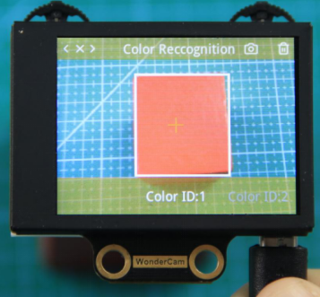
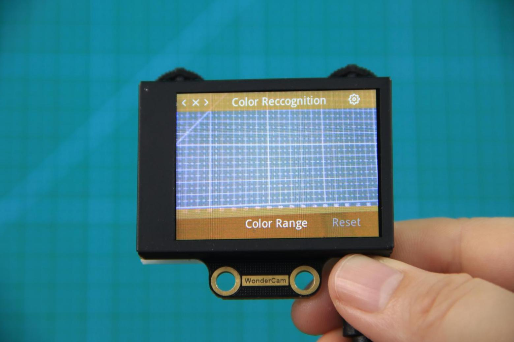
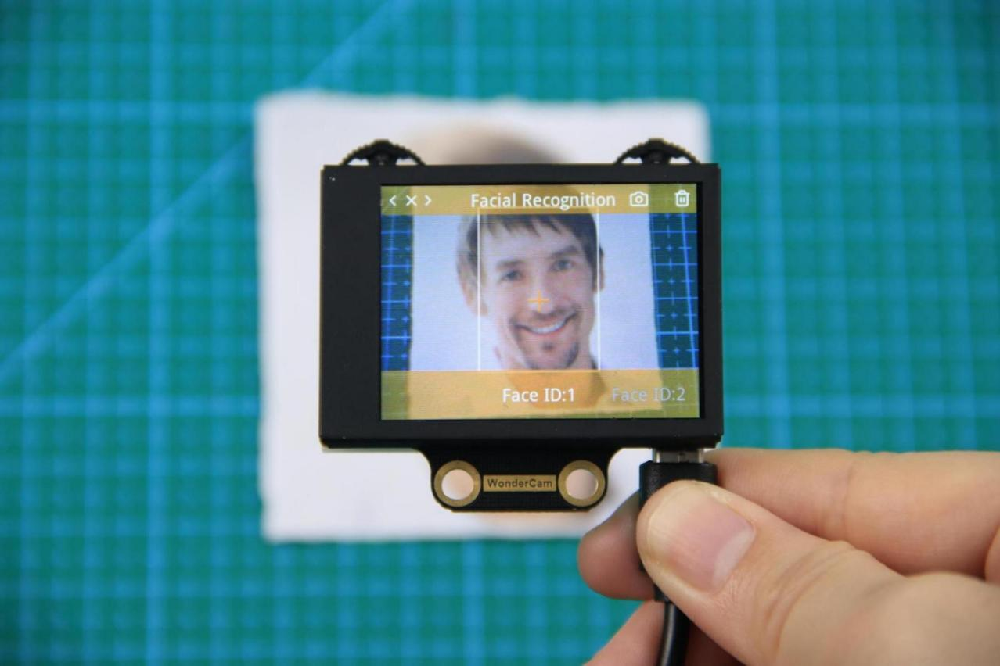
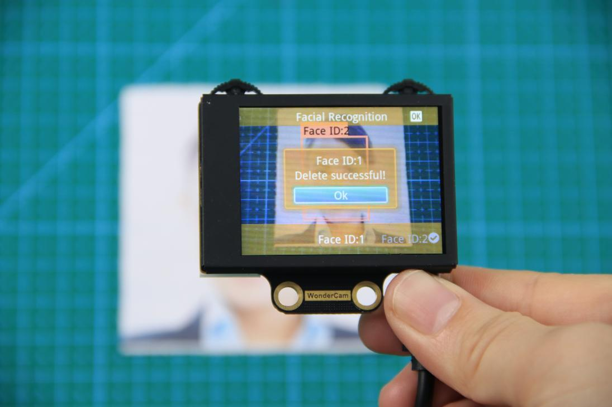
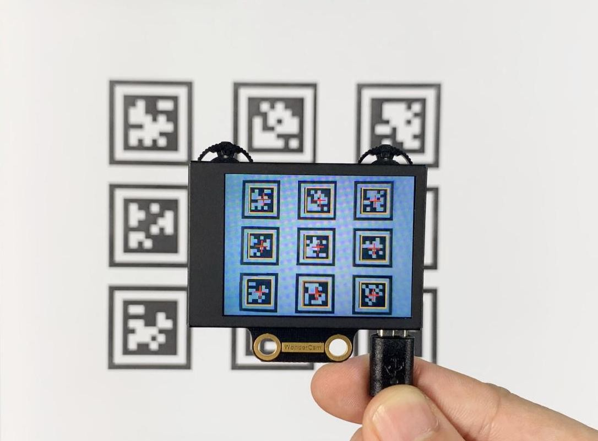
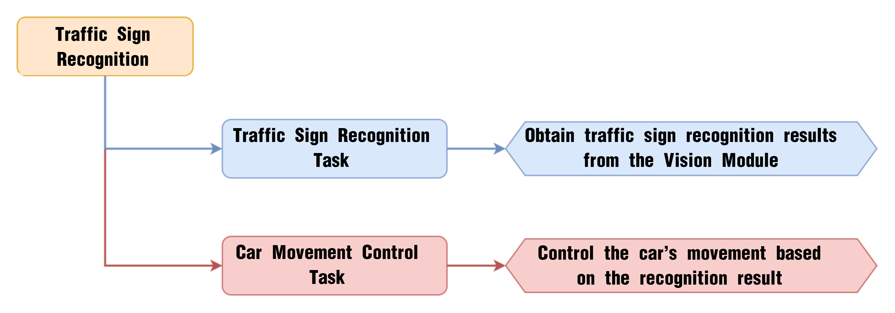

# 6. AI Vision Lesson

## 6.1 WonderCam AI Vision Module Introduction

### 6.1.1 Introduction

The WonderCam is a user-friendly AI vision sensor, equipped with 8 built-in functions, including color recognition, face recognition, label classification, visual line tracking, digit recognition, traffic sign recognition, image classification, and feature learning.

It eliminates the need for complicated training processes and visual algorithms — with just one click, you can complete AI training and bring your AI vision projects to life effortlessly.

### 6.1.2  Interface Diagram 

**IIC Port Description：**

**IIC Connectors Specification**

<table border="1" cellpadding="5" cellspacing="0">
  <thead>
    <tr>
      <th align="center" width="33%">No.</th>
      <th align="center"  width="33%">Name</th>
      <th align="center" width="33%">Function</th>
    </tr>
  </thead>
  <tbody>
    <tr>
      <td align="center">1</td>
      <td align="center">SCL</td>
      <td align="center">I2C Clock Line</td>
    </tr>
    <tr>
      <td align="center">2</td>
      <td align="center">SDA</td>
      <td align="center">I2C Data Line</td>
    </tr>
    <tr>
      <td align="center">3</td>
      <td align="center">GND</td>
      <td align="center">Power Ground</td>
    </tr>
    <tr>
      <td align="center">4</td>
      <td align="center">5V</td>
      <td align="center">Power Positive (5V)</td>
    </tr>
  </tbody>
</table>

## 6.2 Color Recognition Introduction

### 6.2.1 Introduction

This feature can recognize multiple colored objects in the image and highlight them on the display. Through the IIC interface, you can obtain data such as the position and size of different colored blocks in the image, enabling color recognition and tracking in various scenarios and expanding a wide range of application possibilities. 

### 6.2.2 WonderCam Vision Module

Please carefully read and follow the following precautions. Otherwise, the performance of this feature may be affected! 

(1)  Use bright and high saturated color. Example red, green or blue. Targeted object color and its background must be distinctive. Example if target object is Yellow, avoid yellow background. 

(2)  Do not learn White color or Composite color. Ensure environment is bright enough or use Fill Light on WonderCam when required.

(3) Adjusting light condition and the focus angle can help to stabilize and improve the color recognition process in the white frame within the display panel.

### 6.2.3 Color Recognition Operations

* **Enter Function**

Push the Navigation Lever to the right until the 'Color Recognition' menu bar appears at the top of the screen. 

* **Learning and recognizing new color**

First, learn the color you want to recognize by following these steps: 

Step 1: On the main color recognition interface, push the Function Lever with the pen icon to the left to enter the learning screen. 

Step 2:Once inside, a + sign will appear at the center of the screen, and the menu bar will list various color IDs such as "Color ID:1", "Color ID:2", etc., which are used to identify and save different color data. 

Step 3: Aim the + sign at the color block you want to learn. The selected block will be highlighted with a white frame that dynamically adjusts based on the + sign position, identifying the nearest color region. 

Reminder:

(1) Use bright and high saturated color. Example red, green or blue.

(2) Targeted object color and its background must be distinctive. Example if target object is Yellow, avoid yellow background.

(3) Do not Learn White color or Composite color. Ensure lighting condition is bright enough or use Fill Light on WonderCam when required.

(4) Adjusting light condition and the focus angle can help to stabilize and improve the color recognition process in the white frame within the display panel.

Step 4: 4)Press down on the Camera icon on the Function Lever to start the learning process on the WonderCam Vision Module. Wait briefly, and you will receive a notification of the learning result. If learning fails, it might be due to poor lighting conditions or insufficient color vibrancy. In this case, adjust the lighting or use a more vivid color, and make sure the white frame remains steady without flickering before trying again. 

Step 5: Once learning is successful, whenever the WonderCam Vision Module detects the learned color in the scene, it will immediately highlight the largest matching object and display the corresponding color ID on the interface. 

* **Delete Color**

If a certain color ID is no longer needed, you can easily delete it. Enter the color recognition learning interface, use the Navigation Lever to select the color ID you want to delete, and press the Trash Bin button on the Function Lever to delete the selected color ID. 

* **Color Recognition Function Settings**

To access the parameter settings for color recognition, go to the Color Recognition main menu and press the Function Lever down on the gear icon. This will open the settings interface.

The color recognition parameters include Color Range and Reset Parameters.
Color Range: This controls the recognition range when learning a color. Adjusting this setting appropriately can help accurately recognize the target color and avoid selecting irrelevant areas.
A suitable value is usually 20, which typically provides ideal recognition performance in most cases. If the value is set too high, the white frame during learning might cover the entire screen. If the value is set too low, it might only surround part of the target color, affecting the recognition accuracy.
It is important to note that the color range used during the learning process is saved with the learned color ID. The new Color Range setting will not affect previously learned color IDs. To adjust the recognition range for an already learned color ID, you will need to re-learn it.
Reset Parameters: This option resets the color recognition parameters to their factory defaults.

 **Please note that after resetting, you must save the new settings before exiting the settings interface. If not saved, the parameters will not be retained after resetting.**

## 6.3 Color Recognition

### 6.3.1 Project Process

### 6.3.2 WonderCam Vision Module

WonderCam is a user-friendly AI vision sensor with multiple built-in features, including color detection, face recognition, label recognition, line tracking, digit recognition, traffic sign recognition, image classification, and feature learning. It is compatible with various controllers such as ESP32, micro:bit, Arduino, and Raspberry Pi, making it easy to bring your AI vision projects to life.

### 6.3.3 Program Download 

[Color Recognition Program.sb3]()

(1\) Connect the AiNova robot to your computer using a USB data cable.

(2) In the WonderCode main interface, click “Connect”, and select the corresponding port. The port number varies based on your computer. In the example below, it is COM3.

:::{Note}

Avoid selecting COM1, which is usually reserved for system communication.

:::

(3) After successfully connecting, click "**Upload**” button under upload mode in the right side.

(4) Wait for the upload to complete.

### 6.3.4 Project Outcome

First, assign the red, green, and blue objects to Color IDs 1, 2, and 3 in sequence, then begin color recognition. Then, begin the color recognition process. When a recognized color is detected, the RGB LEDs will light up in the corresponding color.

### 6.3.5 Program Brief Analysis

(1\) When AiNova powers on, it initializes the vision module on port 9, disables the RGB lighting on the ultrasonic sensor, and sets the vision module to color recognition mode. After these initialization steps are complete, the buzzer will emit a confirmation tone. The LEN_ON variable is a flag used to control the fill light of the vision module. A value of -1 means the fill light is off, and a value of 1 means it is on.

(2\) When button A is pressed, the LEN_ON variable toggles between 1 and -1. This switch turns the fill light on or off based on the variable’s current value.

(3\) In the main loop, the program continuously updates and retrieves the color recognition results. It calculates the area of each detected color (IDs 1 to 3) using the recognized width and height, and stores the area in a corresponding variable. The program sets red as the default color, with the color variable initialized to 1.

(4\) The program then compares the area values of all detected colors to determine which color has the largest area, and updates the color variable to that color’s ID.

(5\) Finally, if the detected area is greater than 1200, the color is considered valid. The onboard LED on the CoreX controller will then light up in the detected color. If the area is too small, all LEDs will remain off.

##  6.4 Color Tracking

### 6.4.1 Project Process

### 6.4.2 WonderCam Vision Module

WonderCam is a user-friendly AI vision sensor with multiple built-in features, including color detection, face recognition, label recognition, line tracking, digit recognition, traffic sign recognition, image classification, and feature learning. It is compatible with various controllers such as ESP32, micro:bit, Arduino, and Raspberry Pi, making it easy to bring your AI vision projects to life.

### 6.4.3 Program Download 

[Color Tracking Program.sb3]()

(1\) Connect the AiNova robot to your computer using a USB data cable.

(2) In the WonderCode main interface, click **“Connect”**, and select the corresponding port. The port number varies based on your computer. In the example below, it is COM3.

:::{Note}

Avoid selecting COM1, which is usually reserved for system communication.

:::

(3) After successfully connecting, click "**Upload**” button under upload mode in the right side.

(4) Wait for the upload to complete.

### 6.4.4 Project Outcome

Start by assigning any one of the three colors—red, green, or blue—to Color ID 1. Then begin the color recognition process. Once the color is recognized, you can slowly move the colored object, and the AiNova robot will follow its position accordingly.

### 6.4.5 Program Brief Analysis

(1\) When AiNova powers on, it initializes the vision module on port 9, disables the RGB lighting on the ultrasonic sensor, and sets the vision module to color recognition mode. After these initialization steps are complete, the buzzer will emit a confirmation tone. The LEN_ON variable is a flag used to control the fill light of the vision module. A value of -1 means the fill light is off, and a value of 1 means it is on.

(2\) When button A is pressed, the LEN_ON variable toggles between 1 and -1. This switch turns the fill light on or off based on the variable’s current value.

(3\) In the main loop, the program continuously updates and retrieves recognition results. When Color ID 1 is detected, the X and Y coordinates of the center of the recognized color area are stored in the variables TRACK_X and TRACK_Y.

(4\) Next, the robot determines its forward or backward movement speed based on the value of TRACK_Y, which reflects the vertical position of the detected object on the vision module’s screen. Finally, using the value of TRACK_X, an offset speed is calculated. The speeds of the two motors are then set to SPEED - DIREC and SPEED + DIREC, allowing the robot to follow the object’s position — achieving a basic color tracking behavior.

## 6.5 Facial Recognition Introduction

### 6.5.1 Introduction

In face recognition mode, the WonderCam vision module can detect faces in the frame and determine whether they match a specific face. Through the I2C interface, external control devices can obtain data such as the position and size of the face within the frame, enabling face detection, face recognition, face tracking, and other applications.

### 6.5.2 Notice

Please carefully read and follow the following precautions. Otherwise, the performance of this feature may be affected!

(1) In the face learning step which will be detailed later in this section, always align the screen’s central crosshairs with the center of the face. Failure to do so may result in learning failure.

(2) Choose standard frontal face photos for the learning process.

(3) Ensure adequate lighting when performing face recognition. If the lighting is insufficient, you should turn on the supplemental lighting on WonderCam vision module.

### 6.5.3 Facial Recognition Operations

* **Enter Function**

Push the Navigation Lever to the right until the **'Face Recognition'** menu bar appears at the top of the screen.

* **Face Detection**

Once the mode is activated, face detection begins automatically. When successful, the detected face will be enclosed in a white box.

* **Learning and Recognizing Specific Faces**

To recognize a specific face, you need to first teach the module the faces you want it to recognize.

(1) Learning a Single Face

Step 1:Move the Function Lever to the left to select the pencil icon, which will enter the face learning mode. After entering the face learning mode, a "+" symbol will appear at the center of the screen, and the menu bar will display “Face ID:1”, “Face ID:2”, etc. The face ID is like a file name on a computer and is used to save data and mark different faces.

Step 2: Align the screen’s center **“+”** with the center of the face. 

:::{Note}

For better learning results, it is critical to follow this step closely. Failure to do so may result in learning failure!

:::

Step 3: After alignment, move the Function Lever to the left again to press the camera icon to start learning the face. Once the learning is complete, press OK to close the dialog box. A message will pop up indicating whether the learning was successful or failed. Upon successful learning, a checkmark (√) will appear next to the corresponding face ID in the menu bar, indicating that the face has been successfully learned.

(2) Learn Multiple Faces

For example, if we have already learned Face ID:1, to learn multiple faces, simply move the Navigation Lever to the right in face learning mode to select another face ID, such as “Face ID:2”, and then follow the same steps as when learning Face ID:1.

(3) Recognizing Specific Faces

After learning, when the same face is detected again, it will be enclosed in a colored box and the corresponding face ID will be displayed.

(4) Delete Face

If you no longer want to recognize a particular face ID, you can delete the previously learned face. In the face learning interface, use the Navigation Lever to select the face ID you want to delete, then move the Function Lever to the right and press the trash icon to delete that face.

### 6.5.4 Facial Recognition Function Settings

To access the parameter settings for face recognition, go to the Color Recognition main menu and press the Function Lever down on the gear icon. This will open the settings interface. The face recognition parameters include: "Detection Threshold," "NMS Threshold," "Recognition Threshold," and "Reset Parameters."

(1) Detection Threshold: This setting controls the threshold for face detection. The higher the value, the more accurate the detection, and the less likely it is to misidentify a face. However, if the threshold is set too high, the detection rate may decrease, and faces may not be detected at all.

(2) NMS Threshold: This parameter generally does not need to be adjusted. The default value is recommended.

(3) Recognition Threshold: This threshold controls the accuracy of recognizing specific faces. A higher value increases the accuracy and reduces the likelihood of misidentification. A value that is too low may cause incorrect faces to be misidentified as the target face, while a value that is too high could lead to recognition failures or require specific positions or angles for successful recognition.

(4) Reset Parameters: This option resets all face recognition parameters to their default values. Please note that after resetting, you must save the new settings before exiting the settings interface. If not saved, the parameters will not be retained after resetting.

## 6.6 Face Recognition

### 6.6.1 Project Process

### 6.6.2 WonderCam Vision Module

WonderCam is a user-friendly AI vision sensor with multiple built-in features, including color detection, face recognition, label recognition, line tracking, digit recognition, traffic sign recognition, image classification, and feature learning. It is compatible with various controllers such as ESP32, micro:bit, Arduino, and Raspberry Pi, making it easy to bring your AI vision projects to life.

### 6.6.3 Program Download 

[Face Recognition Program.sb3]()

(1\) Connect the AiNova robot to your computer using a USB data cable.

(2) In the WonderCode main interface, click “Connect”, and select the corresponding port. The port number varies based on your computer. In the example below, it is COM3.

:::{Note}

Avoid selecting COM1, which is usually reserved for system communication.

:::

 

(3) After successfully connecting, click "**Upload**” button under upload mode in the right side.

(4) Wait for the upload to complete.

### 6.6.4 Project Outcome

When a registered face is recognized, the AiNova robot moves forward and backward, and the RGB lights turn green. When an unregistered face is detected, the robot sways left and right with the RGB lights turning blue. If no face is detected, all RGB lights are turned off.

### 6.6.5 Program Brief Analysis

(1\) When AiNova powers on, the program initializes the vision module on Port 9, disables the RGB lighting on the ultrasonic module, sets the motor type to TT motors, and switches the vision module to face recognition mode. After these initialization steps are complete, the buzzer will emit a confirmation tone. The LEN_ON variable is a flag used to control the fill light of the vision module. A value of -1 means the fill light is off, and a value of 1 means it is on.

(2\) When button A is pressed, the LEN_ON variable toggles between 1 and -1. This switch turns the fill light on or off based on the variable’s current value.

(3\) In the main loop, the program continuously updates and retrieves face recognition results. Based on the outcome, it executes different behaviors.

(4\) If a registered face is recognized, the RGB lights turn green and the buzzer beeps once. The robot moves forward and backward at 50 RPM, then stops.

(5) If an unregistered face is detected, the RGB lights turn red and the buzzer beeps once. The robot first turns left at 40 RPM, waits for 0.3 seconds, then turns right at 50 RPM before stopping.

(6) If no face is detected, all RGB lights are turned off.

## 6.7 Face Tracking

### 6.7.1 Project Process

### 6.7.2 WonderCam Vision Module

WonderCam is a user-friendly AI vision sensor with multiple built-in features, including color detection, face recognition, label recognition, line tracking, digit recognition, traffic sign recognition, image classification, and feature learning. It is compatible with various controllers such as ESP32, micro:bit, Arduino, and Raspberry Pi, making it easy to bring your AI vision projects to life.

### 6.7.3 Program Download 

[Face Tracking Program.sb3]()

(1\) Connect the AiNova robot to your computer using a USB data cable.

(2) In the WonderCode main interface, click “Connect”, and select the corresponding port. The port number varies based on your computer. In the example below, it is COM3.

:::{Note}

Avoid selecting COM1, which is usually reserved for system communication.

:::

(3) After successfully connecting, click "**Upload**” button under upload mode in the right side.

(4) Wait for the upload to complete.

### 6.7.4 Project Outcome

Once the program is downloaded and the switch is turned on, the WonderCam vision module will automatically switch to **“Face Recognition”** mode. When a face is aligned with the camera and slightly moved, the AiNova robot will follow the movement of the face accordingly.

### 6.7.5 Program Brief Analysis

(1\) When AiNova powers on, the program initializes the vision module interface to Port 9, disables the ultrasonic module's RGB lights, sets the motor type to TT motors, and stops all motor operations. The vision module is then switched to face recognition mode. The buzzer plays a sound to indicate that the device initialization is complete. The LEN_ON variable serves as the flag for controlling the vision module's supplementary light. When LEN_ON is set to -1, the light is turned off.

(2\) When the A button is pressed, the value of the LEN_ON variable is toggled. Each time the button is pressed, the value of LEN_ON alternates between 1 and -1. When LEN_ON is 1, the supplementary light on the vision module is turned on. When LEN_ON is -1, the supplementary light is turned off.

(3\) In the main loop, the program continuously updates and retrieves face recognition results. When any face is detected, the program stores the face data’s center X and Y coordinates in the variables TRACK_X and TRACK_Y. The program also calculates the area of the detected face based on its width and height.

(4\) The movement speed of the robot is set according to the area of the detected face. The further the face is from the robot, the faster the robot moves. The closer the face is, the slower the robot moves.

(5\) The robot's offset speed is determined based on the X-coordinate of the face's center in the vision module's screen. If the face is located more to the left on the screen, DIREC becomes larger, causing the speed of motor 1 to decrease, making the robot move left.

## 6.8 Tag Recognition Introduction

### 6.8.1 Introduction

In Tag Recognition mode, the WonderCam vision module can recognize AprilTag markers in the scene and highlight them on the display screen. Through the I2C interface, external control devices can retrieve the position data and 3D transformation data of each AprilTag, enabling spatial localization.

AprilTag is a type of visual localization marker, similar to QR codes or barcodes, but designed with reduced complexity to meet real-time processing requirements. It allows for fast marker detection and calculation of relative position. This technology is widely applicable in scenarios such as augmented reality (AR), robotics, and camera calibration. Tags can be printed directly using a standard printer, and AprilTag detection software can compute the tag’s precise 3D position, orientation, and ID relative to the camera.

### 6.8.2 Notice

(1) You don’t have to download any materials online. Please go to the directory of this section and find the "AprilTag Tag Collection" to use the provided tag materials. A total of 200 tag images are provided.

(2) Maintain an appropriate distance from the tags. The module can recognize the tag as long as it can frame it. If the tag is too far from the WonderCam vision module, or if it appears too small in the frame, the module will not be able to recognize it.

(3) It is best if the area next to the tag has a white background or is entirely white. A dark background will make it difficult for the WonderCam vision module to recognize the tag.

### 6.8.3 Tag Recognition Operations

* **Enter Function**

Push the Navigation Lever to the right until the 'Tag Recognition' menu bar appears at the top of the screen.

* **Tag Recognition Effect**

When an AprilTag of type TAG36H11 appears in the frame, the tag will be framed on the display, and a cross will be shown at the center of the tag. The WonderCam vision module is capable of recognizing multiple tags with the same or different IDs simultaneously.

Note: Maintain an appropriate distance from the tags. The module can recognize the tag as long as it can frame it. If the tag is too far from the WonderCam vision module, or if it appears too small in the frame, the module will not be able to recognize it.

## 6.9 Tag Recognition

### 6.9.1 Project Process

### 6.9.2 WonderCam Vision Module

WonderCam is a user-friendly AI vision sensor with multiple built-in features, including color detection, face recognition, label recognition, line tracking, digit recognition, traffic sign recognition, image classification, and feature learning. It is compatible with various controllers such as ESP32, micro:bit, Arduino, and Raspberry Pi, making it easy to bring your AI vision projects to life.

### 6.9.3 Program Download 

[Tag Recognition Program.sb3]()

(1\) Connect the AiNova robot to your computer using a USB data cable.

(2) In the WonderCode main interface, click **“Connect”**, and select the corresponding port. The port number varies based on your computer. In the example below, it is COM3.

:::{Note}

Avoid selecting COM1, which is usually reserved for system communication.

:::

 

(3) After successfully connecting, click "**Upload**” button under upload mode in the right side.

(4) Wait for the upload to complete.

### 6.9.4 Project Outcome

Present the three included ID tags one by one to the WonderCam vision module. The AiNova robot will respond with the following corresponding actions:

| **ID** |                  **Behavior**                  |
| :----: | :--------------------------------------------: |
|   1    |     RGB lights turn red, buzzer beeps once     |
|   2    |   RGB lights turn green, buzzer beeps twice    |
|   3    | RGB lights turn blue, buzzer beeps three times |

### 6.9.5 Program Brief Analysis

(1\)  When AiNova powers on, it initializes the vision module on port 9, disables the RGB lighting on the ultrasonic sensor, and sets the vision module to tag recognition mode. After these initialization steps are complete, the buzzer will emit a confirmation tone. The LEN_ON variable is a flag used to control the fill light of the vision module. A value of -1 means the fill light is off, and a value of 1 means it is on.

(2\) When button A is pressed, the LEN_ON variable toggles between 1 and -1. This switch turns the fill light on or off based on the variable’s current value.

(3\) In the main program, the recognition results are continuously updated. When Tag ID1 is detected, all CoreX LEDs are set to red, and the alert sound is played once.

(4\) When Tag ID2 is detected, all LEDs on the CoreX board are set to green, and the alert sound is played twice.

(5\) When Tag ID3 is detected, all LEDs on the CoreX board are set to blue, and the alert sound is played three times.

If no tag is detected, all LED lights on the CoreX board are turned off.

## 6.10 Tag Tracking

### 6.10.1 Project Process

### 6.10.2 WonderCam Vision Module

WonderCam is a user-friendly AI vision sensor with multiple built-in features, including color detection, face recognition, label recognition, line tracking, digit recognition, traffic sign recognition, image classification, and feature learning. It is compatible with various controllers such as ESP32, micro:bit, Arduino, and Raspberry Pi, making it easy to bring your AI vision projects to life.

### 6.10.3 Program Download 

[Tag Tracking Program.sb3]()

(1\) Connect the AiNova robot to your computer using a USB data cable.

(2) In the WonderCode main interface, click “Connect”, and select the corresponding port. The port number varies based on your computer. In the example below, it is COM3.

:::{Note}

Avoid selecting COM1, which is usually reserved for system communication.

:::

(3) After successfully connecting, click "**Upload**” button under upload mode in the right side.

(4) Wait for the upload to complete.

### 6.10.4 Project Outcome

When the Tag ID1 card is shown and slightly moved in front of the camera, the AiNova robot will follow the tag’s movement accordingly.

### 6.10.5 Program Brief Analysis

(1\) When AiNova powers on, it initializes the vision module on port 9, disables the RGB lighting on the ultrasonic sensor, and sets the vision module to tag recognition mode. After these initialization steps are complete, the buzzer will emit a confirmation tone. The LEN_ON variable is a flag used to control the fill light of the vision module. A value of -1 means the fill light is off, and a value of 1 means it is on.

(2\) When button A is pressed, the LEN_ON variable toggles between 1 and -1. This switch turns the fill light on or off based on the variable’s current value.

(3\) In the main program, the recognition results are continuously updated. When Tag ID1 is detected, the X and Y coordinates of the center of the detected tag are stored in the variables TRACK_X and TRACK_Y. The area of the tag region is then calculated based on the tag's width and height.

(4\) The speed of the robot is set based on the area of the detected tag. This ensures that the further the tag is from the robot, the faster the robot moves, and the closer the tag is, the slower the robot moves.

(5\) The robot's offset speed is determined based on the X-coordinate of the face's center in the vision module's screen. If the tag is located more to the left on the screen, DIREC becomes larger, causing the speed of motor 1 to decrease, making the robot move left.

## 6.11 Traffic Sign Recognition Introduction

### 6.11.1 Introduction

In the Traffic Sign Recognition mode, the WonderCam vision module can recognize traffic sign cards and display their respective IDs and similarity scores on the screen.

### 6.11.2 Notice

The optimal distance between the traffic sign card and the camera is 15-20 cm. Additionally, ensure that the background lighting is adequate. It is recommended to use a solid color, such as white, for the background to achieve the best recognition results.

### 6.11.3 Traffic Sign Recognition Operations

* **Enter Function**

Push the Navigation Lever to the right until the 'Traffic Sign Recognition' menu bar appears at the top of the screen.

* **Traffic Sign Recognition Usage**

The five traffic sign cards correspond to different IDs. During operation, the WonderCam vision module screen will display the ID with the highest confidence level and its associated confidence score. The closer the confidence score is to 1.0, the more reliable the recognition result will be.

 

The corresponding IDs for the five traffic sign cards are listed in the table below:

|                    **Traffic Sign Card**                     | **Correspond ID** |                    **Traffic Sign Card**                     | **Correspond ID** |
| :----------------------------------------------------------: | :---------------: | :----------------------------------------------------------: | :---------------: |
|  |         1         |  |         2         |
|  |         3         |  |         4         |
|  |         5         |                                                              |                   |

## 6.12 Traffic Sign Recognition

### 6.12.1 Project Process

### 6.12.2 WonderCam Vision Module

WonderCam is a user-friendly AI vision sensor with multiple built-in features, including color detection, face recognition, label recognition, line tracking, digit recognition, traffic sign recognition, image classification, and feature learning. It is compatible with various controllers such as ESP32, micro:bit, Arduino, and Raspberry Pi, making it easy to bring your AI vision projects to life.

### 6.12.3 Program Download 

[Traffic Sign Recognition Program.sb3]()

(1\) Connect the AiNova robot to your computer using a USB data cable.

(2) In the WonderCode main interface, click “Connect”, and select the corresponding port. The port number varies based on your computer. In the example below, it is COM3.

:::{Note}

Avoid selecting COM1, which is usually reserved for system communication.

:::

(3) After successfully connecting, click "**Upload**” button under upload mode in the right side.

(4) Wait for the upload to complete.

### 6.12.4 Project Outcome

Present the five included traffic sign cards one by one to the WonderCam vision module. The AiNova robot will respond with the following corresponding actions:

|  ID  |                      Traffic Sign Card                       | Action Performed |
| :--: | :----------------------------------------------------------: | :--------------: |
|  1   |  |   Go Straight    |
|  2   |  |    Turn Left     |
|  3   |  |    Turn Right    |
|  4   |  |      U-turn      |
|  5   |  |       Stop       |

### 6.12.5 Program Brief Analysis

(1\) When AiNova powers on, it initializes the vision module on port 9, disables the RGB lighting on the ultrasonic sensor, and sets the vision module to traffic sign recognition mode. After these initialization steps are complete, the buzzer will emit a confirmation tone. The LEN_ON variable is a flag used to control the fill light of the vision module. A value of -1 means the fill light is off, and a value of 1 means it is on.

(2\) When button A is pressed, the LEN_ON variable toggles between 1 and -1. This switch turns the fill light on or off based on the variable’s current value.

(3\) In the main program, the recognition results are continuously updated. When a traffic sign with a non-zero ID is detected, the LAST_CLASS_ID variable is set to the traffic sign ID with the highest confidence, and the CLASS_COUNT variable is incremented by one. If no traffic sign is detected, CLASS_COUNT is reset to 0, and LAST_CLASS_ID is updated with the ID of the traffic sign that has the highest confidence. Each time a traffic sign is detected, the CLASS_COUNT variable is incremented to track the number of detections.

(4\) When the detection count exceeds 2, the direction of the robot's movement is determined by the value of LAST_CLASS_ID. If the ID is 2, it indicates a left turn, so motor 2 is set to rotate forward, and motor 1 rotates backward to turn the robot left.

(5\) If the traffic sign ID is 3, indicating a right turn, motor 1 is set to rotate forward and motor 2 backward to turn the robot right.

(6\) If the traffic sign ID is 1, indicating forward movement, both motors are set to rotate forward to move the robot forward.

(7\) If the traffic sign ID is 5, indicating stop, all motors are stopped.

(8\) Lastly, if the road sign ID is 4, indicating a U-turn. Motor 1 rotates alone, and motor 2 rotates forward for 1 second to perform a U-turn from the left.

## 6.13 Number Recognition Introduction

### 6.13.1 Introduction

In Number Recognition mode, the WonderCam Vision Module can recognize five digit cards and display the corresponding digits and similarity scores on the screen.

:::{Note}

You can use the provided digit cards to perform this function.

:::

### 6.13.2 Notice

The optimal distance between the card and the camera should be around 15-20 cm. Additionally, ensure the background lighting is adequate. It is recommended to use a solid color, such as white, for the background for the best recognition results.

### 6.13.3 Number Recognition Operation Steps

* **Enter Function**

Push the Navigation Lever to the right until the 'Number Recognition' menu bar appears at the top of the screen.

* **Number Recognition**

Once the Number Recognition function is activated, you can perform classification testing using the five provided digit cards. Each of the five digit cards corresponds to a specific digit. When in use, the WonderCam Vision Module will display the digit with the highest confidence score on the screen. The closer the confidence score is to 1.0, the more reliable the recognition result will be.

:::{Note}

The optimal distance between the card and the camera should be around 15-20 cm. Additionally, ensure the background lighting is adequate. It is recommended to use a solid color, such as white, for the background for the best recognition results.

:::

The corresponding IDs for the five cards are listed in the table below:

|                         **Card ID**                          | **Displayed Digit** |                         **Card ID**                          | **Displayed Digit** |
| :----------------------------------------------------------: | :-----------------: | :----------------------------------------------------------: | :-----------------: |
|  |          1          |  |          2          |
|  |          3          |  |          4          |
|  |          5          |                                                              |                     |

## 6.14 Number Recognition

### 6.14.1 Project Process

### 6.14.2 WonderCam Vision Module

WonderCam is a user-friendly AI vision sensor with multiple built-in features, including color detection, face recognition, label recognition, line tracking, digit recognition, traffic sign recognition, image classification, and feature learning. It is compatible with various controllers such as ESP32, micro:bit, Arduino, and Raspberry Pi, making it easy to bring your AI vision projects to life.

### 6.14.3 Program Download 

[Number Recognition Program.sb3]()

(1\) Connect the AiNova robot to your computer using a USB data cable.

(2) In the WonderCode main interface, click “Connect”, and select the corresponding port. The port number varies based on your computer. In the example below, it is COM3.

:::{Note}

Avoid selecting COM1, which is usually reserved for system communication.

:::

(3) After successfully connecting, click "**Upload**” button under upload mode in the right side.

(4) Wait for the upload to complete.

### 6.14.4 Project Outcome

Take out the five included number cards one by one and present them to the WonderCam vision module. The AiNova robot will perform the following corresponding actions based on the recognized ID:

|  ID  |                         Number Card                          |                       Action Performed                       |
| :--: | :----------------------------------------------------------: | :----------------------------------------------------------: |
|  1   |  |                     RGB light turns red                      |
|  2   |  |                    RGB light turns purple                    |
|  3   |  |  RGB light turns green and plays the melody of “Two Tigers”  |
|  4   |  | RGB light turns blue and plays the melody of “Twinkle Twinkle Little Star” |
|  5   |  | RGB light turns yellow and plays the melody of “Little Donkey” |

### 6.14.5 Program Brief Analysis

(1\) When AiNova powers on, it initializes the vision module on port 9, disables the RGB lighting on the ultrasonic sensor, and sets the vision module to number recognition mode. After these initialization steps are complete, the buzzer will emit a confirmation tone. The LEN_ON variable is a flag used to control the fill light of the vision module. A value of -1 means the fill light is off, and a value of 1 means it is on. Finally, set the CoreX LED lights to pink and set the buzzer volume to 5.

(2\) When button A is pressed, the LEN_ON variable toggles between 1 and -1. This switch turns the fill light on or off based on the variable’s current value.

(3\) In the main program loop, continuously update and obtain the recognition results. Assign the digit with the highest confidence detected by the vision module to a variable called "myVariable." Then, based on the value of "myVariable," different actions are executed. If "myVariable" equals 1, set all the LEDs to red.

(4\) If the recognized digit is 2, set the LED color to purple.

(5\) If the recognized digit is 3, set the LED color to green and play the "Two Tigers" melody.

The code snippet for the "Two Tigers" melody is as follows:

(6\) If the recognized digit is 4, set all LEDs to blue and play the "Twinkle Twinkle Little Star" melody.

The code snippet for the "Twinkle Twinkle Little Star" melody is:

(7\) If the recognized digit is 5, set the LED color to light blue and play the "Little Donkey" melody.

The code snippet for the "Little Donkey" melody is:

(8\) Otherwise, if other digits are recognized, set the LED color to yellow. If no digit is recognized, turn off all LEDs.

## 6.15 Visual Line Following Introduction

### 6.15.1 Introduction

The Visual Line Following function allows the system to recognize multiple colored lines in the frame and display the direction of each detected line on the screen. Through the I2C interface, it can also retrieve data such as the position, offset, and angle of the lines in the frame, enabling smooth visual line-following feature and functionalities.

### 6.15.2 Notice

Please carefully read and follow the following precautions. Otherwise, the performance of this feature may be affected!

(1) Use bright and high saturated color. Example red, green or blue. Targeted object color and its background must be distinctive. Example if target object is Yellow, avoid yellow background.

(2) Do not learn White color or Composite color. Ensure environment is bright enough or use Fill Light on WonderCam when required.

(3) The line width should not be too wide or too narrow. You can adjust it based on the screen's height, but the white arrow in the frame must remain stable and without fluctuations.

### 6.15.3 Visual Line Following Operation Steps

* **Enter Function**

Push the Navigation Lever to the right until the 'Visual Line Following' menu bar appears at the top of the screen.

* **Learning and Recognizing New Lines**

The process for learning new line colors is similar to the color recognition learning method. Here are the steps:

Step 1: In the main Visual Line Following interface, press the pencil icon button briefly.

Step 2: Center the crosshairs on the line you want to learn. Ensure that the line is as straight or vertical as possible in the frame, and adjust the white arrow to align with the target line’s direction.

Step 3: Press the camera icon button briefly to start the learning process. Adjust lighting and angles to ensure the white arrow remains stable and without fluctuations. Wait for the learning result prompt. If learning fails, adjust lighting conditions, use more vibrant colors, and ensure the arrow stays stable before retrying.

After successful learning, if the corresponding colored line appears in the frame, the module will calculate the region of the color and display the arrow.

* **Deleting Lines**

If you no longer need to recognize a specific line with a particular ID, you can delete it. Enter the Visual Line Following learning interface, use the navigation dial to select the line ID you wish to delete, and press the trash can icon button briefly to remove the selected line ID.

### 6.15.4 Visual Line Following Function Parameters Explanation

To access the settings for the Visual Line Following feature, press the gear icon on the navigation dial to enter the parameter settings interface from the main menu.

The recognition parameters include Color Range and Reset Parameters.

Color Range: This controls the recognition range when learning a color. Adjusting this setting appropriately can help accurately recognize the target color and avoid selecting irrelevant areas.

Reset Parameters: This option resets the visual line following parameters to their factory defaults.

## 6.16 Visual Line Following

### 6.16.1 Project Process

### 6.16.2 WonderCam Vision Module

WonderCam is a user-friendly AI vision sensor with multiple built-in features, including color detection, face recognition, label recognition, line tracking, digit recognition, traffic sign recognition, image classification, and feature learning. It is compatible with various controllers such as ESP32, micro:bit, Arduino, and Raspberry Pi, making it easy to bring your AI vision projects to life.

### 6.16.3 Program Download 

[Visual Line Following Program.sb3]

(1\) Connect the AiNova robot to your computer using a USB data cable.

(2) In the WonderCode main interface, click “Connect”, and select the corresponding port. The port number varies based on your computer. In the example below, it is COM3.

:::{Note}

Avoid selecting COM1, which is usually reserved for system communication.

:::

 

(3) After successfully connecting, click "**Upload**” button under upload mode in the right side.

(4) Wait for the upload to complete.

### 6.16.4 Project Outcome

The display on the WonderCam vision module will automatically switch to the “Line Following” interface. Lay out the included map on a flat surface.

### 6.16.5 Program Brief Analysis

(1\) When AiNova powers on, it initializes the vision module on port 9, disables the RGB lighting on the ultrasonic sensor, and sets the vision module to visual line following mode. After these initialization steps are complete, the buzzer will emit a confirmation tone. The LEN_ON variable is a flag used to control the fill light of the vision module. A value of -1 means the fill light is off, and a value of 1 means it is on.

(2\) When button A is pressed, the LEN_ON variable toggles between 1 and -1. This switch turns the fill light on or off based on the variable’s current value.

(3\) In the main program, set the visual line-following recognition area, and continuously update and obtain the recognition results in a loop. If a line is detected, and it is identified as line ID1, the line's angle and offset angle are stored in variables, then set the LED color to red and the speed to 45.

(4\) Similarly, if line ID2 is detected, store the angle and offset angle, and set the LED color to green.

(5) If line ID3 is detected, store the angle and offset angle, and set the LED color to blue.

(6\) If no line is detected, set the SPEED, ANGLE, and OFFSET variables to 0.

(7\) Based on the obtained line offset angle, use the PID algorithm to calculate the total offset in the actual moving direction. Then, control the two motors to rotate according to the calculated offset and the set speed, achieving the visual line-following effect.

(8\) Finally, if no line is detected, stop the robot and turn off all the LEDs.

