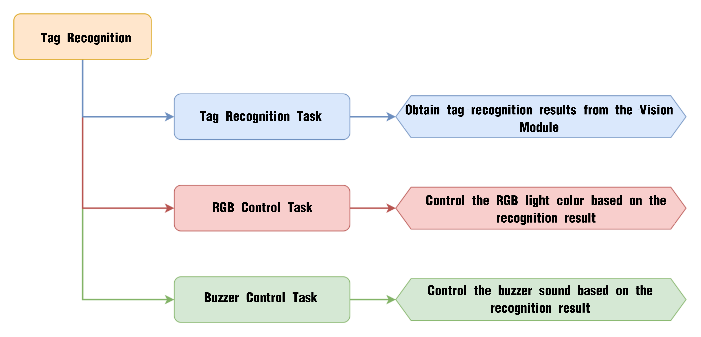
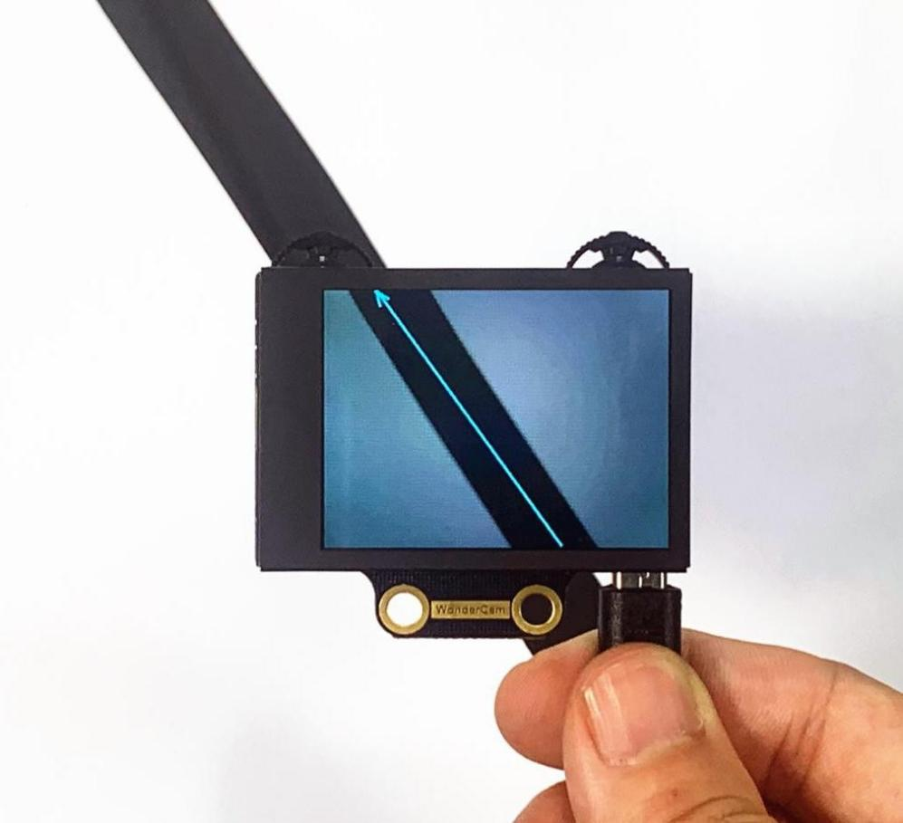
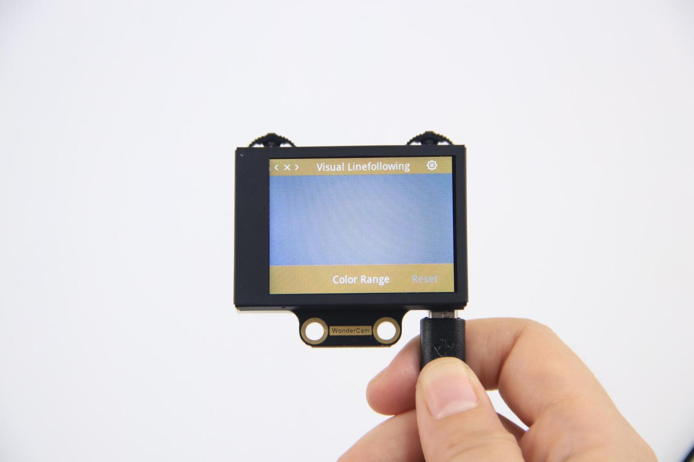

# 7. Python Extension Course

## 7.1 Introduction to Hiwonder Python Editor

In this section, we will learn about the connection methods and specific functions of the Hiwonder Python Editor.

:::{Note}

If the editor fails to open, please change the editor's name to English only, such as 'Hiwonder'.

:::

### 7.1.1 Function Introduction

The editor interface is divided into 5 sections as below:


Each area has its corresponding functions, as shown in the table below:

| **No.** | **Area Name**     | **Function Description**                                     |
| :------ | :---------------- | :----------------------------------------------------------- |
| 1       | Menu Bar          | Contains File, Edit, View, Connect, Run, and Help            |
| 2       | Toolbar           | Includes some commonly used shortcut keys that have the same effect as certain keys in the menu bar |
| 3       | File List         | Divided into multiple project files in the device and locally, allowing you to view the contents of project files (folders, source code, etc.) |
| 4       | Code Editing Area | Allows you to view and write code                            |
| 5       | Terminal          | Displays message logs and debugging information. When no device is connected, only the message logs can be viewed |

### 7.1.2 Operation Instructions

* **Importing Local Projects**

(1) When importing a local project for the first time, left-click on '**Local Projects**' to open the file selection list. For subsequent imports, right-click on '**Local Projects**' and select '**Switch Project Path**'.


(2) Select the Python program folder under “2. Software Installation Package & Program Collection,” and click the “Select Folder” button.

(3) The files in the folder will be automatically added to the local project and can be viewed under “Local Project.”

:::{Note}

Importing a local project means bringing files from your computer into the editor. It does not mean downloading them to the ESP32 mainboard.

:::

* **Viewing Imported Files/Programs**

Double-click the program file in the file list to view its source code, for example, [Demo.py]().


Similarly, after downloading the program to the ESP32 board, you can double-click the file under the “Device” list to view it.

* **Writing and Saving Code**

The code editing area on the right side of the interface supports creating, viewing, editing, modifying, and saving code.

Before writing code, please read the following notes carefully:

(1\) Users cannot create files directly under the “Device” tab. Files in “Device” can only be saved via download. To back up a file, first copy it into the “Local Project.”

(2\) Do not modify action group files with the .rob suffix in the editor, as this may lead to format errors. To edit action group files, use the upper computer software.

(3\) Among the provided low-level files, main.py is the device’s main program. All robot functions must be launched via this file. Reset and startup operations both rely on it. If main.py crashes, no other functions can be executed. If you need to add functions to main.py, it is safer to rename the file. Even if the program hangs, shortcuts like Ctrl+C or Ctrl+D don’t respond, you can reset the board and re-download the program. This will restore normal operation.

* **Program Download and Execution**

Downloading the program is an interaction between the editor and the device. Using [Demo.py]() as an example:

(1) Select the "Demo.py" file in the "Local Project" tab, then click the download icon  on the toolbar, or right-click the file and choose "Download."


(2) You can view the download progress and completion status in the terminal window.


(3) Once the download is complete, the program will appear in the file list under the **"Device"** tab.


(4) Finally, rename the downloaded “Demo.py” file to “corex.py.”


Additionally, here are a few things you need to know:

Apart from this download method, you can also rename the file to "corex.py" before downloading.

The “Download and Run” function first restarts the device, then downloads and runs the program. This approach helps with the program’s stability.

If you do not need to run the program immediately, simply click the download button  or right-click the target file and choose "Download." When you are ready to run the program later, you can restart the device first by clicking the reset icon, then execute the program.

* **Terminal Usage (Debugging)**

The terminal is a functional area that integrates the information window and debugging interface. However, it is important to note that if no device is connected,

the terminal will only serve as an information viewing tool and will not support editing or debugging.

As for information viewing, you have already experienced it in the previous steps, so we won’t go into further details here. This section mainly explains the debugging functions.

(1) The terminal supports code input. For example, when you type the code print(123) in the terminal and press Enter, the output will appear as follows:


(2) Additionally, the terminal also supports auto-indentation. When typing Python statements that end with a colon, such as if, for, or while, and pressing Enter, the next line will automatically continue with the same indentation level as the current statement, or with an appropriate indentation level as required. If you press the Backspace key, it will undo one level of indentation.


(3) To copy and paste code, you can right-click the target code after selecting it in the terminal interface.


Please note that, because the terminal supports auto-indentation, before pasting code, you need to press Ctrl+E to enter edit mode. Otherwise, indentation errors may occur during debugging.

Here’s an example of correct indentation after copying and pasting:


And here’s an example of incorrect indentation:


To exit the edit mode, you can press Ctrl+C. Additionally, if you’ve written a dead loop, you can also press Ctrl+C to exit.

:::{Note}

In the terminal, the shortcut Ctrl+C is only used to interrupt a running program. It does not perform the copy function, and Ctrl+V does not paste.

:::

(4) When entering commands in the terminal, you can use the Tab key for code completion. For example, after typing os in the terminal and pressing Tab, the behavior is as follows:


If there are two or more possible completions, the terminal will list all options. If there is only one possible completion, the terminal will complete it automatically. If there are no matches, nothing happens.

(5) You can use the Up (↑) and Down (↓) arrow keys in the terminal to browse through your command history, saving input time.

For more commands and explanations, please visit: <http://docs.micropython.org/en/latest/library/uos.html>

## 7.2 AiNova Basic Course

### 7.2.1 RGB Light Blinking

* **Project Process**


* **Module Introduction**


These onboard RGB lights use RGB light bulbs, which allow the three colors—red, green, and blue—to be individually adjusted for brightness. This enables the creation of a colorful, mixed light effect.

* **Program Download** 

[RGB Light Blinking Program]()

(1) Open the Hiwonder Python editor software.

(2) Locate the file named corex.py in the RGB Light Blinking Program folder located in the same directory as this document.


(3) Click the Connect button in the top menu . Once successfully connected, the icon will turn green.

(4) After connecting, click the Download button  in the menu to upload the program to the AiNova controller. Wait for the message box at the bottom of the editor to confirm the download is complete.


(5) Finally, click the Restart button  to reboot the robot car. The program will start running automatically.

* **Project Outcome**

The RGB lights on the AiNova controller will blink sequentially according to the preset flashing mode, then loop the breathing gradual flashing mode continuously.


* **Program Brief Analysis**

(1) The required libraries are imported at the beginning, enabling communication with sensors and motor control.

{lineno-start=1}

```
import time
import random
import Hiwonder
```

(2) A variable count is created to track the current LED index. Additional variables are defined for the R, G, and B values.

{lineno-start=6}

```
count = 0
R = 0
B = 0
G = 0
R_Gradient = 0
G_Gradient = 0
B_Gradient = 0
```

(3) Function: flash_onebyone(). Lights up the RGB LEDs one by one. It uses Neopixel_onboard.setItem() with four parameters:LED index, Red intensity (0–255), Green intensity (0–255), Blue intensity (0–255). After setting the color, Neopixel_onboard.write() is called to light up the LED. By calling while function, the LEDs are turned on from index 1 to 6, each lighting up for 0.1 seconds before turning off.

{lineno-start=14}

```
def flash_onebyone():   #Flash one by one(逐一闪烁)
  global count

  count = 1
  while not (count>6):
    Hiwonder.Neopixel_onboard.setItem(count-1,50,206,250)  #Set RGB light color(设置RGB灯的颜色)
    Hiwonder.Neopixel_onboard.write()
    count+=1
    time.sleep(0.1)
    Hiwonder.Neopixel_onboard.clear()
    time.sleep(0.01)
```

(4) The `light_onebyone()`function is similar to `flash_onebyone()`, but with a key difference: After each RGB LED is turned on, it is not turned off using `Neopixel_onboard.clear()`. Instead, each LED stays continuously lit, resulting in a cumulative lighting effect.

{lineno-start=26}

```
def light_onebyone():   #Light one by one(逐一亮起)
  global count

  Hiwonder.Neopixel_onboard.clear()
  time.sleep(0.01)
  count = 1
  time.sleep(0.3)
  while not (count>6):
    Hiwonder.Neopixel_onboard.setItem(count-1,50,206,250)
    Hiwonder.Neopixel_onboard.write()
    count+=1
    time.sleep(0.3)
```

(5) The `random_color()` function generates random values for the red, green, and blue channels using `random.randint()`. These values are then assigned to the corresponding R, G, and B components. Finally, a randomly selected RGB LED is lit up with the randomly generated color.

{lineno-start=36}

```
def random_color():   #Random color(随机颜色)
  global R
  global B
  global G

  R = random.randint(1,255)
  B = random.randint(1,255)
  G = random.randint(1,255)
  Hiwonder.Neopixel_onboard.setItem(round(random.randint(1,6))-1,round(R),round(G),round(B))
  Hiwonder.Neopixel_onboard.write()
```

(6) The `flash_all()` function lights up all RGB LEDs at once by calling `Neopixel_onboard.fill()`. This function takes three parameters representing the intensity of the red, green, and blue channels. After the LEDs are lit, `Neopixel_onboard.clear()` is called to turn them off, creating a flash effect.

{lineno-start=50}

```
def flash_all():   # Flash all(全部闪烁)
  Hiwonder.Neopixel_onboard.fill(50,206,250)
  time.sleep(0.3)
  Hiwonder.Neopixel_onboard.clear()
  time.sleep(0.01)
```

(7) The `light_breath()` function creates a breathing gradient effect by first assigning random values between 5 and 250 to the R, G, and B channels. The rate of change for each color is set as follows: Red: 3, Green: 5, Blue: 7. Inside a while loop, the function continuously checks the R, G, and B values and adjusts the change direction accordingly (increase or decrease). The RGB values are then updated, and the LEDs are lit to reflect the current color, remaining steadily on.

{lineno-start=56}

```
def light_breath():   # Light breath(呼吸渐变)
  global count
  global R
  global B
  global G
  global R_Gradient
  global G_Gradient
  global B_Gradient

  R = random.randint(5,250)
  B = random.randint(5,250)
  G = random.randint(5,250)
  R_Gradient = 3
  G_Gradient = 5
  B_Gradient = 7
  while True:
    if ((R>245) or (R<10)):
      R_Gradient = (0-R_Gradient)
    if ((G>245) or (G<10)):
      G_Gradient = (0-G_Gradient)
    if ((B>245) or (B<10)):
      B_Gradient = (0-B_Gradient)
    R+=R_Gradient
    G+=G_Gradient
    B+=B_Gradient
    Hiwonder.Neopixel_onboard.fill(round(R),round(G),round(B))
    time.sleep(0.01)
```

(8) In the main program, execution begins with calling the flash_onebyone() function three times, causing the RGB LEDs to flash one by one for three cycles. Next, the `light_onebyone()` function is used to light up each RGB LED one at a time, leaving them continuously on. Once all LEDs are lit, Hiwonder.`Neopixel_onboard.clear()` is called to turn off all the RGB LEDs. Then, a for loop is used to call the `flash_all()` function five times, making all RGB LEDs flash simultaneously. After that, the `random_color()` function is called 50 times, causing randomly selected RGB LEDs to light up and flash in random colors. Finally, the `light_breath()` function is called to switch the RGB LEDs into the breathing gradient mode, where the colors gradually shift in a smooth, continuous cycle.

{lineno-start=85}

```
def start_main():
  global count

  for count in range(3):
    flash_onebyone()
  light_onebyone()
  Hiwonder.Neopixel_onboard.clear()
  time.sleep(0.01)
  for count in range(5):
    flash_all()
    time.sleep(0.3)
  for count in range(50):
    random_color()
    time.sleep(0.1)
  light_breath()

Hiwonder.startMain(start_main)
```

### 7.2.2 Straight-Line Movement

* **Project Process**


* **Module Introduction**


The encoder motor is a DC gear motor equipped with a Hall encoder. The encoder can detect both the speed and rotation direction of the motor, allowing for precise movement control.

* **Program Download** 

[Straight-Line Movement Program]()

(1) Open the Hiwonder Python editor software.

(2) Locate the file named corex.py in the 02 Straight-Line Movement Program folder located in the same directory as this document.


(3) Click the Connect button  in the top menu. When successfully connected, the icon will turn green.

(4) After connecting, click the Download button  in the menu to upload the program to the AiNova controller. Wait for the message box at the bottom of the editor to confirm the download is complete.


(5) Finally, click the Restart button  to reboot the robot car. The program will start running automatically.

* **Project Outcome**

The AiNova robot will first move straight forward, then make a right turn, and repeat this cycle continuously.


* **Program Brief Analysis**

(1) The required libraries are imported at the beginning, enabling communication with sensors and motor control.

{lineno-start=1}

```
import Hiwonder
import time
```

(2) An object is created to control the motor, and the Ultrasonic RGB sensor is initialized on Port 4. The encoder motor type is set to TT motor. The RGB LEDs on the ultrasonic module are set to rainbow mode.

{lineno-start=4}

```
en_motor = Hiwonder.EncoderMotor
i2csonar_4 = Hiwonder.I2CSonar(Hiwonder.Port(4))  # Initialize the IIC interface of the RGB ultrasonic module to port 4 (初始化发光超声波的IIC接口为4号)  

en_motor.setType(en_motor.TT_MOTOR)  # Initialize the encoder motor type as TT motor (初始化编码电机的型号为TT马达) 
i2csonar_4.startSymphony()  # Set the RGB light mode of the ultrasonic module to color-changing mode (设置发光超声波的RGB彩灯模式为幻彩模式) 
```

(3) In the main function, the robot is controlled using the en_motor.setSpeed() function. This function takes two parameters: The motor to be controlled – in this case, en_motor.AllMotor is used to control both motors. The motor speed – here it's set to 50 RPM revolutions per minute, allowing the robot to move forward at a steady pace.

{lineno-start=11}

```
def start_main():
  global en_motor
  global i2csonar_4

  en_motor.setSpeed(en_motor.AllMotor,50)  #  Control all motors to move forward at a speed of 50 RPM (控制全部电机以50转/分钟的速度向前移动)
```

### 7.2.3 Right-Angle Turn

* **Project Process**


* **Module Introduction**


The encoder motor is a DC gear motor equipped with a Hall encoder. The encoder can detect both the speed and rotation direction of the motor, allowing for precise movement control.

* **Program Download** 

[Right-Angle Turn Program]()

(1) Open the Hiwonder Python editor software.

(2) Locate the file named corex.py in the [Right-Angle Turn Program]() folder located in the same directory as this document.


(3) Click the Connect button  in the top menu. When successfully connected, the icon will turn green.

(4) After connecting, click the Download button  in the menu to upload the program to the AiNova controller. Wait for the message box at the bottom of the editor to confirm the download is complete.


(5) Finally, click the Restart button  to reboot the robot car. The program will start running automatically.

* **Project Outcome**

The AiNova robot will continuously drive forward, executing right-angle turns in a loop.


* **Program Brief Analysis**

(1) The required libraries are imported at the beginning, enabling communication with sensors and motor control.

{lineno-start=1}

```
import Hiwonder
import time
```

(2) An object is created to control the motor, and the Ultrasonic RGB sensor is initialized on Port 4. The encoder motor type is set to TT motor. The RGB LEDs on the ultrasonic module are set to rainbow mode.

{lineno-start=4}

```
# initialize variables
en_motor = Hiwonder.EncoderMotor
i2csonar_4 = Hiwonder.I2CSonar(Hiwonder.Port(4))  # Initialize the IIC interface of the RGB ultrasonic module to port 4 (初始化发光超声波的IIC接口为4号)  


en_motor.setType(en_motor.TT_MOTOR)  # Initialize the encoder motor type as TT motor (初始化编码电机的型号为TT马达)  
i2csonar_4.startSymphony()  # Set the RGB light mode of the ultrasonic module to color-changing mode (设置发光超声波的RGB彩灯模式为幻彩模式)

```

(3) In the main function, the motors are controlled using the en_motor.setSpeed() function. First, both motors are set to move forward at the same speed for 3 seconds, allowing the robot to drive straight. Then, the motors are stopped briefly. Next, Motor 1 is set to a speed of 50 (forward rotation), and Motor 2 is set to -50 (reverse rotation). This causes the two wheels to spin in opposite directions, allowing the robot to perform an in-place right-angle turn. Finally, the motors are stopped again, and this sequence runs in a loop.

{lineno-start=13}

```
def start_main():
  global en_motor
  global i2csonar_4

  while True:
    en_motor.setSpeed(en_motor.AllMotor,50)  # Set the speed of all motors to 50 RPM (设置全部电机的速度为50转/分钟)
    time.sleep(3)
    en_motor.stop(en_motor.AllMotor)  # Stop all motor rotation (停止全部电机转动) 
    time.sleep(0.1)
    en_motor.setSpeed(en_motor.Motor1,50)  # Set the speed of motor 1 to 50 (设置1号电机的速度为50)
    en_motor.setSpeed(en_motor.Motor2,-50)  # Set the speed of motor 2 to -50 (设置2号电机的速度为-50) 
    time.sleep(0.45)
    en_motor.stop(en_motor.AllMotor)  # Stop rotation (停止转动)
    time.sleep(0.1)

Hiwonder.startMain(start_main)
```

### 7.2.4 Variable Speed Operation

* **Project Process**


* **Module Introduction**


The encoder motor is a DC gear motor equipped with a Hall encoder. The encoder can detect both the speed and rotation direction of the motor, allowing for precise movement control.

* **Program Download** 

[Variable Speed Operation Program]()

(1) Open the Hiwonder Python editor software.

(2) Locate the file named corex.py in the [Variable Speed Operation Program]() folder located in the same directory as this document.


(3) Click the Connect button  in the top menu. When successfully connected, the icon will turn green.

(4) After connecting, click the Download button  in the menu to upload the program to the AiNova controller. Wait for the message box at the bottom of the editor to confirm the download is complete.


(5) Finally, click the Restart button  to reboot the robot car. The program will start running automatically.

* **Project Outcome**

Place the AiNova robot on a flat, open surface. After turning on the power, AiNova will first accelerate as it moves straight ahead, then gradually slow down while continuing to move forward.


* **Program Brief Analysis**

(1) The required libraries are imported at the beginning, enabling communication with sensors and motor control.

{lineno-start=1}

```
import Hiwonder
import time
```

(2) An object is created to control the motor, and the Ultrasonic RGB sensor is initialized on Port 4. Two variables are initialized: one to store the speed increment, and the other to store the current speed. The encoder motor type is set to TT motor. The RGB LEDs on the ultrasonic module are set to rainbow mode.

{lineno-start=4}

```
# initialize variables
en_motor = Hiwonder.EncoderMotor
i2csonar_4 = Hiwonder.I2CSonar(Hiwonder.Port(4))  # Initialize the IIC interface of the RGB ultrasonic module to port 4 (初始化发光超声波的IIC接口为4号) 
speed_change = 0  # Speed delta (速度变化量) 
speed = 0  # Actual speed (实际速度)


en_motor.setType(en_motor.TT_MOTOR)  # Initialize the encoder motor type as TT motor (初始化编码电机的型号为TT马达)
i2csonar_4.startSymphony()  # Set the RGB light mode of the ultrasonic module to color-changing mode (设置发光超声波的RGB彩灯模式为幻彩模式)
```

(3) In the main function, the program checks the current speed and adjusts the speed increment accordingly: If the speed is less than or equal to 20, the increment is set to a positive value, increasing the speed. If the speed is greater than or equal to 120, the increment becomes negative, reducing the speed. Finally, the motor is controlled to rotate based on the updated speed. With each loop, the motor's speed changes, achieving a variable-speed operation effect.

{lineno-start=17}

```
def start_main():
  global en_motor
  global i2csonar_4
  global speed_change
  global speed

  speed_change = 3 
  speed = 50
  while True:
    if ((speed<=20) or (speed>120)):  # Limit the speed within the range of 20 to 120 (将速度限制在20-120之间) 
      speed_change = (0-speed_change)
    speed+=speed_change
    en_motor.setSpeed(en_motor.AllMotor,speed)  # Control the speed of two motors (控制两个电机的速度)
    time.sleep(0.01)

Hiwonder.startMain(start_main)
```

### 7.2.5 Sound Control

* **Project Process**


* **Module Introduction**


The onboard sound sensor is designed to detect the level of external sound. It can read the sound level by using the ADC pin to get the pin value. The main working principle is that sound vibrations at the microphone's sensor cause the diaphragm inside the microphone to vibrate. These vibrations lead to changes in capacitance, which then generate a small voltage corresponding to these changes. This voltage is then converted into an electrical signal output.

* **Program Download** 

[Sound Control Program]()

(1) Open the Hiwonder Python editor software.

(2) Locate the file named corex.py in the 02 Sound Control Program folder located in the same directory as this document.


(3) Click the Connect button  in the top menu. When successfully connected, the icon will turn green.

(4) After connecting, click the Download button  in the menu to upload the program to the AiNova controller. Wait for the message box at the bottom of the editor to confirm the download is complete.


(5) Finally, click the Restart button  to reboot the robot car. The program will start running automatically.

* **Project Outcome**

When you clap once near the main controller, the AiNova robot will detect the sound and start moving straight forward. If you clap twice quickly, the robot will perform a U-turn.


* **Program Brief Analysis**

(1) The required libraries are imported at the beginning, enabling communication with sensors and motor control.

{lineno-start=1}

```
import Hiwonder
import time
from Hiwonder import Buzzer
```

(2) An object is created to control the motor, and the Ultrasonic RGB sensor is initialized on Port 4. Two variables are initialized to keep track of the number of sounds detected and the count. The encoder motor type is set to TT motor. The RGB LEDs on the ultrasonic module are set to rainbow mode.

{lineno-start=5}

```
# initialize variables
en_motor = Hiwonder.EncoderMotor
i2csonar_4 = Hiwonder.I2CSonar(Hiwonder.Port(4))  # Initialize the IIC interface of the RGB ultrasonic module to port 4 (初始化发光超声波的IIC接口为4号)  
sound_count = 0
count = 0


en_motor.setType(en_motor.TT_MOTOR)  # Initialize the encoder motor type as TT motor (初始化编码电机的型号为TT马达)
i2csonar_4.startSymphony()  # Set the RGB light mode of the ultrasonic module to color-changing mode (设置发光超声波的RGB彩灯模式为幻彩模式)
Buzzer.playTone(1319,125,False)  # Make the buzzer beep once (控制蜂鸣器鸣响一声)  
time.sleep(0.5)
```

(3) In the main function, the program uses the Sound_onboard.read() function to monitor the sound level. If the sound level exceeds 80, it enters a loop of 500 iterations to check for a second clap.

{lineno-start=20}

```
def start_main():
  global en_motor
  global i2csonar_4
  global sound_count
  global count

  while True:
    sound_count = 0
    if (Hiwonder.Sound_onboard.read()>80):  # If the detected sound is greater than 80 (如果检测到的声音大于80)
      sound_count = 1
      count = 500
      time.sleep(0.07)
      while not (count<=0):  # Continuously check for a second sound (循环检测是否有第二次声音)
        count+=-1
        if (Hiwonder.Sound_onboard.read()>80): 
          sound_count = 2
```

(4) If only one clap is detected, the buzzer sounds once, and the robot moves forward for 2 seconds before stopping.

{lineno-start=36}

```
    if (sound_count==1):  # When the sound count is 1, control the car to go straight (当声音次数为1时，控制小车直行)
      Buzzer.playTone(1397,125,False)
      en_motor.setSpeed(en_motor.AllMotor,50)
      time.sleep(2)
      en_motor.stop(en_motor.AllMotor)
      time.sleep(0.5)
```

(5) If two claps are detected, the buzzer sounds twice, and the robot turns right in place.

{lineno-start=42}

```
    else:
      if (sound_count==2):  # When the sound count is 2, control the car to turn in place (当声音次数为2时，控制小车进行原地转弯)
        Buzzer.playTone(1397,125,False)
        time.sleep(0.2)
        Buzzer.playTone(1397,125,False)
        en_motor.setSpeed(en_motor.Motor1,50)
        en_motor.setSpeed(en_motor.Motor2,-50)
        time.sleep(0.94)
        en_motor.stop(en_motor.AllMotor)
        time.sleep(0.5)
      else:
        pass

Hiwonder.startMain(start_main)
```

### 7.2.6 Intelligent Line Following

* **Project Process**


* **Module Introduction**

The four-channel line-following sensor has four probes. Each probe consists of an infrared (IR) emitter and an IR receiver.  

Because white surfaces strongly reflect infrared light and black surfaces reflect it weakly, this module can detect black and white colors effectively. It features fast detection speed and good adaptability, making it ideal for line-following in intelligent cars or robots, including complex track patterns.


* **Program Download** 

[Intelligent Line Following Program]()

(1) Open the Hiwonder Python editor software.

(2) Locate the file named corex.py in the [Intelligent Line Following]() folder located in the same directory as this document.


(3) Click the Connect button  in the top menu. When successfully connected, the icon will turn green.

(4) After connecting, click the Download button  in the menu to upload the program to the AiNova controller. Wait for the message box at the bottom of the editor to confirm the download is complete.


(5) Finally, click the Restart button  to reboot the robot car. The program will start running automatically.

* **Project Outcome**

Place the AiNova robot on the included line-following map. Turn on the power, and the AiNova robot will follow the black line on the track.


* **Program Brief Analysis**

(1) The required libraries are imported at the beginning, enabling communication with sensors and motor control.

{lineno-start=1}

```
import Hiwonder
import time
from Hiwonder import Buzzer
```

(2) An object is created to control the motor, and the Ultrasonic RGB sensor is initialized on Port 4. A variable is initialized to store data from the line-following sensors. The encoder motor type is set to TT motor. The RGB LEDs on the ultrasonic module are set to rainbow mode.

{lineno-start=1}

```
import Hiwonder
import time
from Hiwonder import Buzzer

# initialize variables
i2csonar_5 = Hiwonder.I2CSonar(Hiwonder.Port(4))  # Initialize the IIC interface of the 4-way line tracking sensor (初始化四路巡线传感器的IIC接口)
en_motor = Hiwonder.EncoderMotor
i2csonar_4 = Hiwonder.I2CSonar(Hiwonder.Port(4))  # Initialize the IIC interface of the RGB ultrasonic module (初始化发光超声波的IIC接口) 

_Sensor1 = 0
_Sensor2 = 0
_Sensor3 = 0
_Sensor4 = 0


i2csonar_5.setRGB(0,0x00,0x00,0x00)  # Turn off the RGB light of the ultrasonic module (关闭发光超声波的RGB灯) 
en_motor.setType(en_motor.TT_MOTOR)  # Initialize the encoder motor type as TT motor (初始化编码电机的型号为TT马达)
Buzzer.playTone(698,125,False)  # Make the buzzer beep once (蜂鸣器鸣响一声)  

```

(3) In the main function, the lineSensor_4.read() function reads data from the four probes of the sensor. If the line is detected in the center, the robot moves straight forward.

{lineno-start=23}

```
def start_main():
  global i2csonar_5
  global en_motor
  global _Sensor1
  global lineSensor_4
  global _Sensor2
  global _Sensor3
  global _Sensor4

  while True:
    _Sensor1 = (lineSensor_4.read(lineSensor_4.Sensor1))  # Get data from the 4-way line tracking sensor (获取四路巡线传感器数据) 
    _Sensor2 = (lineSensor_4.read(lineSensor_4.Sensor2))
    _Sensor3 = (lineSensor_4.read(lineSensor_4.Sensor3))
    _Sensor4 = (lineSensor_4.read(lineSensor_4.Sensor4))
    if (((not _Sensor1 and _Sensor2)) and ((_Sensor3 and not _Sensor4))):  # If the line is detected in the middle (如果识别到线路在中间)
      en_motor.setSpeed(en_motor.AllMotor,40)  # Control the car to go straight (控制小车直行)
```

(4) If the line is detected on the left, the robot turns left. If the line is detected on the right, the robot turns right.

{lineno-start=39}

```
    else:
      if (((not _Sensor1 and _Sensor2)) and ((not _Sensor3 and not _Sensor4))):
        en_motor.setSpeed(en_motor.Motor1,6)  # Control the car to turn left (控制小车左转)
        en_motor.setSpeed(en_motor.Motor2,40)
      else:
        if (((not _Sensor1 and not _Sensor2)) and ((_Sensor3 and not _Sensor4))):
          en_motor.setSpeed(en_motor.Motor1,40)  # Control the car to turn right (控制小车右转)
          en_motor.setSpeed(en_motor.Motor2,6)
        else:
          pass
```

### 7.2.7 Distance Measurement and Alarm

* **Project Process**


* **Glowy Ultrasonic Module**


This is a glowy ultrasonic distance measurement module that uses an industrial-grade ultrasonic chip. The chip integrates the ultrasonic transmission circuit, reception circuit, and digital processing circuit all in one. This module uses an IIC communication interface and can read distance measurements from the ultrasonic sensor via IIC.

* **Program Download** 

[Distance Measurement and Alarm Program]()

(1) Open the Hiwonder Python editor software.

(2) Locate the file named corex.py in the [Distance Measurement and Alarm]() Program folder located in the same directory as this document.


(3) Click the Connect button  in the top menu. When successfully connected, the icon will turn green.

(4) After connecting, click the Download button  in the menu to upload the program to the AiNova controller. Wait for the message box at the bottom of the editor to confirm the download is complete.


(5) Finally, click the Restart button  to reboot the robot car. The program will start running automatically.

* **Project Outcome**

Place a small box in front of the ultrasonic sensor. When the sensor detects an object within the preset distance, the RGB light above the main controller will turn red, and the buzzer will sound an alert.


* **Program Brief Analysis**

(1) The required libraries are imported at the beginning, enabling communication with sensors and motor control.

{lineno-start=1}

```
import Hiwonder
import time
from Hiwonder import Buzzer
```

(2) An object is created to control the motor, and the Ultrasonic RGB sensor is initialized on Port 4. A variable is initialized to store the distance to detected obstacles. The encoder motor type is set to TT motor. The RGB LEDs on the ultrasonic module are set to rainbow mode.

{lineno-start=5}

```
# initialize variables
en_motor = Hiwonder.EncoderMotor
i2csonar_4 = Hiwonder.I2CSonar(Hiwonder.Port(4))  # Initialize the IIC interface of the RGB ultrasonic module (初始化发光超声波的IIC接口) 
distance = 0


en_motor.setType(en_motor.TT_MOTOR)  # Initialize the encoder motor type as TT motor (初始化编码电机的型号为TT马达)
i2csonar_4.startSymphony()  # Set the RGB light mode of the ultrasonic module to rainbow mode (设置发光超声波的RGB彩灯模式为幻彩模式)
```

(3) In the main function, the distance is obtained using i2csonar_4.getDistance(). When the distance is greater than 0 cm and less than 50 cm, an obstacle is detected. If the distance is greater than 10 cm, the buzzer sounds once, and the RGB light color changes based on the distance.

{lineno-start=16}

```
def start_main():
  global en_motor
  global i2csonar_4
  global distance

  while True:
    distance = i2csonar_4.getDistance()  # Get the distance from the ultrasonic module (获取发光超声波的距离)
    if ((distance>0) and (distance<50)):  # If the distance is greater than 0cm and less than 50cm (如果距离大于0cm且小于50cm) 
      if (distance>10):  # When the distance is greater than 10cm (当距离大于10cm时) 
        Buzzer.playTone(1319,125,False)
        Hiwonder.Neopixel_onboard.fill(100,round((((distance*2)-20))),round((((distance*2)-20))))  # Set the onboard RGB light color based on the distance (根据距离设置板载RGB灯颜色) 
        i2csonar_4.setRGB(0,100,round((((distance*2)-20))),round((((distance*2)-20))))  # Set the RGB light color of the ultrasonic module based on the distance (根据距离设置发光超声波的RGB灯颜色)
        time.sleep((0.01*distance))
```

(4) If the distance is less than 10 cm, the buzzer beeps at varying frequencies, and the onboard RGB light turns red.

{lineno-start=29}

```
      else:
        Buzzer.playTone(1319,1000,False)  # If the distance is less than 10cm (若距离小于10cm)
        Hiwonder.Neopixel_onboard.fill(100,0,0)  # Set the onboard RGB light to red (设置板载RGB灯为红色)  
        time.sleep(1)
```

(5) If the distance is 50 cm or more, the onboard RGB light is set to white, and the ultrasonic sensor’s RGB light displays a colorful gradient mode.

{lineno-start=}

```
    else:  # If the distance is greater than or equal to 50cm (距离大于或等于50时)
      Hiwonder.Neopixel_onboard.fill(100,100,100)  # Set the onboard RGB light color to white (设置板载RGB的颜色为白色)
      i2csonar_4.startSymphony()  # Set the RGB light mode of the ultrasonic module to rainbow mode again (设置发光超声波的RGB彩灯模式为幻彩模式)
      time.sleep(0.1)
```

### 7.2.8 Maze Navigation

* **Project Process**


* **Glowy Ultrasonic Module**


This is a glowy ultrasonic distance measurement module that uses an industrial-grade ultrasonic chip. The chip integrates the ultrasonic transmission circuit, reception circuit, and digital processing circuit all in one. This module uses an IIC communication interface and can read distance measurements from the ultrasonic sensor via IIC.

* **Program Download** 

[Maze Navigation Program]()

(1) Open the Hiwonder Python editor software.

(2) Locate the file named corex.py in the [Maze Navigation Program]() folder located in the same directory as this document.


(3) Click the Connect button  in the top menu. When successfully connected, the icon will turn green.

(4) After connecting, click the Download button  in the menu to upload the program to the AiNova controller. Wait for the message box at the bottom of the editor to confirm the download is complete.


(5) Finally, click the Restart button  to reboot the robot car. The program will start running automatically.

* **Project Outcome**

Place a small box in front of the ultrasonic sensor. When an obstacle is detected within 20 cm, the robot will turn right to avoid it, then continue moving forward.


* **Program Brief Analysis**

(1) The required libraries are imported at the beginning, enabling communication with sensors and motor control.

{lineno-start=1}

```
import Hiwonder
import time
```

(2) An object is created to control the motor, and the Ultrasonic RGB sensor is initialized on Port 4. A variable is initialized to store the distance to detected obstacles. The encoder motor type is set to TT motor. The RGB LEDs on the ultrasonic module are set to rainbow mode.

{lineno-start=4}

```
# initialize variables
en_motor = Hiwonder.EncoderMotor
i2csonar_4 = Hiwonder.I2CSonar(Hiwonder.Port(4))  # Initialize the IIC interface of the RGB ultrasonic sensor (初始化发光超声波的IIC接口)  
distance = 0


en_motor.setType(en_motor.TT_MOTOR)  # Initialize the encoder motor type as TT motor (初始化编码电机的型号为TT马达) 
i2csonar_4.startSymphony()  # Set the RGB light mode of the ultrasonic sensor to rainbow mode (设置发光超声波的RGB彩灯模式为幻彩模式) 
```

(3) In the main function, the distance to the obstacle is obtained using `i2csonar_4.getDistance()`. If the distance is greater than 0 cm and less than 20 cm, the robot will turn right to avoid the obstacle.

{lineno-start=14}

```
def start_main():
  global en_motor
  global i2csonar_4
  global distance

  while True:
    distance = i2csonar_4.getDistance()  # Get the distance from the RGB ultrasonic sensor (获取发光超声波的距离) 
    if ((distance>0) and (distance<20)):  # If the distance is greater than 0 and less than 20 (如果距离大于0且小于20)
      en_motor.setSpeed(en_motor.Motor1,50)  # Control the car to turn right (控制小车进行右转) 
      en_motor.setSpeed(en_motor.Motor2,-50)
      time.sleep(0.47)
      en_motor.stop(en_motor.AllMotor)
      time.sleep(0.1)
```

(4) If no obstacle is detected, the robot moves straight ahead at a speed of 50 RPM.

{lineno-start=27}

```
    else:
      en_motor.setSpeed(en_motor.AllMotor,50)  # Control the car to go straight (控制小车直行)
```

## 7.3 AI Vision Lesson

### 7.3.1 WonderCam AI Vision Module Introduction

* **Introduction**

The WonderCam is a user-friendly AI vision sensor, equipped with 8 built-in functions, including color recognition, face recognition, label classification, visual line tracking, digit recognition, traffic sign recognition, image classification, and feature learning.

It eliminates the need for complicated training processes and visual algorithms — with just one click, you can complete AI training and bring your AI vision projects to life effortlessly.


* **Interface Diagram** 


**IIC Port Description：**


**IIC Connectors Specification**

<table border="1" cellpadding="5" cellspacing="0">
  <thead>
    <tr>
      <th align="center" width="33%">No.</th>
      <th align="center"  width="33%">Name</th>
      <th align="center" width="33%">Function</th>
    </tr>
  </thead>
  <tbody>
    <tr>
      <td align="center">1</td>
      <td align="center">SCL</td>
      <td align="center">I2C Clock Line</td>
    </tr>
    <tr>
      <td align="center">2</td>
      <td align="center">SDA</td>
      <td align="center">I2C Data Line</td>
    </tr>
    <tr>
      <td align="center">3</td>
      <td align="center">GND</td>
      <td align="center">Power Ground</td>
    </tr>
    <tr>
      <td align="center">4</td>
      <td align="center">5V</td>
      <td align="center">Power Positive (5V)</td>
    </tr>
  </tbody>
</table>

### 7.3.2 Color Recognition Introduction

* **Introduction**

This feature can recognize multiple colored objects in the image and highlight them on the display. Through the IIC interface, you can obtain data such as the position and size of different colored blocks in the image, enabling color recognition and tracking in various scenarios and expanding a wide range of application possibilities. 

* **WonderCam Vision Module**

Please carefully read and follow the following precautions. Otherwise, the performance of this feature may be affected! 

(1)  Use bright and high saturated color. Example red, green or blue. Targeted object color and its background must be distinctive. Example if target object is Yellow, avoid yellow background. 

(2)  Do not learn White color or Composite color. Ensure environment is bright enough or use Fill Light on WonderCam when required.

(3) Adjusting light condition and the focus angle can help to stabilize and improve the color recognition process in the white frame within the display panel.

* **Color Recognition Operations**

(1) Enter Function

Push the Navigation Lever to the right until the 'Color Recognition' menu bar appears at the top of the screen. 

(2) Learning and recognizing new color

First, learn the color you want to recognize by following these steps: 

Step 1: On the main color recognition interface, push the Function Lever with the pen icon to the left to enter the learning screen. 


Step 2:Once inside, a + sign will appear at the center of the screen, and the menu bar will list various color IDs such as "Color ID:1", "Color ID:2", etc., which are used to identify and save different color data. 

Step 3: Aim the + sign at the color block you want to learn. The selected block will be highlighted with a white frame that dynamically adjusts based on the + sign position, identifying the nearest color region. 


Reminder:

(1) Use bright and high saturated color. Example red, green or blue.

(2) Targeted object color and its background must be distinctive. Example if target object is Yellow, avoid yellow background.

(3) Do not Learn White color or Composite color. Ensure lighting condition is bright enough or use Fill Light on WonderCam when required.

(4) Adjusting light condition and the focus angle can help to stabilize and improve the color recognition process in the white frame within the display panel.

Step 4: Press down on the Camera icon on the Function Lever to start the learning process on the WonderCam Vision Module. Wait briefly, and you will receive a notification of the learning result. If learning fails, it might be due to poor lighting conditions or insufficient color vibrancy. In this case, adjust the lighting or use a more vivid color, and make sure the white frame remains steady without flickering before trying again. 


Step 5: Once learning is successful, whenever the WonderCam Vision Module detects the learned color in the scene, it will immediately highlight the largest matching object and display the corresponding color ID on the interface. 


(3) Delete Color

If a certain color ID is no longer needed, you can easily delete it. Enter the color recognition learning interface, use the Navigation Lever to select the color ID you want to delete, and press the Trash Bin button on the Function Lever to delete the selected color ID. 

(4) Color Recognition Function Settings

To access the parameter settings for color recognition, go to the Color Recognition main menu and press the Function Lever down on the gear icon. This will open the settings interface.


The color recognition parameters include Color Range and Reset Parameters.
Color Range: This controls the recognition range when learning a color. Adjusting this setting appropriately can help accurately recognize the target color and avoid selecting irrelevant areas.
A suitable value is usually 20, which typically provides ideal recognition performance in most cases. If the value is set too high, the white frame during learning might cover the entire screen. If the value is set too low, it might only surround part of the target color, affecting the recognition accuracy.
It is important to note that the color range used during the learning process is saved with the learned color ID. The new Color Range setting will not affect previously learned color IDs. To adjust the recognition range for an already learned color ID, you will need to re-learn it.
Reset Parameters: This option resets the color recognition parameters to their factory defaults.

 **Please note that after resetting, you must save the new settings before exiting the settings interface. If not saved, the parameters will not be retained after resetting.**

### 7.3.3 Color Recognition

* **Project Process**


* **WonderCam Vision Module**


WonderCam is a user-friendly AI vision sensor with multiple built-in features, including color detection, face recognition, label recognition, line tracking, digit recognition, traffic sign recognition, image classification, and feature learning. It is compatible with various controllers such as ESP32, micro:bit, Arduino, and Raspberry Pi, making it easy to bring your AI vision projects to life.

* **Program Download** 

[Color Recognition Program]()

(1) Open the Hiwonder Python editor software.

(2) Locate the file named corex.py in the [Color Recognition Program]() folder located in the same directory as this document.


(3) Click the Connect button  in the top menu. When successfully connected, the icon will turn green.

(4) After connecting, click the Download button  in the menu to upload the program to the AiNova controller. Wait for the message box at the bottom of the editor to confirm the download is complete.


(5) Finally, click the Restart button  to reboot the robot car. The program will start running automatically.

* **Project Outcome**

We have pre-trained the WonderCam to recognize red, green, and blue colors and assigned them to Color IDs 1, 2, and 3, respectively. When the red color is detected, the onboard RGB light on the main controller turns red. It turns green when green is detected, and blue when blue is detected.

* **Program Brief Analysis**

(1) The required libraries are imported at the beginning, enabling communication with sensors and motor control.

{lineno-start=1}

```
import Hiwonder
import time
from Hiwonder import Buzzer
```

(2) Motor control objects are created, and interfaces for the RGB ultrasonic module and the WonderCam vision module are initialized. Variables are initialized to store color area, maximum area, and the current color. The encoder motor type is set to TT motor. The RGB lights of the ultrasonic module are turned off, and the WonderCam’s detection mode is set to color recognition.

{lineno-start=5}

```
# initialize variables
_LEN_ON = 0
cam = Hiwonder.WonderCam(Hiwonder.Port(4))  # Initialize the IIC interface of the WonderCam vision module (初始化小幻熊视觉模块的IIC接口) 
i2csonar_4 = Hiwonder.I2CSonar(Hiwonder.Port(4))  # Initialize the IIC interface of the RGB ultrasonic sensor (初始化发光超声波的IIC接口) 

red_area = 0
green_area = 0
blue_area = 0
area = 0
color = 0


i2csonar_4.setRGB(0,0x00,0x00,0x00)  # Turn off the RGB light of the ultrasonic sensor (关闭发光超声波的RGB灯)
cam.switchFunc(cam.ColorDetect)  # Set the WonderCam vision module to color recognition mode (设置小幻熊视觉模块的工作模式为颜色识别模式) 
Buzzer.playTone(698,125,False)
_LEN_ON = -1
```

(3) A helper function is included to toggle the WonderCam’s fill light.

{lineno-start=23}

```
def on_button_A_clicked():  # Fill light control function (补光灯控制函数) 
  global _LEN_ON
  global cam
  global i2csonar_4
  global red_area
  global green_area
  global blue_area
  global area
  global color

  _LEN_ON = (0-_LEN_ON)
  if (_LEN_ON>0):
    cam.setLed(cam.LED_ON)  # Turn on the fill light of the WonderCam vision module (打开小幻熊视觉模块的补光灯)
  else:
    cam.setLed(cam.LED_OFF)
```

(4) In the main function, cam.updateResult() is called to update and retrieve the latest data from the vision module. The function cam.getColorOfId() retrieves the width and height of the red, green, and blue color regions, from which the area for each is calculated.

{lineno-start=42}

```
def start_main():
  global _LEN_ON
  global cam
  global i2csonar_4
  global red_area
  global green_area
  global blue_area
  global area
  global color

  while True:
    cam.updateResult()  # Update and get data from the vision module (更新并获取视觉模块的数据)
    red_area = (cam.getColorOfId(1)[2]*cam.getColorOfId(1)[3])  # Get the area of red, green, and blue colors (获取红、绿、蓝三种颜色的面积)
    green_area = (cam.getColorOfId(2)[2]*cam.getColorOfId(2)[3])
    blue_area = (cam.getColorOfId(3)[2]*cam.getColorOfId(3)[3])
    area = red_area
```

(5) The program compares the areas and identifies the color with the largest detected area.

{lineno-start=59}

```
    # Find the color with the largest area by comparison (通过比较找出最大面积的颜色)
    color = 1 
    if (green_area>red_area):
      color = 2
      area = green_area
    if (blue_area>green_area):
      color = 3
      area = blue_area
```

(6) Any detected area smaller than 1200 is ignored; only areas greater than 1200 are considered valid detections. Based on the value of the color variable, the onboard RGB light is set to the corresponding color. If the detected area is below the threshold, the RGB light is turned off.

{lineno-start=68}

```
    if (area>1200):  # When the area is greater than 1200 (当面积大于1200时) 
      if (color==1):
        Hiwonder.Neopixel_onboard.fill(255,0,0)  # RGB light displays red (RGB灯显示红色)
      if (color==2):
        Hiwonder.Neopixel_onboard.fill(0,255,0)  # RGB light displays green (RGB灯显示绿色)
      if (color==3):
        Hiwonder.Neopixel_onboard.fill(0,0,255)  # RGB light displays blue (RGB灯显示蓝色)
    else:
      Hiwonder.Neopixel_onboard.clear()
      time.sleep(0.01)
```

(7) A task is also registered to monitor Button A. When Button A is pressed, the `on_button_A_clicked()` function is executed.

{lineno-start=79}

```
Hiwonder.Button_A.Clicked(on_button_A_clicked)  # Register button A detection task and set the callback function (注册按键A检测任务，并设置回调函数)
Hiwonder.startMain(start_main)
```

### 7.3.4 Color Tracking

* **Project Process**


* **WonderCam Vision Module**


WonderCam is a user-friendly AI vision sensor with multiple built-in features, including color detection, face recognition, label recognition, line tracking, digit recognition, traffic sign recognition, image classification, and feature learning. It is compatible with various controllers such as ESP32, micro:bit, Arduino, and Raspberry Pi, making it easy to bring your AI vision projects to life.

* **Program Download** 

[Color Tracking Program]()

(1) Open the Hiwonder Python editor software.

(2) Locate the file named corex.py in the [Color Tracking Program]() folder located in the same directory as this document.


(3) Click the Connect button  in the top menu. When successfully connected, the icon will turn green.

(4) After connecting, click the Download button  in the menu to upload the program to the AiNova controller. Wait for the message box at the bottom of the editor to confirm the download is complete.


(5) Finally, click the Restart button  to reboot the robot car. The program will start running automatically.

* **Project Outcome**

When the WonderCam vision module detects Color ID 1, the robot car will follow the color by moving forward, backward, left, or right based on the position of the detected color.

* **Program Brief Analysis**

(1) The required libraries are imported at the beginning, enabling communication with sensors and motor control.

{lineno-start=1}

```
import Hiwonder
import time
from Hiwonder import Buzzer
```

(2) Motor control objects are created, and interfaces for the RGB ultrasonic module and the WonderCam vision module are initialized. Variables are initialized to store the color position and to control motor speed. The encoder motor type is set to TT motor. The RGB lights of the ultrasonic module are turned off, and the WonderCam’s detection mode is set to color recognition.

{lineno-start=5}

```
# initialize variables
cam = Hiwonder.WonderCam(Hiwonder.Port(4))  # Initialize the IIC interface of the WonderCam vision module (初始化小幻熊视觉模块的IIC接口)
i2csonar_4 = Hiwonder.I2CSonar(Hiwonder.Port(4))  # Initialize the IIC interface of the RGB ultrasonic sensor (初始化发光超声波的IIC接口)
en_motor = Hiwonder.EncoderMotor
_LEN_ON = 0
_TRACK_X = 0
_TRACK_Y = 0
_SPEED = 0
_DIREC = 0


i2csonar_4.setRGB(0,0x00,0x00,0x00)  # Turn off the RGB light of the ultrasonic sensor (关闭发光超声波的RGB灯)
en_motor.setType(en_motor.TT_MOTOR)  # Initialize the encoder motor model as TT motor (初始化编码电机的型号为TT马达)
en_motor.stop(en_motor.AllMotor)  # Stop the encoder motor operation (停止编码电机的运行)
cam.switchFunc(cam.ColorDetect)  # Set the WonderCam vision module to color recognition mode (设置小幻熊视觉模块的工作模式为颜色识别模式)
Buzzer.playTone(698,125,False)
_LEN_ON = -1
```

(3) A helper function is included to toggle the WonderCam’s fill light.

{lineno-start=5}

```
# initialize variables
cam = Hiwonder.WonderCam(Hiwonder.Port(4))  # Initialize the IIC interface of the WonderCam vision module (初始化小幻熊视觉模块的IIC接口)
i2csonar_4 = Hiwonder.I2CSonar(Hiwonder.Port(4))  # Initialize the IIC interface of the RGB ultrasonic sensor (初始化发光超声波的IIC接口)
en_motor = Hiwonder.EncoderMotor
_LEN_ON = 0
_TRACK_X = 0
_TRACK_Y = 0
_SPEED = 0
_DIREC = 0


i2csonar_4.setRGB(0,0x00,0x00,0x00)  # Turn off the RGB light of the ultrasonic sensor (关闭发光超声波的RGB灯)
en_motor.setType(en_motor.TT_MOTOR)  # Initialize the encoder motor model as TT motor (初始化编码电机的型号为TT马达)
en_motor.stop(en_motor.AllMotor)  # Stop the encoder motor operation (停止编码电机的运行)
cam.switchFunc(cam.ColorDetect)  # Set the WonderCam vision module to color recognition mode (设置小幻熊视觉模块的工作模式为颜色识别模式)
Buzzer.playTone(698,125,False)
_LEN_ON = -1
```

(4) In the main function, `cam.updateResult()` is called to update and retrieve the latest data from the vision module. The function cam.isColorOfIdDetected(1) is used to check whether Color ID 1 has been detected. If the color is detected, cam.getColorOfId() retrieves the X and Y coordinates of the center of Color ID 1.

{lineno-start=41}

```
def start_main():
  global cam
  global i2csonar_4
  global en_motor
  global _LEN_ON
  global _TRACK_X
  global _TRACK_Y
  global _SPEED
  global _DIREC

  while True:
    cam.updateResult()  # Update and get data from the vision module (更新并获取视觉模块的数据)
    if cam.isColorOfIdDetected(1):  # Determine whether the learned color No.1 is recognized (判断是否识别到已学习的1号颜色)
      _TRACK_X = cam.getColorOfId(1)[0]  # Get the center X coordinate of color No.1 (获取1号颜色的中心X坐标)
      _TRACK_Y = cam.getColorOfId(1)[1]  # Get the center Y coordinate of color No.1 (获取1号颜色的中心Y坐标)
```

(5) Since the WonderCam’s top-left corner is coordinate \[0, 0\] and its resolution is 320×240, if the Y coordinate is less than 120, it means the color is in the upper half of the screen, and the robot calculates a forward speed based on the Y-axis value.

{lineno-start=56}

```
      if (_TRACK_Y<120):  # If Y is less than 120, the color center is in the upper half; calculate motor speed and move forward (如果Y小于120，表明颜色的中心点在上半部分，计算小车的电机速度，控制小车前进)
        _SPEED = (((120-_TRACK_Y))*0.7)
      else:  #  If Y is greater than 120, the color center is in the lower half; calculate motor speed and move backward (如果Y大于120，颜色中心点在下半部分，计算小车的电机速度，控制小车后退)
        _SPEED = (((120-_TRACK_Y))*0.5)
      _DIREC = (((160-_TRACK_X))*0.25)  # Determine whether to turn based on the X coordinate of the center (根据中心X的坐标，计算小车是否进行转向) 
      en_motor.setSpeed(en_motor.Motor1,(_SPEED-_DIREC))  # Control the car movement proportionally (根据比例控制小车进行移动) 
      en_motor.setSpeed(en_motor.Motor2,(_SPEED+_DIREC))
```

(6) If Y is greater than 120, the color is in the lower half, and the robot calculates a backward speed proportionally. The X-axis value is then used to determine whether the robot should turn left or right. Finally, en_motor.setSpeed() is called to set the speeds of the two motors accordingly.

{lineno-start=58}

```
      else:  #  If Y is greater than 120, the color center is in the lower half; calculate motor speed and move backward (如果Y大于120，颜色中心点在下半部分，计算小车的电机速度，控制小车后退)
        _SPEED = (((120-_TRACK_Y))*0.5)
      _DIREC = (((160-_TRACK_X))*0.25)  # Determine whether to turn based on the X coordinate of the center (根据中心X的坐标，计算小车是否进行转向) 
      en_motor.setSpeed(en_motor.Motor1,(_SPEED-_DIREC))  # Control the car movement proportionally (根据比例控制小车进行移动) 
      en_motor.setSpeed(en_motor.Motor2,(_SPEED+_DIREC))
```

(7) If Color ID 1 is not detected, the motors are stopped.

{lineno-start=63}

```
    else:  # Stop motor operation if the color is not recognized (未识别到就停止电机运行)
      en_motor.stop(en_motor.AllMotor)
    time.sleep(0.05)
```

### 7.3.5 Facial Recognition Introduction

* **Introduction**

In face recognition mode, the WonderCam vision module can detect faces in the frame and determine whether they match a specific face. Through the I2C interface, external control devices can obtain data such as the position and size of the face within the frame, enabling face detection, face recognition, face tracking, and other applications.

* **Notice**

Please carefully read and follow the following precautions. Otherwise, the performance of this feature may be affected!

(1) In the face learning step which will be detailed later in this section, always align the screen’s central crosshairs with the center of the face. Failure to do so may result in learning failure.

(2) Choose standard frontal face photos for the learning process.

(3) Ensure adequate lighting when performing face recognition. If the lighting is insufficient, you should turn on the supplemental lighting on WonderCam vision module.

* **Facial Recognition Operations**

(1) Enter Function

Push the Navigation Lever to the right until the **'Face Recognition'** menu bar appears at the top of the screen.

(2) Face Detection

Once the mode is activated, face detection begins automatically. When successful, the detected face will be enclosed in a white box.


* **Learning and Recognizing Specific Faces**

To recognize a specific face, you need to first teach the module the faces you want it to recognize.

(1) Learning a Single Face

Step 1:Move the Function Lever to the left to select the pencil icon, which will enter the face learning mode. After entering the face learning mode, a **"+"** symbol will appear at the center of the screen, and the menu bar will display “Face ID:1”, “Face ID:2”, etc. The face ID is like a file name on a computer and is used to save data and mark different faces.


Step 2: Align the screen’s center **“+”** with the center of the face. 

:::{Note}

For better learning results, it is critical to follow this step closely. Failure to do so may result in learning failure!

:::


Step 3: After alignment, move the Function Lever to the left again to press the camera icon to start learning the face. Once the learning is complete, press OK to close the dialog box. A message will pop up indicating whether the learning was successful or failed. Upon successful learning, a checkmark (√) will appear next to the corresponding face ID in the menu bar, indicating that the face has been successfully learned.


(2) Learn Multiple Faces

For example, if we have already learned Face ID:1, to learn multiple faces, simply move the Navigation Lever to the right in face learning mode to select another face ID, such as “Face ID:2”, and then follow the same steps as when learning Face ID:1.


(3) Recognizing Specific Faces

After learning, when the same face is detected again, it will be enclosed in a colored box and the corresponding face ID will be displayed.


(4) Delete Face

If you no longer want to recognize a particular face ID, you can delete the previously learned face. In the face learning interface, use the Navigation Lever to select the face ID you want to delete, then move the Function Lever to the right and press the trash icon to delete that face.


* **Facial Recognition Function Settings**

To access the parameter settings for face recognition, go to the Color Recognition main menu and press the Function Lever down on the gear icon. This will open the settings interface. The face recognition parameters include: "Detection Threshold," "NMS Threshold," "Recognition Threshold," and "Reset Parameters."

(1) Detection Threshold: This setting controls the threshold for face detection. The higher the value, the more accurate the detection, and the less likely it is to misidentify a face. However, if the threshold is set too high, the detection rate may decrease, and faces may not be detected at all.

(2) NMS Threshold: This parameter generally does not need to be adjusted. The default value is recommended.

(3) Recognition Threshold: This threshold controls the accuracy of recognizing specific faces. A higher value increases the accuracy and reduces the likelihood of misidentification. A value that is too low may cause incorrect faces to be misidentified as the target face, while a value that is too high could lead to recognition failures or require specific positions or angles for successful recognition.

(4) Reset Parameters: This option resets all face recognition parameters to their default values. Please note that after resetting, you must save the new settings before exiting the settings interface. If not saved, the parameters will not be retained after resetting.

### 7.3.6 Face Recognition

* **Project Process**


* **WonderCam Vision Module**


WonderCam is a user-friendly AI vision sensor with multiple built-in features, including color detection, face recognition, label recognition, line tracking, digit recognition, traffic sign recognition, image classification, and feature learning. It is compatible with various controllers such as ESP32, micro:bit, Arduino, and Raspberry Pi, making it easy to bring your AI vision projects to life.

* **Program Download** 

[Face Recognition Program]()

(1) Open the Hiwonder Python editor software.

(2) Locate the file named corex.py in the [Face Recognition Program]() folder located in the same directory as this document.


(3) Click the Connect button  in the top menu. When successfully connected, the icon will turn green.

(4) After connecting, click the Download button  in the menu to upload the program to the AiNova controller. Wait for the message box at the bottom of the editor to confirm the download is complete.


(5) Finally, click the Restart button  to reboot the robot car. The program will start running automatically.

* **Project Outcome**

The WonderCam vision module will automatically switch to “Face Recognition” mode. When a face is aligned with the camera and slightly moved, the AiNova robot will follow the movement of the face accordingly.

* **Program Brief Analysis**

(1) The required libraries are imported at the beginning, enabling communication with sensors and motor control.

{lineno-start=1}

```
import Hiwonder
import time
from Hiwonder import Buzzer
```

(2) Motor control objects are created, and interfaces for the RGB ultrasonic module and the WonderCam vision module are initialized. The encoder motor type is set to TT motor. The RGB lights of the ultrasonic module are turned off, and the WonderCam’s detection mode is set to face recognition.

{lineno-start=5}

```
# initialize variables
cam = Hiwonder.WonderCam(Hiwonder.Port(4))  # Initialize the IIC interface of the WonderCam vision module (初始化小幻熊视觉模块的IIC接口)
i2csonar_4 = Hiwonder.I2CSonar(Hiwonder.Port(4))  # Initialize the IIC interface of the RGB ultrasonic sensor (初始化发光超声波的IIC接口)
en_motor = Hiwonder.EncoderMotor
_LEN_ON = 0


i2csonar_4.setRGB(0,0x00,0x00,0x00)  # Turn off the RGB light of the ultrasonic sensor (关闭发光超声波的RGB灯)
en_motor.setType(en_motor.TT_MOTOR)  # Initialize the encoder motor model as TT motor (初始化编码电机的型号为TT马达)
en_motor.stop(en_motor.AllMotor)  # Stop the encoder motor operation (停止编码电机的运行)
cam.switchFunc(cam.FaceDetect)  # # Set the WonderCam vision module to face recognition mode (设置小幻熊视觉模块的工作模式为人脸识别模式）
Buzzer.playTone(698,125,False)
_LEN_ON = -1
```

(3) A helper function is included to toggle the WonderCam’s fill light.

{lineno-start=22}

```
def on_button_A_clicked():  # Fill light control function (补光灯控制函数) 
  global cam
  global i2csonar_4
  global en_motor
  global _LEN_ON

  _LEN_ON = (0-_LEN_ON)
  if (_LEN_ON>0):
    cam.setLed(cam.LED_ON)  # Turn on the fill light of the WonderCam vision module (打开小幻熊视觉模块的补光灯) 
  else:
    cam.setLed(cam.LED_OFF)
```

(4) In the main function, cam.updateResult() is called to update and retrieve the latest data from the vision module. The function cam.isAnyFaceDetected() is used to check whether any face is detected. If a learned face is recognized, the onboard RGB light is set to green, the buzzer beeps twice, and the robot moves forward and backward.

{lineno-start=41}

```
  while True:
    cam.updateResult()  # Update and get data from the vision module (更新并获取视觉模块的数据)
    if cam.isAnyFaceDetected():  # Determine whether any face is detected (判断是否识别到任意人脸)
      if cam.isAnyLearnedFaceRec():  # If the recognized face is a learned face (如果识别到的人脸是已学习的人脸)
        Hiwonder.Neopixel_onboard.fill(0x00,0xcc,0x00)  # Set the onboard RGB light to green (设置板载RGB灯的颜色为绿色)
        Buzzer.playTone(2637,125,False)  # The buzzer beeps twice (蜂鸣器鸣响两声)
        time.sleep(0.2)
        Buzzer.playTone(2637,125,False)
        time.sleep(1)
        en_motor.setSpeed(en_motor.Motor1,50)  # Control the car to move forward (控制小车向前直行)  
        en_motor.setSpeed(en_motor.Motor2,50)
        time.sleep(0.3)
        en_motor.setSpeed(en_motor.Motor1,-50)  # Control the car to move backward (控制小车向后直行) 
        en_motor.setSpeed(en_motor.Motor2,-50)
        time.sleep(0.4)
        en_motor.stop(en_motor.AllMotor)  # Stop the motor operation (停止电机运行) 

```

(5) If an unlearned face is detected, the RGB light turns red, and the robot swings left and right.

{lineno-start=58}

```
      else:  # If the recognized face is an unlearned face (如果识别到的人脸是未学习的人脸) 
        Hiwonder.Neopixel_onboard.fill(0xff,0x00,0x00)  # Set the onboard RGB light to red (设置板载RGB灯的颜色为红色) 
        Buzzer.playTone(2637,125,False)  # The buzzer beeps twice (蜂鸣器鸣响两声)
        time.sleep(0.2)
        Buzzer.playTone(2637,125,False)
        time.sleep(1)
        en_motor.setSpeed(en_motor.Motor1,-40)  #Control the car to turn left (控制小车左转) 
        en_motor.setSpeed(en_motor.Motor2,40)
        time.sleep(0.3)
        en_motor.setSpeed(en_motor.Motor1,50)  # Control the car to turn right (控制小车右转)
        en_motor.setSpeed(en_motor.Motor2,-50)
        time.sleep(0.3)
        en_motor.stop(en_motor.AllMotor)  # Stop the motor operation (停止电机运行)
```

(6) If no face is detected, the RGB light is turned off.

{lineno-start=71}

```
    else:  # If no face is recognized (如果没有识别到人脸)
      Hiwonder.Neopixel_onboard.clear()  # Turn off the RGB light (关闭RGB灯)
      time.sleep(0.01)
    time.sleep(1)
```

### 7.3.7 Face Tracking

* **Project Process**


* **WonderCam Vision Module**


WonderCam is a user-friendly AI vision sensor with multiple built-in features, including color detection, face recognition, label recognition, line tracking, digit recognition, traffic sign recognition, image classification, and feature learning. It is compatible with various controllers such as ESP32, micro:bit, Arduino, and Raspberry Pi, making it easy to bring your AI vision projects to life.

* **Program Download** 

[Face Tracking Program]()

(1) Open the Hiwonder Python editor software.

(2) Locate the file named corex.py in the  [Face Tracking Program]() folder located in the same directory as this document.


(3) Click the Connect button  in the top menu. When successfully connected, the icon will turn green.

(4) After connecting, click the Download button  in the menu to upload the program to the AiNova controller. Wait for the message box at the bottom of the editor to confirm the download is complete.


(5) Finally, click the Restart button  to reboot the robot car. The program will start running automatically.

* **Project Outcome**

The WonderCam vision module will automatically switch to “Face Recognition” mode. When a face is aligned with the camera and slightly moved, the AiNova robot will follow the movement of the face accordingly.

* **Program Brief Analysis**

(1) The required libraries are imported at the beginning, enabling communication with sensors and motor control.

{lineno-start=1}

```
import Hiwonder
import time
from Hiwonder import Buzzer
```

(2) Motor control objects are created, and interfaces for the RGB ultrasonic module and the WonderCam vision module are initialized. Variables are initialized to store the face position and to control motor speed. The encoder motor type is set to TT motor. The RGB lights of the ultrasonic module are turned off, and the WonderCam’s detection mode is set to face recognition.

{lineno-start=5}

```
# initialize variables
cam = Hiwonder.WonderCam(Hiwonder.Port(4))  # Initialize the IIC interface of the WonderCam vision module (初始化小幻熊视觉模块的IIC接口)
i2csonar_4 = Hiwonder.I2CSonar(Hiwonder.Port(4))  # Initialize the IIC interface of the RGB ultrasonic sensor (初始化发光超声波的IIC接口) 
en_motor = Hiwonder.EncoderMotor
_LEN_ON = 0
_TRACK_X = 0
_TRACK_Y = 0
area = 0
_SPEED = 0
_DIREC = 0


i2csonar_4.setRGB(0,0x00,0x00,0x00)  # Turn off the RGB light of the ultrasonic sensor (关闭发光超声波的RGB灯)
en_motor.setType(en_motor.TT_MOTOR)  # Initialize the encoder motor model as TT motor (初始化编码电机的型号为TT马达) 
en_motor.stop(en_motor.AllMotor)  # Stop the encoder motor operation (停止编码电机的运行) 
cam.switchFunc(cam.FaceDetect)  # Set the WonderCam vision module to face recognition mode (设置小幻熊视觉模块的工作模式为人脸识别模式）
Buzzer.playTone(698,125,False)
_LEN_ON = -1
```

(3) A helper function is included to toggle the WonderCam’s fill light.

{lineno-start=27}

```
def on_button_A_clicked():  # Fill light control function (补光灯控制函数)
  global cam
  global i2csonar_4
  global en_motor
  global _LEN_ON
  global _TRACK_X
  global _TRACK_Y
  global area
  global _SPEED
  global _DIREC

  _LEN_ON = (0-_LEN_ON)  
  if (_LEN_ON>0):
    cam.setLed(cam.LED_ON)  # Turn on the fill light of the WonderCam vision module (打开小幻熊视觉模块的补光灯)
  else:
    cam.setLed(cam.LED_OFF)
```

(4) In the main function, cam.updateResult() is called to update and retrieve the latest data from the vision module. The function cam.isAnyUnlearnedFaceDetected() is then used to obtain the X and Y coordinates of the detected face center, as well as to calculate the face area.

{lineno-start=45}

```
def start_main():
  global cam
  global i2csonar_4
  global en_motor
  global _LEN_ON
  global _TRACK_X
  global _TRACK_Y
  global area
  global _SPEED
  global _DIREC

  while True:
    cam.updateResult()  # Update and get data from the vision module (更新并获取视觉模块的数据)
    if cam.isAnyUnlearnedFaceDetected():  # Determine whether an unlearned face is recognized (判断是否识别到未学习的人脸) 
      _TRACK_X = cam.getUnlearnedFaceOfIndex(1)[0]  # Get the X coordinate of the center of the first unlearned face detected (获取识别到的第1个未学习人脸的中心X坐标)
      _TRACK_Y = cam.getUnlearnedFaceOfIndex(1)[1]  # Get the Y coordinate of the center of the first unlearned face detected (获取识别到的第1个未学习人脸的中心Y坐标) 
      area = round((cam.getUnlearnedFaceOfIndex(1)[2]*cam.getUnlearnedFaceOfIndex(1)[3]))  # Calculate the area of the face (计算人脸的面积)    
```

(5) If the area is less than 6000, it indicates the face is relatively far; the motor speed is calculated proportionally to move the robot forward.

{lineno-start=63}

```
      if (area<6000):  # If the area is less than 6000 (如果面积小于6000) 
        _SPEED = (((6000-area))*0.012)  # Calculate the motor speed based on the area and move the car forward (根据面积计算电机速度，控制小车前进)  
```

(6) If the area is greater than 7500, it means the face is close, so the robot should move backward. If the area exceeds 30000, it is capped at 30000 to limit the reverse speed and prevent the robot from retreating too quickly. The backward speed is calculated based on the area.

{lineno-start=65}

```
      else:
        if (area>=7500):  # If the area is greater than or equal to 7500 (若面积大于或等于7500)
          if (area>30000):  # Limit the maximum area to restrict motor speed (限制最大面积，用于限制电机速度) 
            area = 30000
          _SPEED = (0-(((area-7500))*0.002))  # Calculate the motor speed and move the car backward (计算电机速度，控制小车后退) 
      _DIREC = (((160-_TRACK_X))*0.12)  # Calculate whether the car should turn based on the X coordinate of the center (根据中心X的坐标，计算小车是否进行转向) 
      en_motor.setSpeed(en_motor.Motor1,(_SPEED-_DIREC))  # Control the robot movement proportionally (根据比例控制小车进行移动)
      en_motor.setSpeed(en_motor.Motor2,(_SPEED+_DIREC))
```

(7) The X-axis position is also analyzed to determine if the robot needs to turn. Finally, `en_motor.setSpeed()` is called to move the robot based on the calculated speed values.

{lineno-start=65}

```
      else:
        if (area>=7500):  # If the area is greater than or equal to 7500 (若面积大于或等于7500)
          if (area>30000):  # Limit the maximum area to restrict motor speed (限制最大面积，用于限制电机速度) 
            area = 30000
          _SPEED = (0-(((area-7500))*0.002))  # Calculate the motor speed and move the car backward (计算电机速度，控制小车后退) 
      _DIREC = (((160-_TRACK_X))*0.12)  # Calculate whether the car should turn based on the X coordinate of the center (根据中心X的坐标，计算小车是否进行转向) 
      en_motor.setSpeed(en_motor.Motor1,(_SPEED-_DIREC))  # Control the robot movement proportionally (根据比例控制小车进行移动)
      en_motor.setSpeed(en_motor.Motor2,(_SPEED+_DIREC))
```

(8) If no unlearned face is detected, the robot stops moving.

{lineno-start=73}

```
    else:  # Stop the motor if no face is recognized (未识别到就停止电机运行)
      en_motor.stop(en_motor.AllMotor)
    time.sleep(0.05)
```

### 7.3.8 Tag Recognition Introduction

* **Introduction**

In Tag Recognition mode, the WonderCam vision module can recognize AprilTag markers in the scene and highlight them on the display screen. Through the I2C interface, external control devices can retrieve the position data and 3D transformation data of each AprilTag, enabling spatial localization.

AprilTag is a type of visual localization marker, similar to QR codes or barcodes, but designed with reduced complexity to meet real-time processing requirements. It allows for fast marker detection and calculation of relative position. This technology is widely applicable in scenarios such as augmented reality (AR), robotics, and camera calibration. Tags can be printed directly using a standard printer, and AprilTag detection software can compute the tag’s precise 3D position, orientation, and ID relative to the camera.


* **Notice**

(1) You don’t have to download any materials online. Please go to the directory of this section and find the "AprilTag Tag Collection" to use the provided tag materials. A total of 200 tag images are provided.

(2) Maintain an appropriate distance from the tags. The module can recognize the tag as long as it can frame it. If the tag is too far from the WonderCam vision module, or if it appears too small in the frame, the module will not be able to recognize it.

(3) It is best if the area next to the tag has a white background or is entirely white. A dark background will make it difficult for the WonderCam vision module to recognize the tag.

* **Tag Recognition Operations**

(1) Enter Function

Push the Navigation Lever to the right until the 'Tag Recognition' menu bar appears at the top of the screen.

(2) Tag Recognition Effect

When an AprilTag of type TAG36H11 appears in the frame, the tag will be framed on the display, and a cross will be shown at the center of the tag. The WonderCam vision module is capable of recognizing multiple tags with the same or different IDs simultaneously.


:::{Note}

Maintain an appropriate distance from the tags. The module can recognize the tag as long as it can frame it. If the tag is too far from the WonderCam vision module, or if it appears too small in the frame, the module will not be able to recognize it.

:::

### 7.3.9 Tag Recognition

* **Project Process**



* **WonderCam Vision Module**


WonderCam is a user-friendly AI vision sensor with multiple built-in features, including color detection, face recognition, label recognition, line tracking, digit recognition, traffic sign recognition, image classification, and feature learning. It is compatible with various controllers such as ESP32, micro:bit, Arduino, and Raspberry Pi, making it easy to bring your AI vision projects to life.

* **Program Download** 

[Tag Recognition Program]()

(1) Open the Hiwonder Python editor software.

(2) Locate the file named corex.py in the [Tag Recognition Program]() folder located in the same directory as this document.


(3) Click the Connect button  in the top menu. When successfully connected, the icon will turn green.

(4) After connecting, click the Download button  in the menu to upload the program to the AiNova controller. Wait for the message box at the bottom of the editor to confirm the download is complete.


(5) Finally, click the Restart button  to reboot the robot car. The program will start running automatically.

* **Project Outcome**

Present the three included ID tags one by one to the WonderCam vision module. The AiNova robot will respond with the following corresponding actions:

|  ID  |                    Behavior                    |
| :--: | :--------------------------------------------: |
|  1   |     RGB lights turn red, buzzer beeps once     |
|  2   |   RGB lights turn green, buzzer beeps twice    |
|  3   | RGB lights turn blue, buzzer beeps three times |

* **Program Brief Analysis**

(1) The required libraries are imported at the beginning, enabling communication with sensors and motor control.

{lineno-start=1}

```
import Hiwonder
import time
from Hiwonder import Buzzer
```

(2) Motor control objects are created, and interfaces for the RGB ultrasonic module and the WonderCam vision module are initialized. The encoder motor type is set to TT motor. The RGB lights of the ultrasonic module are turned off, and the WonderCam’s detection mode is set to tag recognition.

{lineno-start=5}

```
# initialize variables
cam = Hiwonder.WonderCam(Hiwonder.Port(4))  # Initialize the IIC interface of the WonderCam vision module (初始化小幻熊视觉模块的IIC接口)  
i2csonar_4 = Hiwonder.I2CSonar(Hiwonder.Port(4))  # Initialize the IIC interface of the RGB ultrasonic sensor (初始化发光超声波的IIC接口)
en_motor = Hiwonder.EncoderMotor
_LEN_ON = 0


i2csonar_4.setRGB(0,0x00,0x00,0x00)  # Turn off the RGB light of the ultrasonic sensor (关闭发光超声波的RGB灯)
en_motor.setType(en_motor.TT_MOTOR)  # Initialize the encoder motor model as TT motor (初始化编码电机的型号为TT马达)
en_motor.stop(en_motor.AllMotor)  # Stop the encoder motor operation (停止编码电机的运行)
cam.switchFunc(cam.AprilTag)  # Set the WonderCam vision module to tag recognition mode (设置小幻熊视觉模块的工作模式为标签识别模式）
Buzzer.playTone(698,125,False)
_LEN_ON = -1
```

(3) A helper function is included to toggle the WonderCam’s fill light.

{lineno-start=22}

```
def on_button_A_clicked():  # Fill light control function (补光灯控制函数)
  global cam
  global i2csonar_4
  global en_motor
  global _LEN_ON

  _LEN_ON = (0-_LEN_ON)
  if (_LEN_ON>0):
    cam.setLed(cam.LED_ON)  # Turn on the fill light of the WonderCam vision module (打开小幻熊视觉模块的补光灯) 
  else:
    cam.setLed(cam.LED_OFF)
```

(4) In the main function, cam.updateResult() is called to update and retrieve the latest data from the vision module. The function cam.isTagOfIdDetected() checks if Tag ID 1 is recognized. If Tag ID 1 detected, the RGB light is set to red and the buzzer beeps once.

{lineno-start=35}

```
def start_main():
  global cam
  global i2csonar_4
  global en_motor
  global _LEN_ON

  while True:
    cam.updateResult()  # Update and get data from the vision module (更新并获取视觉模块的数据)
    if cam.isTagOfIdDetected(1):  # If tag 1 is recognized (如果识别到标签1)  
      Hiwonder.Neopixel_onboard.fill(0xff,0x00,0x00)  # Turn on red RGB light (RGB彩灯亮红灯)  
      Buzzer.playTone(2637,125,False)  # Make the buzzer beep once (蜂鸣器鸣响一声)  
      time.sleep(1)
```

(5) If Tag ID 2 is detected, the RGB light turns green and the buzzer beeps twice.

{lineno-start=47}

```
    else:
      if cam.isTagOfIdDetected(2):  # If tag 2 is recognized (识别到标签2)  
        Hiwonder.Neopixel_onboard.fill(0x00,0xcc,0x00)  # Turn on green RGB light (RGB彩灯亮绿灯)  
        Buzzer.playTone(2637,125,False)  # Make the buzzer beep twice (蜂鸣器鸣响两声) 
        time.sleep(0.2)
        Buzzer.playTone(2637,125,False)
        time.sleep(1)
```

(6) If Tag ID 3 is detected, the RGB light turns blue and the buzzer beeps three times.

{lineno-start=54}

```
      else:
        if cam.isTagOfIdDetected(3):  # If tag 3 is recognized (识别到标签3)
          Hiwonder.Neopixel_onboard.fill(0x00,0x00,0x99)  # Turn on blue RGB light (RGB彩灯亮蓝灯)  
          Buzzer.playTone(2637,125,False)  # Make the buzzer beep three times (蜂鸣器鸣响三声)  
          time.sleep(0.2)
          Buzzer.playTone(2637,125,False)
          time.sleep(0.2)
          Buzzer.playTone(2637,125,False)
          time.sleep(1)
```

(7) If no tag is recognized, the RGB lights are turned off.

{lineno-start=63}

```
        else:
          Hiwonder.Neopixel_onboard.clear()  # If no tag is recognized, turn off the RGB light (没有识别到标签则关闭RGB灯)
          time.sleep(0.01)
    time.sleep(0.05)
```

### 7.3.10 Tag Tracking

* **Project Process**


* **WonderCam Vision Module**


WonderCam is a user-friendly AI vision sensor with multiple built-in features, including color detection, face recognition, label recognition, line tracking, digit recognition, traffic sign recognition, image classification, and feature learning. It is compatible with various controllers such as ESP32, micro:bit, Arduino, and Raspberry Pi, making it easy to bring your AI vision projects to life.

* **Program Download** 

[Tag Tracking Program]()

(1) Open the Hiwonder Python editor software.

(2) Locate the file named corex.py in the [Tag Tracking Program]() folder located in the same directory as this document.


(3) Click the Connect button  in the top menu. When successfully connected, the icon will turn green.

(4) After connecting, click the Download button  in the menu to upload the program to the AiNova controller. Wait for the message box at the bottom of the editor to confirm the download is complete.


(5) Finally, click the Restart button  to reboot the robot car. The program will start running automatically.

* **Project Outcome**

When the Tag ID1 card is shown and slightly moved in front of the camera, the AiNova robot will follow the tag’s movement accordingly.

* **Program Brief Analysis**

(1) The required libraries are imported at the beginning, enabling communication with sensors and motor control.

{lineno-start=1}

```
import Hiwonder
import time
from Hiwonder import Buzzer
```

(2) Motor control objects are created, and interfaces for the RGB ultrasonic module and the WonderCam vision module are initialized. Then, initialize the variables used for controlling the robot’s tracking behavior. The encoder motor type is set to TT motor. The RGB lights of the ultrasonic module are turned off, and the WonderCam’s detection mode is set to tag recognition.

{lineno-start=5}

```
# initialize variables
cam = Hiwonder.WonderCam(Hiwonder.Port(4))  # Initialize the IIC interface of the WonderCam vision module (初始化小幻熊视觉模块的IIC接口)  
i2csonar_4 = Hiwonder.I2CSonar(Hiwonder.Port(4))  # Initialize the IIC interface of the RGB ultrasonic sensor (初始化发光超声波的IIC接口) 
en_motor = Hiwonder.EncoderMotor
_LEN_ON = 0
_TRACK_X = 0
_TRACK_Y = 0
area = 0
_SPEED = 0
_DIREC = 0


i2csonar_4.setRGB(0,0x00,0x00,0x00)  # Turn off the RGB light of the ultrasonic sensor (关闭发光超声波的RGB灯) 
en_motor.setType(en_motor.TT_MOTOR)  # Initialize the encoder motor model as TT motor (初始化编码电机的型号为TT马达)
en_motor.stop(en_motor.AllMotor)  # Stop the encoder motor operation (停止编码电机的运行)
cam.switchFunc(cam.AprilTag)  # Set the WonderCam vision module to tag recognition mode (设置小幻熊视觉模块的工作模式为标签识别模式）
Buzzer.playTone(698,125,False)
_LEN_ON = -1
```

(3) A helper function is included to toggle the WonderCam’s fill light.

{lineno-start=27}

```
def on_button_A_clicked():  # Fill light control function (补光灯控制函数)
  global cam
  global i2csonar_4
  global en_motor
  global _LEN_ON
  global _TRACK_X
  global _TRACK_Y
  global area
  global _SPEED
  global _DIREC

  _LEN_ON = (0-_LEN_ON)
  if (_LEN_ON>0):
    cam.setLed(cam.LED_ON)  # Turn on the fill light of the WonderCam vision module (打开小幻熊视觉模块的补光灯)
  else:
    cam.setLed(cam.LED_OFF)
```

(4) In the main function, cam.updateResult() is called to update and retrieve the latest data from the vision module. The function cam.isTagOfIdDetected(1) checks if Tag ID 1 is recognized. If Tag ID1 is detected, the program uses cam.getDataOfTagIdIndex() to obtain the center X and Y coordinates of the tag, as well as its width and height, to calculate the tag’s area.

{lineno-start=45}

```
def start_main():
  global cam
  global i2csonar_4
  global en_motor
  global _LEN_ON
  global _TRACK_X
  global _TRACK_Y 
  global area
  global _SPEED
  global _DIREC

  while True:
    cam.updateResult()  # Update and get data from the vision module (更新并获取视觉模块的数据)
    if cam.isTagOfIdDetected(1):  # If tag 1 is recognized (tracking tag with ID 1) （如果识别到标签1（追踪ID号为1的标签））
      _TRACK_X = cam.getDataOfTagIdIndex(1,1)[0]  # Get the X coordinate of the tag center （获取标签的中心X坐标）
      _TRACK_Y = cam.getDataOfTagIdIndex(1,1)[1]  # Get the Y coordinate of the tag center （获取标签的中心Y坐标）
      area = round((cam.getDataOfTagIdIndex(1,1)[2]*cam.getDataOfTagIdIndex(1,1)[3]))  # Calculate the area of the tag （计算标签的面积） 
```

(5) If the area is less than 6000, it indicates that the tag is relatively far away, and the robot calculates a forward speed based on the area. If the area is greater than or equal to 7500, the robot calculates a backward speed based on the area.

{lineno-start=63}

```
      if (area<6000):  # If the area is less than 6000 （如果面积小于6000）
        _SPEED = (((6000-area))*0.012)  # Calculate motor speed based on area and move the car forward （根据面积计算电机速度，控制小车前进）
      else:
        if (area>=7500):  # If the area is greater than or equal to 7500 （若面积大于或等于7500） 
          _SPEED = (0-(((area-7500))*0.005))  # Calculate motor speed and move the car backward （计算电机速度，控制小车后退）
```

(6) The center X-coordinate of the tag is then used to determine whether the tag is in the middle of the camera’s view. If it is off-center, the robot adjusts its direction accordingly using the X-axis value. Finally, en_motor.setSpeed() is called to control the motors and achieve the tracking effect.

{lineno-start=68}

```
      _DIREC = (((160-_TRACK_X))*0.25)  # 根Determine if the car should turn based on the X coordinate of the center （根据中心X的坐标，计算小车是否进行转向）
      en_motor.setSpeed(en_motor.Motor1,(_SPEED-_DIREC))  # Move the car proportionally based on the offset （根据比例控制小车进行移动）
      en_motor.setSpeed(en_motor.Motor2,(_SPEED+_DIREC))
```

(7) If Tag ID1 is not detected, the motors are stopped, keeping the robot stationary.

{lineno-start=71}

```
    else:  # If the tag is not recognized, stop the motors （未识别到就停止电机运行）
      en_motor.stop(en_motor.AllMotor)
    time.sleep(0.05)
```

### 7.3.11 Traffic Sign Recognition Introduction

* **Introduction**

In the Traffic Sign Recognition mode, the WonderCam vision module can recognize traffic sign cards and display their respective IDs and similarity scores on the screen.

* **Notice**

The optimal distance between the traffic sign card and the camera is 15-20 cm. Additionally, ensure that the background lighting is adequate. It is recommended to use a solid color, such as white, for the background to achieve the best recognition results.

* **Traffic Sign Recognition Operations**

(1) Enter Function

Push the Navigation Lever to the right until the 'Traffic Sign Recognition' menu bar appears at the top of the screen.

(2) Traffic Sign Recognition Usage

The five traffic sign cards correspond to different IDs. During operation, the WonderCam vision module screen will display the ID with the highest confidence level and its associated confidence score. The closer the confidence score is to 1.0, the more reliable the recognition result will be.

 

The corresponding IDs for the five traffic sign cards are listed in the table below:

|                    **Traffic Sign Card**                     | **Correspond ID** |                    **Traffic Sign Card**                     | **Correspond ID** |
| :----------------------------------------------------------: | :---------------: | :----------------------------------------------------------: | :---------------: |
|  |         1         |  |         2         |
|  |         3         |  |         4         |
|  |         5         |                                                              |                   |
### 7.3.12 Traffic Sign Recognition

* **Project Process**


* **WonderCam Vision Module**


WonderCam is a user-friendly AI vision sensor with multiple built-in features, including color detection, face recognition, label recognition, line tracking, digit recognition, traffic sign recognition, image classification, and feature learning. It is compatible with various controllers such as ESP32, micro:bit, Arduino, and Raspberry Pi, making it easy to bring your AI vision projects to life.

* **Program Download** 

[Traffic Sign Recognition Program]()

(1) Open the Hiwonder Python editor software.

(2) Locate the file named corex.py in the [Traffic Sign Recognition Program]() folder located in the same directory as this document.


(3) Click the Connect button  in the top menu. When successfully connected, the icon will turn green.

(4) After connecting, click the Download button  in the menu to upload the program to the AiNova controller. Wait for the message box at the bottom of the editor to confirm the download is complete.


(5) Finally, click the Restart button  to reboot the robot car. The program will start running automatically.

* **Project Outcome**

Present the five included road sign cards one by one to the WonderCam vision module. The AiNova robot will respond with the following corresponding actions:

| **ID** |                      **Road Sign Card**                      | **Project Outcome** |
| :----: | :----------------------------------------------------------: | :-----------------: |
|   1    |  |     Go Straight     |
|   2    |  |      Turn Left      |
|   3    |  |     Turn Right      |
|   4    |  |       U-turn        |
|   5    |  |        Stop         |

* **Program Brief Analysis**

(1) The required libraries are imported at the beginning, enabling communication with sensors and motor control.

{lineno-start=1}

```
import Hiwonder
import time
from Hiwonder import Buzzer
```

(2) Motor control objects are created, and interfaces for the RGB ultrasonic module and the WonderCam vision module are initialized. A variable is created to store the count of recognized landmarks. The encoder motor type is set to TT motor. The RGB lights of the ultrasonic module are turned off, and the WonderCam’s detection mode is set to landmark recognition.

{lineno-start=5}

```
# initialize variables
cam = Hiwonder.WonderCam(Hiwonder.Port(4))  # Initialize the IIC interface of the WonderCam vision module (初始化小幻熊视觉模块的IIC接口) 
i2csonar_4 = Hiwonder.I2CSonar(Hiwonder.Port(4))  # Initialize the IIC interface of the RGB ultrasonic sensor (初始化发光超声波的IIC接口)
en_motor = Hiwonder.EncoderMotor
_LEN_ON = 0
_LAST_CLASS_ID = 0
_CLASS_COUNT = 0


i2csonar_4.setRGB(0,0x00,0x00,0x00)  # Turn off the RGB light of the ultrasonic sensor (关闭发光超声波的RGB灯) 
en_motor.setType(en_motor.TT_MOTOR)  # Initialize the encoder motor model as TT motor (初始化编码电机的型号为TT马达)
en_motor.stop(en_motor.AllMotor)  # Stop the encoder motor operation (停止编码电机的运行) 
cam.switchFunc(cam.LandmarkRecognition)  # Set the WonderCam vision module to traffic sign recognition mode (设置小幻熊视觉模块的工作模式为路标识别模式)
Buzzer.playTone(698,125,False)
_LEN_ON = -1
```

(3) A helper function is included to toggle the WonderCam’s fill light.

{lineno-start=24}

```
def on_button_A_clicked():  # Fill light control function (补光灯控制函数)
  global cam
  global i2csonar_4
  global en_motor
  global _LEN_ON
  global _LAST_CLASS_ID
  global _CLASS_COUNT

  _LEN_ON = (0-_LEN_ON)
  if (_LEN_ON>0):
    cam.setLed(cam.LED_ON)  # Turn on the fill light of the WonderCam vision module (打开小幻熊视觉模块的补光灯) 
  else:
    cam.setLed(cam.LED_OFF)
```

(4) In the main function, cam.updateResult() is called to update and retrieve the latest data from the vision module. The function cam.getLandmarkMaxProbId() is called to check whether the landmark with the highest confidence is ID 0. If no landmark is detected, the function returns 0. Next, the program compares the newly recognized landmark ID with the previously detected one. If they are the same, the recognition count variable increases by 1. If not, the count is reset and the new ID is stored in the \_LAST_CLASS_ID variable.

{lineno-start=39}

```
def start_main():
  global cam
  global i2csonar_4
  global en_motor
  global _LEN_ON
  global _LAST_CLASS_ID
  global _CLASS_COUNT

  while True:
    cam.updateResult()  # Update and get data from the vision module (更新并获取视觉模块的数据)
    if not ((cam.getLandmarkMaxProbId()==0)):  # If the recognized highest confidence ID is not 0 (0 means no sign detected) （如果识别到的置信度最大编号不为0（为0则表示未识别到任何路标））
      if (_LAST_CLASS_ID==cam.getLandmarkMaxProbId()):  # Check if the saved sign ID matches the currently recognized one (to filter false recognition) （判断保存的路标ID是否与当前识别到的一致（用于过滤误识别））
        _CLASS_COUNT+=1  # Increment the count of sign recognition times （路标识别的次数加1）
      else:  # If not matching, clear the recognition count and restart counting （不一致就清空路标识别次数，重新开始计数）
        _CLASS_COUNT = 0
        _LAST_CLASS_ID = cam.getLandmarkMaxProbId()
```

(5) When the count exceeds 2, it is considered a valid recognition. The program then checks which landmark ID was recognized. If ID 2 is detected, the robot turns left.

{lineno-start=56}

```
      # Recognizing the same sign twice means recognition is successful （识别到同一路标两次，则表示识别成功）
      if (_CLASS_COUNT>2):
        if (_LAST_CLASS_ID==2):  # If a left turn sign is recognized, control the car to turn left （识别到了向左转弯路标，控制小车左转）
          en_motor.setSpeed(en_motor.Motor2,53.784)
          en_motor.setSpeed(en_motor.Motor1,-53.784)
          time.sleep(0.5)
          en_motor.stop(en_motor.AllMotor) 
```

(6) If traffic sign of Right Turn is detected, the robot turns right.

{lineno-start=63}

```
        if (_LAST_CLASS_ID==3):  # If a right turn sign is recognized, control the car to turn right （识别到了向右转弯路标，控制小车右转）
          en_motor.setSpeed(en_motor.Motor1,53.784)
          en_motor.setSpeed(en_motor.Motor2,-53.784)
          time.sleep(0.5)
          en_motor.stop(en_motor.AllMotor)
```

(7) Similarly, when the **"Forward"**, **"Stop"**, or **"U-turn"** sign is recognized, the robot performs the corresponding action. After each valid recognition and corresponding action, the recognition count is cleared to restart the counting process.

{lineno-start=68}

```
        if (_LAST_CLASS_ID==1):  # If a forward sign is recognized, control the car to move straight （识别到了前进路标，控制小车直行）
          en_motor.setSpeed(en_motor.AllMotor,30)
          time.sleep(1)
          en_motor.stop(en_motor.AllMotor)
        if (_LAST_CLASS_ID==5):  # If a stop sign is recognized, control the car to stop moving （识别到了停车路标，控制小车停止移动）
          en_motor.stop(en_motor.AllMotor)
        if (_LAST_CLASS_ID==4):  # If a U-turn sign is recognized, control the car to make a left U-turn in place （识别到了掉头路标，控制小车原地向左掉头）
          en_motor.setSpeed(en_motor.Motor1,-53.784)
          en_motor.setSpeed(en_motor.Motor2,53.784)
          time.sleep(1)
          en_motor.stop(en_motor.AllMotor)
        _CLASS_COUNT = 0  # Finally, clear the sign recognition count and restart counting （最后清空路标识别次数，重新开始计数）
    time.sleep(0.05)
```

### 7.3.13 Number Recognition Introduction

* **Introduction**

In Number Recognition mode, the WonderCam Vision Module can recognize five digit cards and display the corresponding digits and similarity scores on the screen.

:::{Note}

You can use the provided digit cards to perform this function.

:::

* **Notice**

The optimal distance between the card and the camera should be around 15-20 cm. Additionally, ensure the background lighting is adequate. It is recommended to use a solid color, such as white, for the background for the best recognition results.

* **Number Recognition Operation Steps**

(1) Enter Function

Push the Navigation Lever to the right until the 'Number Recognition' menu bar appears at the top of the screen.

(2) Number Recognition

Once the Number Recognition function is activated, you can perform classification testing using the five provided digit cards. Each of the five digit cards corresponds to a specific digit. When in use, the WonderCam Vision Module will display the digit with the highest confidence score on the screen. The closer the confidence score is to 1.0, the more reliable the recognition result will be.

:::{Note}

The optimal distance between the card and the camera should be around 15-20 cm. Additionally, ensure the background lighting is adequate. It is recommended to use a solid color, such as white, for the background for the best recognition results.

:::


The corresponding IDs for the five cards are listed in the table below:

|                         **Card ID**                          | **Displayed Digit** |                         **Card ID**                          | **Displayed Digit** |
| :----------------------------------------------------------: | :-----------------: | :----------------------------------------------------------: | :-----------------: |
|  |          1          |  |          2          |
|  |          3          |  |          4          |
|  |          5          |                                                              |                     |

### 7.3.14 Number Recognition

* **Project Process**


* **WonderCam Vision Module**


WonderCam is a user-friendly AI vision sensor with multiple built-in features, including color detection, face recognition, label recognition, line tracking, digit recognition, traffic sign recognition, image classification, and feature learning. It is compatible with various controllers such as ESP32, micro:bit, Arduino, and Raspberry Pi, making it easy to bring your AI vision projects to life.

* **Program Download** 

[Number Recognition Program]()

(1) Open the Hiwonder Python editor software.

(2) Locate the file named corex.py in the [Number Recognition Program]() folder located in the same directory as this document.


(3) Click the Connect button  in the top menu. When successfully connected, the icon will turn green.

(4) After connecting, click the Download button  in the menu to upload the program to the AiNova controller. Wait for the message box at the bottom of the editor to confirm the download is complete.


(5) Finally, click the Restart button  to reboot the robot car. The program will start running automatically.

* **Project Outcome**

Take out the five included number cards one by one and present them to the WonderCam vision module. The AiNova robot will perform the following corresponding actions based on the recognized ID:

| **ID** |                       **Number Card**                        |                     **Action Performed**                     |
| :----: | :----------------------------------------------------------: | :----------------------------------------------------------: |
|   1    |  |                     RGB light turns red                      |
|   2    |  |                    RGB light turns purple                    |
|   3    |  |  RGB light turns green and plays the melody of “Two Tigers”  |
|   4    |  | RGB light turns blue and plays the melody of “Twinkle Twinkle Little Star” |
|   5    |  | RGB light turns yellow and plays the melody of “Two Little Donkeys” |

* **Program Brief Analysis**

(1) The required libraries are imported at the beginning, enabling communication with sensors and motor control.

{lineno-start=1}

```
from Hiwonder import Buzzer
import Hiwonder
import time
```

(2) Motor control objects are created, and interfaces for the RGB ultrasonic module and the WonderCam vision module are initialized. The encoder motor type is set to TT motor. The program then turns off the RGB light on the ultrasonic module, then sets the WonderCam vision module to number recognition mode. It sets the onboard RGB light to pink and adjusts the buzzer volume to level 5.

{lineno-start=5}

```
# initialize variables
cam = Hiwonder.WonderCam(Hiwonder.Port(4))  # Initialize the IIC interface of the WonderCam vision module (初始化小幻熊视觉模块的IIC接口) 
i2csonar_4 = Hiwonder.I2CSonar(Hiwonder.Port(4))  # Initialize the IIC interface of the RGB ultrasonic sensor (初始化发光超声波的IIC接口)
_LED_ON = 0
num = 0


i2csonar_3.setRGB(0,0x00,0x00,0x00)  # Turn off the RGB light of the ultrasonic sensor (关闭发光超声波的RGB灯)
cam.switchFunc(cam.NumberRecognition)  # Set the WonderCam vision module to digital recognition mode （设置小幻熊视觉模块的工作模式为数字识别模式）
Buzzer.playTone(698,125,False)
_LED_ON = -1
Hiwonder.Neopixel_onboard.fill(0xff,0xcc,0xcc)  # Set the onboard RGB light color to pink （设置板载RGB灯的颜色为粉色）
Buzzer.setVolume(5)  # Set the buzzer volume to 5 （设置蜂鸣器的音量为5）

```

(3) A helper function is included to toggle the WonderCam’s fill light.

{lineno-start=19}

```
def on_button_A_clicked():  # Fill light control function （补光灯控制函数）
  global cam
  global i2csonar_3
  global _LED_ON
  global num

  _LED_ON = (0-_LED_ON)
  if (_LED_ON>0):
    cam.setLed(cam.LED_ON)  # Turn on the WonderCam vision module's fill light （打开小幻熊视觉模块的补光灯）
  else:
    cam.setLed(cam.LED_OFF)
```

(4) In the main function, cam.updateResult() is called to update and retrieve the latest data from the vision module. Next, the cam.getNumMaxProbOfId() function is called to obtain the most confidently recognized number ID. If number 1 is detected, the onboard RGB light is set to red. If number 2 is detected, the RGB light is set to purple.

{lineno-start=159}

```
def start_main():
  global cam
  global i2csonar_3
  global _LED_ON
  global num

  while True:
    cam.updateResult()  # Update and get data from the vision module （更新并获取视觉模块的数据）
    num = cam.getNumMaxProbOfId()  # Get the digital recognition result （获取数字识别结果）
    if (num>0):  # If the recognized number is greater than 0 （如果识别到的数字大于0）
      if (num==1):  # If number 1 is recognized, set RGB light to red （识别到数字1，设置RGB灯为红色）
        Hiwonder.Neopixel_onboard.fill(0xff,0x00,0x00)
      else:
        if (num==2):  # If number 2 is recognized, set RGB light to purple （识别到数字2，设置RGB灯为紫色）
          Hiwonder.Neopixel_onboard.fill(0xcc,0x33,0xcc)
```

(5) If number 3 is detected, the RGB light turns green, and the melody "Two Tigers" is played. If number 4 is detected, the RGB light turns blue, and "Twinkle Twinkle Little Star" is played. If number 5 is detected, the RGB light turns light blue and "Two Little Donkeys" is played.

{lineno-start=174}

```
        else:
          if (num==3):  # If number 3 is recognized, set RGB light to green and play "Two Tigers" music （识别到数字3，设置RGB灯为绿灯，并播放两只老虎音乐） 
            Hiwonder.Neopixel_onboard.fill(0x33,0xff,0x33)
            liang_zhi_lao_hu()
          else:
            if (num==4):  # If number 4 is recognized, set RGB light to blue and play "Twinkle Twinkle Little Star" music （识别到数字4，设置RGB灯为蓝灯，并播放小星星音乐）
              Hiwonder.Neopixel_onboard.fill(0x33,0x66,0xff)
              xiao_xing_xing()
            else:
              if (num==5):  # If number 5 is recognized, set RGB light to light blue and play "Little Donkey" music （识别到数字5，设置RGB灯为浅蓝灯，并播放小毛驴音乐）
                Hiwonder.Neopixel_onboard.fill(0x99,0x99,0xff)
                xiao_mao_lv()
```

(6) If a number outside the range of 1–5 is detected, the RGB light will turn yellow.

{lineno-start=186}

```
              else:
                Hiwonder.Neopixel_onboard.fill(0xff,0xff,0x00)  # If no number between 1-5 is recognized, set RGB light to yellow （如果未识别到数字1-5，那么就设置RGB灯为黄色）
```

(7) If no number is detected at all, the RGB light will be turned off.

{lineno-start=188}

```
    else:  # If no number is recognized, turn off RGB light （未识别到数字时，关闭RGB灯）
      Hiwonder.Neopixel_onboard.clear()
      time.sleep(0.01)
```

### 7.3.15 Visual Line Following Introduction

* **Introduction**

The Visual Line Following function allows the system to recognize multiple colored lines in the frame and display the direction of each detected line on the screen. Through the I2C interface, it can also retrieve data such as the position, offset, and angle of the lines in the frame, enabling smooth visual line-following feature and functionalities.

* **Notice**

Please carefully read and follow the following precautions. Otherwise, the performance of this feature may be affected!

(1) Use bright and high saturated color. Example red, green or blue. Targeted object color and its background must be distinctive. Example if target object is Yellow, avoid yellow background.

(2) Do not learn White color or Composite color. Ensure environment is bright enough or use Fill Light on WonderCam when required.

(3) The line width should not be too wide or too narrow. You can adjust it based on the screen's height, but the white arrow in the frame must remain stable and without fluctuations.

* **Visual Line Following Operation Steps**

(1) Enter Function

Push the Navigation Lever to the right until the 'Visual Line Following' menu bar appears at the top of the screen.

(2) Learning and Recognizing New Lines

The process for learning new line colors is similar to the color recognition learning method. Here are the steps:

Step 1: In the main Visual Line Following interface, press the pencil icon button briefly.


Step 2: Center the crosshairs on the line you want to learn. Ensure that the line is as straight or vertical as possible in the frame, and adjust the white arrow to align with the target line’s direction.


Step 3: Press the camera icon button briefly to start the learning process. Adjust lighting and angles to ensure the white arrow remains stable and without fluctuations. Wait for the learning result prompt. If learning fails, adjust lighting conditions, use more vibrant colors, and ensure the arrow stays stable before retrying.


After successful learning, if the corresponding colored line appears in the frame, the module will calculate the region of the color and display the arrow.



(3) Deleting Lines

If you no longer need to recognize a specific line with a particular ID, you can delete it. Enter the Visual Line Following learning interface, use the navigation dial to select the line ID you wish to delete, and press the trash can icon button briefly to remove the selected line ID.

 Visual Line Following Function Parameters Explanation

To access the settings for the Visual Line Following feature, press the gear icon on the navigation dial to enter the parameter settings interface from the main menu.



The recognition parameters include Color Range and Reset Parameters.

Color Range: This controls the recognition range when learning a color. Adjusting this setting appropriately can help accurately recognize the target color and avoid selecting irrelevant areas.

Reset Parameters: This option resets the visual line following parameters to their factory defaults.

 ### 7.3.16 Visual Line Following

* **Project Process**


* **WonderCam Vision Module**


WonderCam is a user-friendly AI vision sensor with multiple built-in features, including color detection, face recognition, label recognition, line tracking, digit recognition, traffic sign recognition, image classification, and feature learning. It is compatible with various controllers such as ESP32, micro:bit, Arduino, and Raspberry Pi, making it easy to bring your AI vision projects to life.

* **Program Download** 

[Visual Line Following Program]()

(1) Open the Hiwonder Python editor software.

(2) Locate the file named corex.py in the [Visual Line Following Program]() folder located in the same directory as this document.


(3) Click the Connect button  in the top menu. When successfully connected, the icon will turn green.

(4) After connecting, click the Download button  in the menu to upload the program to the AiNova controller. Wait for the message box at the bottom of the editor to confirm the download is complete.


(5) Finally, click the Restart button  to reboot the robot car. The program will start running automatically.

* **Project Outcome**

The display on the WonderCam vision module will automatically switch to the “Line Following” interface. Lay out the included map on a flat surface.

* **Program Brief Analysis**

(1) The required libraries are imported at the beginning, enabling communication with sensors and motor control.

{lineno-start=1}

```
import Hiwonder
import time
from Hiwonder import Buzzer
```

(2) Motor control objects are created, and interfaces for the RGB ultrasonic module and the WonderCam vision module are initialized. Then, initialize the variables used for controlling the robot to follow lines. The encoder motor type is set to TT motor. The program then turns off the RGB light on the ultrasonic module, then sets the WonderCam vision module to visual line following mode, and sets the onboard RGB light to pink.

{lineno-start=5}

```
# initialize variables
cam = Hiwonder.WonderCam(Hiwonder.Port(4))  # Initialize the IIC interface of the WonderCam vision module (初始化小幻熊视觉模块的IIC接口) 
i2csonar_4 = Hiwonder.I2CSonar(Hiwonder.Port(4))  # Initialize the IIC interface of the RGB ultrasonic sensor (初始化发光超声波的IIC接口)
_LEN_ON = 0
_ANGLE = 0
_OFFSET = 0
_SPEED = 0
_ERR = 0
_I = 0
_DIREC = 0
_ERR_LAST = 0


i2csonar_4.setRGB(0,0x00,0x00,0x00)  # Turn off the RGB light of the ultrasonic sensor (关闭发光超声波的RGB灯) 
en_motor.setType(en_motor.TT_MOTOR)  # Initialize the encoder motor model as TT motor (初始化编码电机的型号为TT马达) 
en_motor.stop(en_motor.AllMotor) 
cam.switchFunc(cam.LineFollowing)  # Set the WonderCam vision module to line tracking mode （设置小幻熊视觉模块的工作模式为视觉巡线模式）
cam.setLed(cam.LED_ON)  # Turn on the WonderCam vision module’s fill light （打开小幻熊视觉模块的补光灯）
Buzzer.playTone(698,125,False)
_LEN_ON = -1
```

(4) A helper function is included to toggle the WonderCam’s fill light.

{lineno-start=26}

```
def on_button_A_clicked():  # Fill light control function （补光灯控制函数）
  global cam
  global i2csonar_4
  global en_motor
  global _LEN_ON
  global _ANGLE
  global _OFFSET
  global _SPEED
  global _ERR
  global _I
  global _DIREC
  global _ERR_LAST

  _LEN_ON = (0-_LEN_ON)
  if (_LEN_ON>0):
    cam.setLed(cam.LED_ON)
  else:
    cam.setLed(cam.LED_OFF)

```

(5) In the main function, the cam.setRoi() function is called to set the region of interest for line following to the lower part of the screen. Then, cam.updateResult() is used to update and retrieve data from the vision module.

{lineno-start=45}

```
def start_main():
  global cam
  global i2csonar_4
  global en_motor
  global _LEN_ON
  global _ANGLE
  global _OFFSET
  global _SPEED
  global _ERR
  global _I
  global _DIREC
  global _ERR_LAST

  '''
    #Set the region for visual line tracking (设置视觉巡线的区域)
    Parameter 1: X-axis coordinate of the top-left corner(参数1: 左上角的X轴坐标)
    Parameter 2: Y-axis coordinate of the top-left corner(参数2: 左上角的Y轴坐标)
    Parameter 3: Region width W(参数3: 区域宽度W)
    Parameter 4: Region height H(参数4: 区域高度H)
  '''
  cam.setRoi(0,180,319,59)
  
  while True:
    cam.updateResult()  # Update and obtain data from the vision module （更新并获取视觉模块的数据）
```

(6) It uses cam.isAnyLineDetected() to check whether any line is detected. Then, cam.isLineOfIdDetected(1) determines whether a previously learned line with ID 1 is detected. If line ID 1 is detected, the angle and offset of the line are retrieved. The RGB light is set to red, and the robot moves at 45 RPM.

{lineno-start=69}

```
    if cam.isAnyLineDetected():  # Determine whether a route has been detected （判断是否检测到了路线） 
      if cam.isLineOfIdDetected(1):  #If route ID 1 is recognized （如果识别到了ID为1的路线）  
        _ANGLE = cam.getLineOfId(1)[4]  # Get the angle and offset of route 1 （获取线路1的角度以及偏移量）  
        _OFFSET = cam.getLineOfId(1)[5]
        Hiwonder.Neopixel_onboard.fill(128,0,0)  # Set the RGB light to red （设置RGB灯为红色）
        _SPEED = 45
```

(7) If line ID 2 or ID 3 is detected, the RGB light is set to green or blue respectively, and the corresponding line angle and offset are also retrieved.

{lineno-start=75}

```
      else:
        if cam.isLineOfIdDetected(2):  # If route ID 2 is recognized （如果识别到了ID为2的路线） 
          _ANGLE = cam.getLineOfId(2)[4]  # Get the angle and offset of route 2 （获取线路2的角度以及偏移量）
          _OFFSET = cam.getLineOfId(2)[5]
          Hiwonder.Neopixel_onboard.fill(0,128,0)  # Set the RGB light to green （设置RGB灯为绿色）
          _SPEED = 45
        else:
          if cam.isLineOfIdDetected(3):  # If route ID 3 is recognized （如果识别到了ID为3的路线） 
            _ANGLE = cam.getLineOfId(3)[4]  # Get the angle and offset of route 3 （获取线路3的角度以及偏移量）
            _OFFSET = cam.getLineOfId(3)[5]
            Hiwonder.Neopixel_onboard.fill(0,0,128)  # Set the RGB light to blue （设置RGB灯为蓝色）
            _SPEED = 45
```

(8) If no specific line is detected, the speed, angle, and offset variables are all set to 0.

{lineno-start=87}

```
          else:  # If no specified route is recognized, clear the data （未识别到指定线路则清空数据）
            _SPEED = 0
            _ANGLE = 0
            _OFFSET = 0
```

(9) The variable \_ERR stores the line offset, while \_I accumulates the error and is clamped between -100 and 100 to prevent overflow. These values are then used to calculate the motor speeds for turning, and `en_motor.setSpeed()` is called to move the robot accordingly.

{lineno-start=93}

```
      _ERR = (0-_OFFSET)
      _I = (_ERR+_I)
      if (_I>100):
        _I = 100
      if (_I<-100):
        _I = -100
      _DIREC = ((((_ERR*0.07)+(_I*0.05)))+(((_ERR-_ERR_LAST))*0.15)) # Calculate motor offset using PID algorithm （通过PID算法计算出电机的偏移量）

      en_motor.setSpeed(en_motor.Motor1,(_SPEED-_DIREC)) # Control motor rotation based on the calculated result （根据计算结果控制电机转动）
      en_motor.setSpeed(en_motor.Motor2,(_SPEED+_DIREC))
      _ERR_LAST = _ERR
```

(10) If no line is detected at all, the robot stops moving, the onboard RGB light is turned off, and all variables related to motor speed control are cleared.

{lineno-start=104}

```
    else:  # If no route is recognized （未识别到任何线路）
      en_motor.stop(en_motor.AllMotor)  # Stop motor rotation （停止电机转动）
      Hiwonder.Neopixel_onboard.clear()  # Turn off the RGB light （关闭RGB灯） 
      time.sleep(0.01)
      _ERR = 0
      _I = 0
      _ERR_LAST = 0
```
