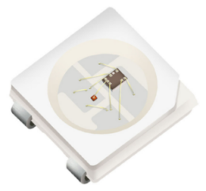
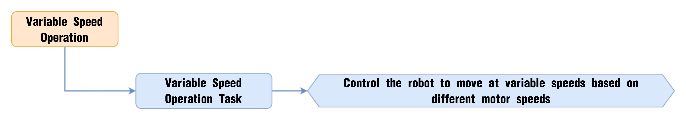
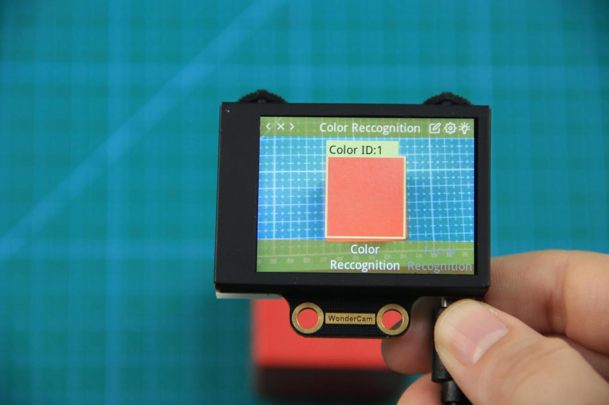
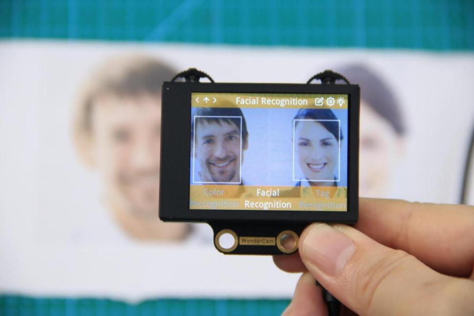
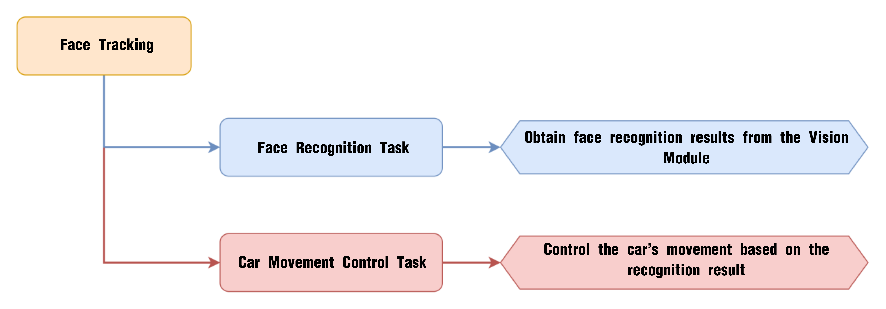
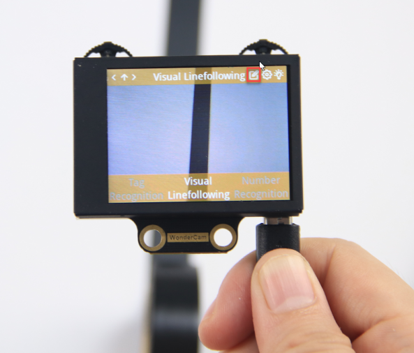

# 8. Arduino Extension Course

## 8.1 Program Editor Installation

### 8.1.1 Installation and Interface Overview of the Arduino IDE

:::{Note}

Installation instructions for Mac can be found in the corresponding section of this guide.

:::

* **Installation**

The Arduino IDE is a powerful software platform specifically designed for use with Arduino microcontroller. The installation process is consistent across different versions. The following instructions use the Windows version of Arduino IDE 2.2.1 as an example.

(1) Locate the Arduino IDE installation package provided in the same directory as this document. Double-click the installer to begin. To download the latest version of the software, visit the official Arduino website: [**<u>https://www.arduino.cc/en/software</u>**](https://www.arduino.cc/en/software)


(2) Click **" I Agree"** to accept the license agreement to proceed with the installation.


(3) Use the default selected options and click **"Next"** to continue.


(4) Choose the desired installation path by clicking **"Browse",** then click **"Install"** to begin installation.


(5) Wait for the installation process to complete.


:::{Note}

If prompted to install USB drivers during the installation, select "**Always trust software from Arduino LLC"** and click "**Install**".

:::

(6) Once installation is complete, click **"Finish"** to exit the installer.


* **Interface Overview**

(1) The main interface of the Arduino IDE is divided into five primary sections:


① Menu Bar provides access to key settings and configuration options for the Arduino IDE.

| Icon                                                         | Function                                                     |
| :----------------------------------------------------------- | :----------------------------------------------------------- |
|  | Create or open projects, and configure interface preferences |
|  | Comment, indent, find/replace text                           |
|  | Configure and compile projects, manage libraries             |
|  | Select controllers and ports, access controller information  |
|  | Access tutorials, troubleshooting resources                  |

② Toolbar contains essential tools for project development, including program compilation, uploading, and serial monitoring.

| Icon                                                         | Function                                                     |
| :----------------------------------------------------------- | :----------------------------------------------------------- |
|  | Verify: Check for errors and compile the code                |
|  | Upload: Upload the program to the Arduino controller         |
|  | Debug: Real-time debugging for supported controllers         |
|  | Select Controller: Select the target controller for the project |
|  | Serial Plotter: Visualize serial data as a graph             |
|  | Serial Monitor: Display data from the serial port            |

③ Editor Area: The primary area for writing and editing code.

④ Status Bar: Displays relevant editor and project information, such as cursor position, controller selection, and other status indicators.

⑤ Sidebar: A key component of the Arduino IDE, providing tools for file management, code debugging, and library installation.

| Icon                                                         | Function                                            |
| :----------------------------------------------------------- | :-------------------------------------------------- |
|  | Explorer: shows the current project's files         |
|  | Board Manager: add or manage packages of controller |
|  | Library Manager: install or remove code libraries   |
|  | Debug: perform real-time project debugging          |
|  | Search: search or replace code and variables        |

### 8.1.2 Using the Arduino IDE

* **Arduino IDE Interface Configuration**

(1) To switch the interface language to English, navigate to **File \> Preferences**, then locate the Language setting in the pop-up window. Select **"English"** from the list and click **"OK"** to apply the changes.


(2) Additional preferences such as project file location, editor font size, and color theme can also be configured from this menu.


* **Upload Program to the Arduino**

(1) This section demonstrates how to upload a simple program that prints the text **"hiwonder"**. Locate and open the sample sketch file [Demo.ino](../_static/source_code/Arduino_Demo.zip) found in the **_Demo** folder under the same directory as this document.


(2) Connect the Arduino controller to the computer using a USB Type-B cable.


(3) From the **"Select Board"** menu, choose the appropriate controller. For example, when using an ESP32 DEV Module, select it accordingly. The COM port may vary, but you can refer to the "**Device Manager**" on the computer to identify the correct COM number, COM10 is taken as the port in this section.


(4) Click the  button to compile the sketch and check for syntax errors or other issues.


(5) Once compiled successfully, click  button to transfer the program to the Arduino controller.


(6) After uploading, open the Serial Monitor . The text **"hiwonder"** should appear, confirming that the program is running correctly.


* **Importing Libraries**

When external libraries are required by a sketch, two import methods are available: Online Import and Local Import.

(1) Online Import

This method is suitable for importing standard libraries provided by the Arduino platform, such as Servo for controlling servo motors, PID for implementing PID algorithms, FastLED for driving RGB LEDs.

For instance, to install the FastLED library, follow the steps below:

① Click the Library Manager icon  in the left sidebar of the Ardu ino IDE.

② In the search bar, type **"FastLED"**. The library will appear in the search results, and click **"Install"**.


③ A confirmation message will appear upon successful installation.


(2) Local Import

This method is used for importing downloaded or custom library files. Using FastLED as an example:

① Go to **Sketch \> Include Library \> Add .ZIP** Library in the Arduino IDE.


② In the dialog box, locate the [FastLED.zip](../_static/source_code/Arduino_Demo.zip) file, which can be found in:  

[_Demo](../_static/source_code/Arduino_Demo.zip)

Select the file and click **"Open"**.


③ A confirmation message will indicate successful installation.


:::{Note}

If an error occurs during local import, follow the steps below to resolve it by manually placing the library in the appropriate directory:

Using the FastLED library as an example, this issue can be resolved by extracting the library files and placing the extracted folder directly into the libraries directory within the project path. Steps as follows:

- Extract the contents of the FastLED.zip archive.


- Open File \> Preferences in the Arduino IDE.


- Copy the Sketchbook location path shown in the preferences window.


- Paste the path into the file explorer and press Enter to open the directory.


- Move the extracted FastLED folder into the libraries folder within this path.


- Restart the Arduino IDE. The library should now be available and recognized.

:::

## 8.2 AiNova Basic Course

### 8.2.1 RGB Light Blinking

* **Project Process**


* **Module Introduction**



These onboard RGB lights use RGB light bulbs, which allow the three colors—red, green, and blue—to be individually adjusted for brightness. This enables the creation of a colorful, mixed light effect.

* **Program Download**

[RGB Light Blinking Program](../_static/source_code/arduino_basic_course.zip)

(1) This program requires manual import of the **"Adafruit_NeoPixel.h"** library. In the Arduino IDE, locate the icon  in the left sidebar.


(2) Enter **"Adafruit_NeoPixel"** in the search box. Find the corresponding library in the results below and click Install.


(3) Connect the AiNova robot to your computer using a USB data cable.

**For the first-time connection, you need to select the appropriate controller. Please choose ESP32 Dev Module under the board selection menu.**


(4) Once the connection is successful, click the button  in the upper-left corner to upload the program to the device.


* **Project Outcome**

When the program is downloaded, the RGB lights on the AiNova controller will blink sequentially according to the preset flashing mode, then loop the breathing gradual flashing mode continuously.


* **Program Brief Analysis**

Import Arduino libraries and the Adafruit_NeoPixel library to control RGB lights.

{lineno-start=6}

```
#include <Arduino.h>
#include <Adafruit_NeoPixel.h>
```

Create an RGB light control object that controls 6 lights, connects to the ESP32 pin 23, and sets the operating mode to RGB with an 800kHz frequency.

{lineno-start=10}

```
// Create RGB light control object. Parameter 1: number of LEDs; Parameter 2: control pin; Parameter 3: mode (创建RGB灯控制对象　参数1：灯数量  参数2：控制引脚  参数3：模式)
Adafruit_NeoPixel pixels(6, 23, NEO_GRB + NEO_KHZ800);
```

Declare functions to control the RGB lights:

{lineno-start=13}

```
void colorfill(uint32_t color, int wait);
void colorclear(void);
//  Flash one by one (逐一闪烁)
void Flicker_one_by_one(void);
// Light up one by one (逐一亮起)
void Light_up_one_by_one(void);
// Flash all at once (全部闪烁)
void Full_flicker(void);
// Random colors (随机颜色)
void Random_color(void);
// Breathing gradient (呼吸渐变)
void Gradient_ramp(void);
```

(1) colorfill(uint32_t color, int wait)

{lineno-start=64}

```
// Fill strip pixels one by one with a color (用一种颜色一个接一个地填充条形像素)
//  Parameter 1: the set color (参数1：设置的颜色)
// Parameter 2: interval time for each pixel (参数2：设置一个的间隔时间)
void colorfill(uint32_t color, int wait) {
  for(int i=0; i<pixels.numPixels(); i++) { //Process one pixel per loop (每次循环处理一个像素)
    pixels.setPixelColor(i, color);         // Set pixel value (in RAM) (设置像素值 (在RAM里))
    pixels.show();                          
    delay(wait);                    
  }
}
```

This function controls the RGB lights by lighting them up one by one in sequence. It has two parameters, color and wait. The parameter color specifies the color of the light. And the parameter wait is the time interval between lighting adjacent RGB lights.

(2) colorclear(void)

{lineno-start=75}

```
// Turn off RGB lights (关闭RGB灯)
void colorclear(void)
{
  pixels.clear();
  pixels.show();
}
```

This function turns off all RGB lights.

(3) Flicker_one_by_one(void)

{lineno-start=82}

```
// Flash one by one (逐一闪烁)
void Flicker_one_by_one(void)
{
  for(int i = 0; i < pixels.numPixels(); i++)
  {
    pixels.setPixelColor(i, pixels.Color(50,206,250));         //  Set pixel value (in RAM) (设置像素值 (在RAM里))
    pixels.show();                          
    delay(100);
    colorclear();
  }
}
```

This function controls the RGB lights to flicker one by one. Using a for loop, starting from RGB light 0, the setPixelColor() function is called to light up the RGB light, and after 100ms, the light is turned off.

(4) Light_up_one_by_one(void)

{lineno-start=94}

```
// Light up one by one (逐一亮起)
void Light_up_one_by_one(void)
{
  colorclear();
  delay(300);
  colorfill(pixels.Color(50,206,250),300);
}
```

This function controls the RGB lights to light up one by one in sequence. First, it calls colorclear() to turn off all lights, then it calls the colorfill() function to light them up in sequence with a 300ms interval between each light.

(5) Full_flicker(void)

{lineno-start=102}

```
// Flash all at once (全部闪烁)
void Full_flicker(void)
{
  colorfill(pixels.Color(50,206,250),10);
  delay(300);
  colorclear();
}
```

This function controls all RGB lights to flash simultaneously. It first calls the colorfill() function to light up all RGB lights in sequence, each with a 10ms interval. This 10ms is fast enough that they appear to light up almost simultaneously to the human eye. After 300ms, all lights are turned off.

(6) Random_color(void)

{lineno-start=110}

```
// Random colors (随机颜色)
void Random_color(void)
{
  int r = random(1,255);
  int g = random(1,255);
  int b = random(1,255);
  int num = random(0,6);

  pixels.setPixelColor(num, pixels.Color(r,g,b));
  pixels.show();   
  delay(100);
}
```

This function controls a randomly selected RGB light to turn on with a random color. Random values between 1 and 255 are set for the r, g, and b variables, creating a random color. Then, the num variable is set to a random value between 0 and 6, randomly controlling which RGB light will turn on. Finally, the setPixelColor() function is called to light up the selected RGB light with the random color.

(7) Gradient_ramp(void)

{lineno-start=123}

```
// Breathing gradient (呼吸渐变)
void Gradient_ramp(void)
{
  int r = random(1,255);
  int g = random(1,255);
  int b = random(1,255);
  int change_r = 3;
  int change_g = 5;
  int change_b = 7;
  while(1)
  {
    if(r > 245 || r < 10)
    {
      change_r = -change_r;
    }
    if(g > 245 || g < 10)
    {
      change_g = -change_g;
    }
    if(b > 245 || b < 10)
    {
      change_b = -change_b;
    }
    r = change_r + r;
    g = change_g + g;
    b = change_b + b;
    colorfill(pixels.Color(r,g,b),10);
    delay(100);
  }
}
```

This function creates a breathing gradient effect with all RGB lights. First, it generates random values between 1 and 255 for the r, g, and b variables. Three new variables, change_r, change_g, and change_b, are created to control the range of color changes. When any of r, g, or b exceeds 245 or falls below 10, the corresponding color change direction is reversed. This keeps the colors fluctuating between 10 and 245. Finally, the RGB lights are lit up according to the new color values, with a 10ms interval between each lighting.

In the initialization function, the serial communication is first started with a baud rate of 115200. Then, the string "**START**" is printed to the serial monitor. After that, the RGB light control module is initialized, and finally, all RGB lights are turned off.

{lineno-start=27}

```
void setup() {
  // Enable serial port (开启串口)
  Serial.begin(115200);
  // Serial printing (串口打印)
  Serial.println("START");

  //Initialize RGB light control module (RGB灯控制模块初始化)
  pixels.begin();
  // Turn off RGB lights (关掉RGB灯)
  colorclear();

}
```

In the main program, a for loop is used to call the "**flicker one by one**" function 3 times, the "**light up one by one**" function once, the "**full flicker**" function 5 times, the "**random color**" function 50 times, and finally the "**gradient ramp**" function is called.

{lineno-start=40}

```
void loop() {
  for(int i = 0 ; i < 3 ; i++)
  {
    Flicker_one_by_one();
  }
  Light_up_one_by_one();
  colorclear();
  delay(500);
  for(int i = 0 ; i < 5 ; i++)
  {
    Full_flicker();
    delay(300);
  }
  for(int i = 0 ; i < 50 ; i++)
  {
    Random_color();
    delay(100);
  }
  Gradient_ramp();
  colorclear();
  delay(5000);
}
```

* **Feature Extensions**

(1) Modifying the Number of Blinks in a Mode

The default blink counts for each mode in the program are shown in the table below. This section uses changing the blink count of the "**Light one by one**" mode to 4 times as an example.

|     **Mode**     |                       **Blink Count**                        |
| :--------------: | :----------------------------------------------------------: |
| Flash one by one |                              3                               |
| Light one by one |                              1                               |
|    Flash all     |                              5                               |
|   Random color   |                              50                              |
| Flash gradually  | Starts blinking after Random color and continues until stopped. |

① Open the program file named **"Change_RGB"** and locate the part of the code controlling the blink count.


② To make the "**light up one by one**" effect run four times, simply add a for loop that executes it four times.


### 8.2.2 Straight-Line Movement

* **Project Process**


* **Module Introduction**


The encoder motor is a DC gear motor equipped with a Hall encoder. The encoder can detect both the speed and rotation direction of the motor, allowing for precise movement control.

* **Program Download**

[Straight-Line Movement Program](../_static/source_code/arduino_basic_course.zip)

(1) Connect the AiNova robot to your computer using a USB data cable.

**For the first-time connection, you need to select the appropriate controller. Please choose ESP32 Dev Module under the board selection menu.**


(2) Once the connection is successful, click the button  in the upper-left corner to upload the program to the device.


* **Project Outcome**

When powered on, the AiNova robot will continuously drive forward, executing right-angle turns in a loop.


* **Program Brief Analysis**

Import Arduino libraries and the Adafruit_NeoPixel library to control RGB lights.

{lineno-start=6}

```
#include <Arduino.h>
#include "robotrun.h"
```

Create a low-level control module object to control the motor's rotation. Then, define two motor speed variables and set their values to 50.

{lineno-start=9}

```
// Create low-level control module object （创建底层控制模块对象）
robotrun rb;
// Define speed variable （定义速度变量）
int speed = 30;
```

In the initialization program, open the serial port and set the baud rate to 115200. After initialization, print the "**START**" string to the serial monitor. Initialize the low-level control object and set the motor type to TT motor.

{lineno-start=14}

```
void setup() {
  // Enable serial communication （开启串口）
  Serial.begin(115200);
  // Serial print （串口打印）
  Serial.println("START");
  // Initialize low-level system （底层初始化）
  rb.begin();
  // Set motor type to TT motor （设置电机类型为TT电机）
  rb.hw_encoder_motor_set_motor_type(1);
}
```

In the main loop, call the hw_encoder_motor_set_speed_base() function to control both motors. This function has two parameters. The first parameter controls motor 1, and the second controls motor 2. If the parameters are positive, the corresponding motor rotates forward. The larger the absolute value, the faster it rotates. If the parameters are negative, the corresponding motor rotates in reverse. The larger the absolute value, the faster it rotates.

{lineno-start=25}

```
void loop() {
  // Set encoder motor speed （设置编码器电机转速）
  rb.hw_encoder_motor_set_speed_base(speed,speed);
  // Delay （延时
  delay(1000);
}
```

* **Feature Extensions**

If you want the AiNova robot to move faster or slower, you can modify the program as follows:

(1) Acceleration: To make the robot accelerate, simply increase the motor speed value. The default motor speed is 50 RPM, but here we will increase it to 70 RPM. As shown below:


(2) Deceleration: To make the robot decelerate, simply decrease the motor speed value. The default motor speed is 50 RPM, but here we will decrease it to 30 RPM. As shown below:


### 8.2.3 Right-Angle Turn

* **Project Process**


* **Module Introduction**


The encoder motor is a DC gear motor equipped with a Hall encoder. The encoder can detect both the speed and rotation direction of the motor, allowing for precise movement control.

* **Program Download**

[Right-Angle Turn Program](../_static/source_code/arduino_basic_course.zip)

(1) Connect the AiNova robot to your computer using a USB data cable.

**For the first-time connection, you need to select the appropriate controller. Please choose ESP32 Dev Module under the board selection menu.**


(2) Once the connection is successful, click the button  in the upper-left corner to upload the program to the device.


* **Project Outcome**

The AiNova robot will first move straight forward, then make a right turn, and repeat this cycle continuously.


* **Program Brief Analysis**

Import Arduino libraries and the robotrun library to control motors.

{lineno-start=6}

```
#include <Arduino.h>
#include "WonderCam.h"
#include "robotrun.h"
```

Create a low-level control module object to control the motor's rotation. Then, define two motor speed variables and set their values to 50.

{lineno-start=11}

```
// reate base control module object（创建底层控制模块对象）
robotrun rb;

// Define speed variable（定义速度变量）
int speed = 50;
```

In the initialization program, open the serial port and set the baud rate to 115200. After initialization, print the "**START**" string to the serial monitor. Initialize the low-level control object and set the motor type to TT motor.

{lineno-start=17}

```
void setup() {
  //Open serial port（开启串口）
  Serial.begin(115200);
  // Serial print（串口打印）
  Serial.println("START");
  // Base initialization（底层初始化）
  rb.begin();
  // Set motor type to TT motor（设置电机类型为 TT 电机）
  rb.hw_encoder_motor_set_motor_type(1);
  // Stop（停止）
  rb.hw_encoder_motor_set_speed_base(0,0);
  delay(2000);// Delay（延时）
}
```

In the main loop, call the `hw_encoder_motor_set_speed_base()` function to control both motors. This function has two parameters. The first parameter controls motor 1, and the second controls motor 2. If the parameters are positive, the corresponding motor rotates forward. The larger the absolute value, the faster it rotates. If the parameters are negative, the corresponding motor rotates in reverse. The larger the absolute value, the faster it rotates. By rotating the left and right wheels in opposite directions, the robot can make a turn.

{lineno-start=32}

```
void loop() {
  // Move forward（直行）
  rb.hw_encoder_motor_set_speed_base(speed,speed);
  delay(1000);// Delay（延时）
  // Stop（停止）
  rb.hw_encoder_motor_set_speed_base(0,0);
  delay(100);// Delay（延时）
  // Turn left（左转弯）
  rb.hw_encoder_motor_set_speed_base(-speed,speed);
  delay(470);// Delay（延时）
  // Stop（停止）
  rb.hw_encoder_motor_set_speed_base(0,0);
  delay(100);// Delay（延时）
}
```

* **Feature Extensions**

If you want the AiNova robot to turn left, you can modify the program as follows:

Find the section of the code that controls the robot's turning and swap the speeds of the left and right motors. By setting the left motor to move backward and the right motor to move forward, the robot will turn left.


### 8.2.4 Variable Speed Operation

* **Project Process**



* **Module Introduction**


The encoder motor is a DC gear motor equipped with a Hall encoder. The encoder can detect both the speed and rotation direction of the motor, allowing for precise movement control.

* **Program Download**

[Variable Speed Operation Program](../_static/source_code/arduino_basic_course.zip)

(1) Connect the AiNova robot to your computer using a USB data cable.

**For the first-time connection, you need to select the appropriate controller. Please choose ESP32 Dev Module under the board selection menu.**


(2) Once the connection is successful, click the button  in the upper-left corner to upload the program to the device.


* **Project Outcome**

Place the AiNova robot on a flat, open surface. After turning on the power, AiNova will first accelerate as it moves straight ahead, then gradually slow down while continuing to move forward.


* **Program Brief Analysis**

(1) Import Arduino libraries and the motor control library.

{lineno-start=6}

```
#include <Arduino.h>
#include "robotrun.h"
```

(2) Create a low-level control module object to control the motor's rotation. Then define two motor speed variables and a speed change value, setting the initial values to 50 and 3, respectively.

{lineno-start=9}

```
// Create low-level control module object （创建底层控制模块对象）
robotrun rb;

// Define speed variable （定义速度变量）
int speed = 50;
// Define speed change value （定义速度改变值）
int var = 3;
```

(3) In the initialization program, open the serial port and set the baud rate to 115200. After initialization, print the **"START"** string to the serial monitor. Initialize the low-level control object and set the motor type to TT motor. Finally, stop the motors.

{lineno-start=17}

```
void setup() {
  // Open serial port （开启串口）
  Serial.begin(115200);
  // Serial print （串口打印）
  Serial.println("START");
  // Initialize low-level control （底层初始化）
  rb.begin();
  // Set motor type to TT motor （设置电机类型为TT电机）
  rb.hw_encoder_motor_set_motor_type(1);
  // Stop （停止）
  rb.hw_encoder_motor_set_speed_base(0,0);
  delay(2000);// Delay （延时）
}
```

(4) In the loop, change the motor speed to **"current speed + speed change value"**. When the speed reaches 120 or drops to 20, reverse the speed change value. This ensures that the robot gradually accelerates and then gradually decelerates.

{lineno-start=31}

```
void loop() {
  // When reaching the speed threshold value （当为速度临界值时）
  if(speed >= 120 || speed <= 20)
  {
    //Change the direction of speed variation （变换速度改变方向）
    var = -var;
  }
  speed = speed + var;
  //Move forward （直行）
  rb.hw_encoder_motor_set_speed_base(speed,speed);
  delay(100);// Delay （延时）
}
```

* **Feature Extensions**

(1) Setting Speed Adjustment Range

① Open the program file for variable speed operation, "**Variable_Motion**", then locate the block of instructions outlined below:


② The parameter 20 represents the minimum speed value, and 120 represents the maximum value. To modify the speed range, simply change these two values. After modification:


(2) Modifying Initial Speed

The program sets the initial speed to 50. Here, we will modify it to 60 as an example:

① Open the program file **"Variable_Motion",** then locate the following block of instructions outlined below:


② Simply replace the **"50"** with **"60"**.


### 8.2.5 Sound Control

* **Project Process**


* **Module Introduction**


The onboard sound sensor is designed to detect the level of external sound. It can read the sound level by using the ADC pin to get the pin value. The main working principle is that sound vibrations at the microphone's sensor cause the diaphragm inside the microphone to vibrate. These vibrations lead to changes in capacitance, which then generate a small voltage corresponding to these changes. This voltage is then converted into an electrical signal output.

* **Program Download**

[ Sound Control Program](../_static/source_code/arduino_basic_course.zip)

(1) Connect the AiNova robot to your computer using a USB data cable.

**For the first-time connection, you need to select the appropriate controller. Please choose ESP32 Dev Module under the board selection menu.**


(2) Once the connection is successful, click the button  in the upper-left corner to upload the program to the device.


* **Project Outcome**

When you clap once near the main controller, the AiNova robot will detect the sound and start moving straight forward. If you clap twice quickly, the robot will perform a U-turn.


* **Program Brief Analysis**

(1) Import Arduino libraries, the motor control library, and the buzzer control library.

{lineno-start=6}

```
#include <Arduino.h>
#include "robotrun.h"
#include "buzzer_music.h"
```

(2) Declare the pins for the sound sensor and buzzer.

{lineno-start=10}

```
#define sound_pin 34
#define buzzer_pin 15
```

(3) Create a base control module object for controlling the movement of the robot. Create a buzzer control object for sound generation.

{lineno-start=14}

```
// Create low-level control module object （创建底层控制模块对象）
robotrun rb;
// Buzzer control object （蜂鸣器控制对象）
buzzer_music buzzer_m(buzzer_pin);

//Speed variable （速度变量）
int speed = 50;
```

(4) In the initialization function, the serial port is opened and the baud rate is set to 115200. Then, the low-level control object is initialized, and the motor type is set to TT motor. Finally print the string "**START**" on the serial monitor.

{lineno-start=23}

```
void setup() {
  // Open serial port （开启串口）
  Serial.begin(115200);
  // Set sound pin mode （设置声音引脚模式）
  pinMode(sound_pin, INPUT);
  // Initialize low-level control （底层初始化）
  rb.begin();
  //Set motor type to TT motor （设置电机类型为TT电机）
  rb.hw_encoder_motor_set_motor_type(1);
  // Serial print （串口打印）
  Serial.println("START");
}

```

(5) Within the loop, a variable is created to count the number of sound events, and another is defined to store the analog value from the sound sensor. If the analog value is greater than 320, it is considered a valid sound event. The count is increased by 1, and the system waits 70 ms before checking for a second sound.

While waiting for the second sound, a for loop is used with a 5 ms delay for each iteration. The loop runs 200 times, so within 1 second after the first sound, if the sound analog value exceeds 320 again, the sound count is incremented.

{lineno-start=37}

```
void loop() {
  // Define sound count （定义声音次数）
  int sound_num = 0;
  // Get sound analog value （获取声音模拟量）
  int val = analogRead(sound_pin);

  // If the analog value is greater than 320, it is considered a sound detected （当模拟量大于320时，认为有响声）
  if(val > 320)
  {
    sound_num = 1;
    delay(70);
    // Wait for the second sound （等待第二次响声）
    for(int i = 0;i <= 200 ; i++)
    {
      val = analogRead(sound_pin);
      if(val > 320)
      {
        sound_num = 2;
      }
      delay(5);
    }
  }
```

(6) Finally, the number of detected sounds is used to control the buzzer and the robot's movement.

If only 1 sound is detected: the buzzer beeps once, and the robot moves forward for 2 seconds, then stops.

{lineno-start=60}

```
  // If one sound is detected （若有一次响声）
  if(sound_num == 1)
  {
    // Buzzer beeps once （蜂鸣器鸣响1声）
    buzzer_m.playTone(1397,125);
    delay(200);
    // Move forward （直走）
    rb.hw_encoder_motor_set_speed_base(speed,speed);
    delay(2000);
    // Stop （停止）
    rb.hw_encoder_motor_set_speed_base(0,0);
    delay(500);
```

If 2 sounds are detected: the buzzer beeps twice, and the robot turns right for 950 milliseconds, then stops.

{lineno-start=72}

```
  }else if(sound_num == 2) // Buzzer beeps twice （蜂鸣器鸣响2声）
  {
    // Buzzer beeps （蜂鸣器鸣响）
    buzzer_m.playTone(1397,125);
    delay(200);
    // Buzzer beeps （蜂鸣器鸣响）
    buzzer_m.playTone(1397,125);
    delay(200);
    //U-turn （掉头）
    rb.hw_encoder_motor_set_speed_base(speed,-speed);
    delay(950);
    // Stop （停止）
    rb.hw_encoder_motor_set_speed_base(0,0);
    delay(500);
  }else{
    
  }
  // Delay （延时）
  delay(2);
}
```

### 8.2.6 Intelligent Line Following

* **Project Process**


* **Module Introduction**

The four-channel line-following sensor has four probes. Each probe consists of an infrared (IR) emitter and an IR receiver. Because white surfaces strongly reflect infrared light and black surfaces reflect it weakly, this module can detect black and white colors effectively. It features fast detection speed and good adaptability, making it ideal for line-following in intelligent cars or robots, including complex track patterns.


* **Program Download**

[Intelligent Line Following Program](../_static/source_code/arduino_basic_course.zip)

(1) Connect the AiNova robot to your computer using a USB data cable.

**For the first-time connection, you need to select the appropriate controller. Please choose ESP32 Dev Module under the board selection menu.**


(2) Once the connection is successful, click the button  in the upper-left corner to upload the program to the device.


* **Project Outcome**

Place the AiNova robot on the included line-following map. Turn on the power, and the AiNova robot will follow the black line on the track.


* **Program Brief Analysis**

(1) Import Arduino libraries, the motor control library, and the buzzer control library.

{lineno-start=6}

```
#include <Arduino.h>
#include <Adafruit_NeoPixel.h>
#include <Wire.h>
#include "robotrun.h"
```

(2) Define 4 functions via macros to parse the data returned by the line-following sensors, and also define the sensor's I2C address for communication and data acquisition.

{lineno-start=11}

```
#define CH1_Data(x)  (x & 0x01)
#define CH2_Data(x)  ((x>>1) & 0x01)
#define CH3_Data(x)  ((x>>2) & 0x01)
#define CH4_Data(x)  ((x>>3) & 0x01)


// Four-channel line sensor IIC address （四路巡线传感器IIC地址）
#define LINE_FOLLOWER_I2C_ADDR    0x78
```

(3) Create an RGB light control object, set the number of RGB lights, bind the pins, and set the control mode. Create a base control module object for controlling the movement of the robot. Create a variable data to store the received sensor data.

{lineno-start=20}

```
// Create RGB light control object, parameter 1: number of lights, parameter 2: control pin, parameter 3: mode （创建RGB灯控制对象　　参数1：灯数量 参数2：控制引脚 参数3：模式）
Adafruit_NeoPixel pixels(6, 23, NEO_GRB + NEO_KHZ800);
// Low-level control object （底层控制对象）
robotrun rb;

// Line sensor data storage variable （巡线传感器存储变量）
uint8_t data;
```

(4) In the initialization program, open the serial port and set the baud rate to 115200, initialize the RGB lights, and turn off the RGB lights after initialization. Initialize the I2C communication, initialize the bottom-level control object, set the motor type to TT motor, and control the motor to move forward at 40 RPM. Finally, print the string "**START**" to the serial port.

{lineno-start=35}

```
void setup() {
  // Open serial port （开启串口）
  Serial.begin(115200);
  // Initialize RGB light control module （RGB灯控制模块初始化）
  pixels.begin();
  // Turn off RGB light （关掉RGB灯）
  colorclear();
  // Initialize IIC （IIC初始化）
  Wire.begin();
  // Initialize low-level control object （底层对象初始化）
  rb.begin();
  // Set to TT encoder motor （设置为TT编码器电机）
  rb.hw_encoder_motor_set_motor_type(1);
  // Move forward （直行）
  rb.hw_encoder_motor_set_speed_base(40,40);

  // Serial print （串口打印）
  Serial.println("START");
}
```

(5) In the main function, use the WireReadDataByte() function to get the data from the four line-following sensors and store it in the data variable. Parse the data from the four sensor probes using the CH1_Data(), CH2_Data(), CH3_Data(), and CH4_Data() functions. If a line is detected, the corresponding sensor data is set to 1; otherwise, it remains 0. Based on the parsed data, call the rb.hw_encoder_motor_set_speed_base() function to control the robot's movement.

{lineno-start=56}

```
void loop() {
  //Get sensor values （获取传感器数值）
  WireReadDataByte(1,data);
  
  // If the line is in the center （若线在中间）
  if(!CH1_Data(data) & CH2_Data(data) & CH3_Data(data) & !CH4_Data(data))
  {
    // Go straight （直走）
    rb.hw_encoder_motor_set_speed_base(40,40);
  }else if(!CH1_Data(data) & CH2_Data(data) & !CH3_Data(data) & !CH4_Data(data)) //If the line is to the left （若线偏左）
  {
    // Turn left （左转）
    rb.hw_encoder_motor_set_speed_base(6,40);
  }else if(!CH1_Data(data) & !CH2_Data(data) & CH3_Data(data) & !CH4_Data(data)) //If the line is to the right （若线偏右）
  {
    // Turn right （右转）
    rb.hw_encoder_motor_set_speed_base(40,6);
  }
  // Delay （延时）
  delay(10);
}
```

### 8.2.7 Distance Measurement and Alarm

* **Project Process**


* **Glowy Ultrasonic Module**


This is a glowy ultrasonic distance measurement module that uses an industrial-grade ultrasonic chip. The chip integrates the ultrasonic transmission circuit, reception circuit, and digital processing circuit all in one. This module uses an IIC communication interface and can read distance measurements from the ultrasonic sensor via IIC.

* **Program Download**

[Distance Measurement and Alarm Program](../_static/source_code/arduino_basic_course.zip)

(1) This program requires manual import of the **"Adafruit_NeoPixel.h"** library. In the Arduino IDE, locate the icon  in the left sidebar.


(2) Enter **"Adafruit_NeoPixel"** in the search box. Find the corresponding library in the results below and click Install.


(3) Connect the AiNova robot to your computer using a USB data cable.

**For the first-time connection, you need to select the appropriate controller. Please choose ESP32 Dev Module under the board selection menu.**


(4) Once the connection is successful, click the button  in the upper-left corner to upload the program to the device.


* **Project Outcome**

Place the robot on a flat surface and power it on. Place a small box in front of the ultrasonic sensor. When the sensor detects an object within the preset distance, the RGB light above the main controller will turn red, and the buzzer will sound an alert.


* **Program Brief Analysis**

(1) Import the necessary libraries for this program, including Arduino libraries, RGB light control library, buzzer library, and ultrasonic module library.

{lineno-start=6}

```
#include <Arduino.h>
#include <Adafruit_NeoPixel.h>
#include "buzzer_music.h"
#include "Ultrasound.h"
```

(2) Declare the buzzer's pin as pin 15, then create the RGB light control object, buzzer control object, and instantiate the ultrasonic object.

{lineno-start=11}

```
// Buzzer Pin （蜂鸣器引脚）
#define buzzer_pin 15

//Create RGB light control object — parameter 1: number of lights, parameter 2: control pin, parameter 3: mode （创建RGB灯控制对象　　参数1：灯数量 参数2：控制引脚 参数3：模式）
Adafruit_NeoPixel pixels(6, 23, NEO_GRB + NEO_KHZ800);
// Buzzer control object （蜂鸣器控制对象）
buzzer_music buzzer_m(buzzer_pin);
// Instantiate ultrasonic object （实例化超声波对象）
Ultrasound ultrasound;  
```

(3) In the initialization program, open the serial port and set the baud rate to 115200. After initialization, print the "**START**" string to the serial monitor. Initialize the RGB light control module and turn off all the RGB lights.

{lineno-start=24}

```
void setup() {
  // Open serial port （开启串口）
  Serial.begin(115200);
  // Serial print （串口打印）
  Serial.println("START");
  // Initialize RGB light control module （RGB灯控制模块初始化）
  pixels.begin();
  // Turn off RGB lights （关掉RGB灯）
  colorclear();
}
```

(4) The Filter() function is a filter that helps the ultrasonic module block some interference during the detection process, improving the accuracy of distance measurement. Get the detection distance of the ultrasonic sensor using the filter and store it in the distance variable. Then print the detected distance to the serial port.

{lineno-start=36}

```
void loop() {

  // Get filter output value （获得滤波器输出值）
  int distance = Filter();         

  // Print distance （打印距离）
  Serial.print("dis:");
  Serial.println(distance);
```

(5) Based on the detected distance, when the distance is between 0 and 100, it is in the warning range. In the warning range, if the distance is greater than 30, make the buzzer emit a short warning beep. Calculate the value distance\*2-20 and use it to control the color of the ultrasonic light and the CoreX onboard light to be green and blue, respectively, then make the buzzer beep. The delay time is calculated as 25 + (distance-29)\*6, so the farther the obstacle, the longer the delay.

{lineno-start=45}

```
  // When distance is within warning range （当距离处于警告范围内）
  if(distance > 0 && distance < 100)
  {
    // When greater than 30mm, short buzzer warning （当大于30mm，则短鸣警告）
    if(distance > 30)
    {
      // Calculate change value （计算变化值）
      uint8_t i = round(distance*2-20);
      Serial.print("i:");
      Serial.println(i);
      // Set ultrasonic color （设置超声波颜色）
      ultrasound.Color(100,i,i,100,i,i);
      // Fill color （填充颜色）
      colorfill(pixels.Color(100,round(distance*2-20),round(distance*2-20)),10);
      // Buzzer beeps （蜂鸣器鸣响）
      buzzer_m.playTone(1319,125);
      // Delay time related to distance （延时时间与距离有关）
      delay(25+(distance-29)*6);
```

(6) When the distance is less than or equal to 30, turn the onboard RGB light on the controller to red, and then make the buzzer emit a continuous tone. The playTone() function has two parameters: the first controls the tone of the buzzer, and the second controls the duration of the beep.

{lineno-start=64}

```
    }else{

      // Fill color （填充颜色）
      colorfill(pixels.Color(200,0,0),10);
      // Buzzer long beep （蜂鸣器长鸣）
      buzzer_m.playTone(1319,1000);
      delay(1000);
    }
```

(7) When the detected obstacle distance is greater than 100, set both the onboard RGB light on the controller and the ultrasonic light to white.

{lineno-start=72}

```
  }else{
    // Fill color （填充颜色）
    colorfill(pixels.Color(100,100,100),10);
    // Ultrasonic set color （超声波设置颜色）
    ultrasound.Color(100,100,100,100,100,100);
  }
  // Delay （延时）
  delay(100);
}
```

### 8.2.8 Maze Navigation

* **Project Process**


* **Glowy Ultrasonic Module**


This is a glowy ultrasonic distance measurement module that uses an industrial-grade ultrasonic chip. The chip integrates the ultrasonic transmission circuit, reception circuit, and digital processing circuit all in one. This module uses an IIC communication interface and can read distance measurements from the ultrasonic sensor via IIC.

* **Program Download**

[Maze Navigation Program](../_static/source_code/arduino_basic_course.zip)

(1) Connect the AiNova robot to your computer using a USB data cable.

**For the first-time connection, you need to select the appropriate controller. Please choose ESP32 Dev Module under the board selection menu.**


(2) Once the connection is successful, click the button  in the upper-left corner to upload the program to the device.


* **Project Outcome**

Place the robot on a flat surface and power it on. Place a small box in front of the ultrasonic sensor. When an obstacle is detected within 20 cm, the robot will turn right to avoid it, then continue moving forward.


* **Program Brief Analysis**

(1) Import the necessary libraries for this program, including the Arduino library, ultrasonic module library, and motor control library.

{lineno-start=6}

```
#include <Arduino.h>
#include "Ultrasound.h"
#include "robotrun.h"
```

(2) Instantiate the ultrasonic object and the motor control object, and create a variable to set the default motor speed to 40.

{lineno-start=10}

```
// Instantiate ultrasonic object （实例化超声波对象）
Ultrasound ultrasound;  
// Low-level control object （底层控制对象）
robotrun rb;

// Speed variable （速度变量）
int speed = 40;
```

(3) In the initialization program, open the serial port and set the baud rate to 115200. Initialize the base control object, set the motor type to TT motor, and after completing the initialization, print the string **"START"** to the serial port.

{lineno-start=21}

```
void setup() {
  // Open serial port （开启串口）
  Serial.begin(115200);
  // Initialize low-level control （底层控制初始化）
  rb.begin();
  // Set encoder motor （设置编码器电机）
  rb.hw_encoder_motor_set_motor_type(1);

  // Serial print （串口打印）
  Serial.println("START");
}
```

(4) The `Filter()` function is a filter that helps the ultrasonic module block some interference during the detection process, improving the accuracy of distance measurement. Get the detection distance of the ultrasonic sensor using the filter and store it in the distance variable. Then print the detected distance to the serial port.

{lineno-start=34}

```
void loop() {

  // Get filter output value （获得滤波器输出值）
  int distance = Filter();         

  // Print distance （打印距离）
  Serial.print("dis:");
  Serial.println(distance);
```

(5) Based on the detected distance, when the distance is between 0 and 200, it is in the warning range. Within the warning range, the car will turn right. After a 470ms delay, the car will turn approximately 45° to the right and then stop. Otherwise, outside the warning range, the car will move straight forward.

{lineno-start=43}

```
  // When distance is within warning range （当距离处于警告范围内）
  if(distance > 0 && distance < 200)
  {
    // Turn right （右转）
    rb.hw_encoder_motor_set_speed_base(speed,-speed);
    delay(470);
    // Stop （停止）
    rb.hw_encoder_motor_set_speed_base(0,0);
    delay(100);
  }else{
    // Move forward （直走）
    rb.hw_encoder_motor_set_speed_base(speed,speed);
  }
  // Delay （延时）
  delay(50);
}
```

## 8.3 AI Vision Lesson

### 8.3.1 WonderCam AI Vision Module Introduction

* **Introduction**

The WonderCam is a user-friendly AI vision sensor, equipped with 8 built-in functions, including color recognition, face recognition, label classification, visual line tracking, digit recognition, traffic sign recognition, image classification, and feature learning.

It eliminates the need for complicated training processes and visual algorithms — with just one click, you can complete AI training and bring your AI vision projects to life effortlessly.


* **Interface Diagram** 


**IIC Port Description：**


**IIC Connectors Specification**

<table  class="docutils-nobg" border="1">
  <thead>
    <tr>
      <th align="center" width="33%">No.</th>
      <th align="center"  width="33%">Name</th>
      <th align="center" width="33%">Function</th>
    </tr>
  </thead>
  <tbody>
    <tr>
      <td align="center">1</td>
      <td align="center">SCL</td>
      <td align="center">I2C Clock Line</td>
    </tr>
    <tr>
      <td align="center">2</td>
      <td align="center">SDA</td>
      <td align="center">I2C Data Line</td>
    </tr>
    <tr>
      <td align="center">3</td>
      <td align="center">GND</td>
      <td align="center">Power Ground</td>
    </tr>
    <tr>
      <td align="center">4</td>
      <td align="center">5V</td>
      <td align="center">Power Positive (5V)</td>
    </tr>
  </tbody>
</table>

### 8.3.2 Color Recognition Introduction

* **Introduction**

This feature can recognize multiple colored objects in the image and highlight them on the display. Through the IIC interface, you can obtain data such as the position and size of different colored blocks in the image, enabling color recognition and tracking in various scenarios and expanding a wide range of application possibilities. 

* **WonderCam Vision Module**

Please carefully read and follow the following precautions. Otherwise, the performance of this feature may be affected! 

(1)  Use bright and high saturated color. Example red, green or blue. Targeted object color and its background must be distinctive. Example if target object is Yellow, avoid yellow background. 

(2)  Do not learn White color or Composite color. Ensure environment is bright enough or use Fill Light on WonderCam when required.

(3) Adjusting light condition and the focus angle can help to stabilize and improve the color recognition process in the white frame within the display panel.

* **Color Recognition Operations**

(1) Enter Function

Push the Navigation Lever to the right until the 'Color Recognition' menu bar appears at the top of the screen. 

(2) Learning and recognizing new color

First, learn the color you want to recognize by following these steps: 

Step 1: On the main color recognition interface, push the Function Lever with the pen icon to the left to enter the learning screen. 


Step 2:Once inside, a + sign will appear at the center of the screen, and the menu bar will list various color IDs such as "**Color ID:1**", "**Color ID:2**", etc., which are used to identify and save different color data. 

Step 3: Aim the + sign at the color block you want to learn. The selected block will be highlighted with a white frame that dynamically adjusts based on the + sign position, identifying the nearest color region. 


Reminder:

(1) Use bright and high saturated color. Example red, green or blue.

(2) Targeted object color and its background must be distinctive. Example if target object is Yellow, avoid yellow background.

(3) Do not Learn White color or Composite color. Ensure lighting condition is bright enough or use Fill Light on WonderCam when required.

(4) Adjusting light condition and the focus angle can help to stabilize and improve the color recognition process in the white frame within the display panel.

Step 4: Press down on the Camera icon on the Function Lever to start the learning process on the WonderCam Vision Module. Wait briefly, and you will receive a notification of the learning result. If learning fails, it might be due to poor lighting conditions or insufficient color vibrancy. In this case, adjust the lighting or use a more vivid color, and make sure the white frame remains steady without flickering before trying again. 


Step 5: Once learning is successful, whenever the WonderCam Vision Module detects the learned color in the scene, it will immediately highlight the largest matching object and display the corresponding color ID on the interface. 



(3) Delete Color

If a certain color ID is no longer needed, you can easily delete it. Enter the color recognition learning interface, use the Navigation Lever to select the color ID you want to delete, and press the Trash Bin button on the Function Lever to delete the selected color ID. 

(4) Color Recognition Function Settings

To access the parameter settings for color recognition, go to the Color Recognition main menu and press the Function Lever down on the gear icon. This will open the settings interface.


The color recognition parameters include Color Range and Reset Parameters.
Color Range: This controls the recognition range when learning a color. Adjusting this setting appropriately can help accurately recognize the target color and avoid selecting irrelevant areas.
A suitable value is usually 20, which typically provides ideal recognition performance in most cases. If the value is set too high, the white frame during learning might cover the entire screen. If the value is set too low, it might only surround part of the target color, affecting the recognition accuracy.
It is important to note that the color range used during the learning process is saved with the learned color ID. The new Color Range setting will not affect previously learned color IDs. To adjust the recognition range for an already learned color ID, you will need to re-learn it.
Reset Parameters: This option resets the color recognition parameters to their factory defaults.

 **Please note that after resetting, you must save the new settings before exiting the settings interface. If not saved, the parameters will not be retained after resetting.**

### 8.3.3 Color Recognition

* **Project Process**


* **WonderCam Vision Module**


WonderCam is a user-friendly AI vision sensor with multiple built-in features, including color detection, face recognition, label recognition, line tracking, digit recognition, traffic sign recognition, image classification, and feature learning. It is compatible with various controllers such as ESP32, micro:bit, Arduino, and Raspberry Pi, making it easy to bring your AI vision projects to life.

* **Program Download**

[Color Recognition Program](../_static/source_code/arduino_ai_vision_lesson.zip)

(1) This program requires manual import of the "**Adafruit_NeoPixel.h**" library. In the Arduino IDE, locate the icon  in the left sidebar.


(2) Enter "**Adafruit_NeoPixel**" in the search box. Find the corresponding library in the results below and click Install.


(3) Connect the AiNova robot to your computer using a USB data cable.

**For the first-time connection, you need to select the appropriate controller. Please choose ESP32 Dev Module under the board selection menu.**


(4) Once the connection is successful, click the button  in the upper-left corner to upload the program to the device.


* **Project Outcome**

We have pre-trained the WonderCam to recognize red, green, and blue colors and assigned them to Color IDs 1, 2, and 3, respectively. When the red color is detected, the onboard RGB light on the main controller turns red. It turns green when green is detected, and blue when blue is detected.

* **Program Brief Analysis**

(1) Import the necessary libraries for this program, including the Arduino library, the WonderCam communication library, and the RGB LED control library.

{lineno-start=6}

```
#include <Arduino.h>
#include "WonderCam.h"
#include <Adafruit_NeoPixel.h>
```

(2) Create the receiver object for the WonderCam vision module and the control object for the RGB LEDs.

{lineno-start=10}

```
// Create WonderCam module receiving object （创建小幻熊模块接收对象）
WonderCam wc;
// Create RGB light control object: parameter 1 – number of lights, parameter 2 – control pin, parameter 3 – mode （创建RGB灯控制对象　参数1：灯数量 参数2：控制引脚 参数3：模式）
Adafruit_NeoPixel pixels(6, 23, NEO_GRB + NEO_KHZ800);
```

(3) Declare the functions to turn on the RGB LEDs and turn them off. The colorfill() function will light up the RGB LEDs in sequence, and the colorclear() function will turn off all LEDs.

{lineno-start=15}

```
void colorfill(uint32_t color, int wait);
void colorclear(void);
```

(4) In the initialization program, open the serial port and set the baud rate to 115200, initialize the WonderCam vision module, and set the receiving function of the WonderCam vision module to color recognition.

{lineno-start=18}

```
void setup() {
  // Open serial port （开启串口）
  Serial.begin(115200);
  // Initialize WonderCam module （初始化小幻熊模块）
  wc.begin();
  // Serial print （串口打印）
  Serial.println("START");
  // Set received function ID （设置接收的功能号）
  wc.changeFunc(APPLICATION_COLORDETECT);
```

Next, initialize the RGB LED control module, set all LEDs to red, and turn off all LEDs after a 1-second delay. This creates the effect of all LEDs light up once.

{lineno-start=28}

```
  // Initialize RGB light control module （RGB灯控制模块初始化）
  pixels.begin();
  // Fill with red color （填充红色）
  colorfill(pixels.Color(255,0,0),50);
  // Delay （延时）
  delay(1000);
  // Turn off RGB light （关掉RGB灯）
  colorclear();
}
```

(5) In the loop, first update and get the data from the WonderCam vision module. When a color is detected, use a for loop to check the recognized color's ID.

{lineno-start=38}

```
void loop() {
  // Update received WonderCam module information （更新接收小幻熊模块的信息）
  wc.updateResult();
  // If information is received （若接收到信息）
  if (wc.anyColorDetected()) {
    for (int i = 1; i < 4; ++i) {
      // When color exists in the i-th label （当i标签的颜色存在时）
      if (wc.colorIdDetected(i)) {
```

① When color ID1 is detected, set all RGB LEDs to red and print the string "**red**" to the serial port.

{lineno-start=46}

```
        switch (i) {
          case 1:
            // Fill with red color （填充红色）
            colorfill(pixels.Color(255,0,0),10);
            Serial.println("red");
            return;
```

② When color ID2 is detected, set all RGB LEDs to green and print the string "**green**" to the serial port.

{lineno-start=52}

```
          case 2:
            // Fill with green color （填充绿色）
            colorfill(pixels.Color(0,255,0),10);
            Serial.println("green");
            return;
```

③ When color ID3 is detected, set all RGB LEDs to blue and print the string "**blue**" to the serial port.

{lineno-start=57}

```
          case 3:
            // Fill with blue color （填充蓝色）
            colorfill(pixels.Color(0,0,255),10);
            Serial.println("blue");
            return;
```

④ When other colors are detected, print the string "**default**" to the serial port.

{lineno-start=62}

```
          default:
            Serial.println("default");
            return;
        }
```

(6) Finally, if no color is recognized, turn off all LEDs and print "**No color detected**" to the serial port.

{lineno-start=68}

```
  } else {  // If no color is recognized （若无识别到）
    // Turn off RGB light （关闭RGB灯）
    colorclear();
    Serial.println("未识别到颜色");
  }
  // Delay （延时）
  delay(100);
}
```

### 8.3.4 Color Tracking

* **Project Process**


* **WonderCam Vision Module**


WonderCam is a user-friendly AI vision sensor with multiple built-in features, including color detection, face recognition, label recognition, line tracking, digit recognition, traffic sign recognition, image classification, and feature learning. It is compatible with various controllers such as ESP32, micro:bit, Arduino, and Raspberry Pi, making it easy to bring your AI vision projects to life.

* **Program Download**

[Color Tracking Program](../_static/source_code/arduino_ai_vision_lesson.zip)

(1) This program requires manual import of the **"Adafruit_NeoPixel.h"** library. In the Arduino IDE, locate the icon  in the left sidebar.


(2) Enter **"Adafruit_NeoPixel"** in the search box. Find the corresponding library in the results below and click Install.


(3) Connect the AiNova robot to your computer using a USB data cable.

**For the first-time connection, you need to select the appropriate controller. Please choose ESP32 Dev Module under the board selection menu.**


(4) Once the connection is successful, click the button  in the upper-left corner to upload the program to the device.


* **Project Outcome**

When the WonderCam vision module detects Color ID 1, the robot car will follow the color by moving forward, backward, left, or right based on the position of the detected color.

* **Program Brief Analysis**

(1) Import the necessary libraries for this program, including the Arduino library, the WonderCam communication library, and the RGB LED control library.

{lineno-start=6}

```
#include <Arduino.h>
#include "WonderCam.h"
#include "robotrun.h"
```

(2) Create the receiver object for the WonderCam module and the control object for the underlying motor, storing the data from the WonderCam vision module in ret.

{lineno-start=16}

```
// Create WonderCam module receiving object （创建小幻熊模块接收对象）
WonderCam wc;
// Create low-level control module object （创建底层控制模块对象）
robotrun rb;
// Create result storage variable （创建结果存储变量）
WonderCamColorDetectResult ret;
```

(3) In the initialization program, open the serial port and set the baud rate to 115200, initialize the WonderCam vision module, and set the receiving function of the WonderCam vision module to color recognition.

{lineno-start=24}

```
void setup() {
  // Open serial port （开启串口）
  Serial.begin(115200);
  // Initialize WonderCam module （初始化小幻熊模块）
  wc.begin();
  // Serial print （串口打印）
  Serial.println("START");
  // Set received function ID （设置接收的功能号）
  wc.changeFunc(APPLICATION_COLORDETECT);
  // Initialize low-level control （底层初始化）
  rb.begin();
  // Set motor type to TT motor （设置电机类型为TT电机）
  rb.hw_encoder_motor_set_motor_type(1);
}
```

Next, initialize the motor control and set the motor type to TT motor.

{lineno-start=33}

```
  // Initialize low-level control （底层初始化）
  rb.begin();
  // Set motor type to TT motor （设置电机类型为TT电机）
  rb.hw_encoder_motor_set_motor_type(1);
}
```

(4) In the loop, first update and get the data from the WonderCam vision module. When color ID1 is detected, retrieve the position data of color ID1 and calculate the center coordinates of color ID1.

{lineno-start=40}

```
void loop() {
  // Update received WonderCam module information （更新接收小幻熊模块的信息）
  wc.updateResult();
  // If color information is received （若接收到颜色信息
  if (wc.colorIdDetected(1)) 
  {
    // Get color block position （获取色块位置）
    wc.colorId(1 , &ret);
    // Calculate center point （计算中心点）
    uint16_t x = ret.x + (ret.w*0.5);
    uint16_t y = ret.y + (ret.h*0.5);
```

① When the center point is on the right, control the robot to move forward right to track color ID1.

{lineno-start=52}

```
    if(x > x_max) // Color block is on the right （色块在右边）
    {
      // Turn right （右转）
      rb.hw_encoder_motor_set_speed_base(speed*1.3,speed*0.3);
```

② Similarly, when the center point of color ID1 is on the left, control the robot to move forward left.

{lineno-start=56}

```
    }else if(x < x_min) // Color block is on the left （色块在左边）
    {
      //Turn left （左转）
      rb.hw_encoder_motor_set_speed_base(speed*0.3,speed*1.3);
```

③ When the center point of color ID1 is on top, control the robot to move forward.

{lineno-start=60}

```
    }else if(y < y_min) // Color block is on the top （色块在上面）
    {
      // Move forward （前进）
      rb.hw_encoder_motor_set_speed_base(speed,speed);
```

④ When the center point of color ID1 is at the bottom, control the robot to reverse.

{lineno-start=64}

```
    }else if(y > y_max) // Color block is on the bottom （色块在下面）
    {
      // Move backward （后退）
      rb.hw_encoder_motor_set_speed_base(-speed,-speed);
```

⑤ When the center point of color ID1 is in the middle, stop the robot.

{lineno-start=68}

```
    }else{ //Color block is in the center （色块在中间）
      // Stop （停止）
      rb.hw_encoder_motor_set_speed_base(0,0);
    }
```

⑥ Finally, if no color ID1 is detected, stop the robot.

{lineno-start=73}

```
  } else {  //If no object is recognized （若无识别到）
    // Stop （停止）
    rb.hw_encoder_motor_set_speed_base(0,0);
  }
  // Delay （延时）
  delay(100);
}
```

### 8.3.5 Facial Recognition Introduction

* **Introduction**

In face recognition mode, the WonderCam vision module can detect faces in the frame and determine whether they match a specific face. Through the I2C interface, external control devices can obtain data such as the position and size of the face within the frame, enabling face detection, face recognition, face tracking, and other applications.

* **Notice**

Please carefully read and follow the following precautions. Otherwise, the performance of this feature may be affected!

(1) In the face learning step which will be detailed later in this section, always align the screen's central crosshairs with the center of the face. Failure to do so may result in learning failure.

(2) Choose standard frontal face photos for the learning process.

(3) Ensure adequate lighting when performing face recognition. If the lighting is insufficient, you should turn on the supplemental lighting on WonderCam vision module.

* **Facial Recognition Operations**

(1) Enter Function

Push the Navigation Lever to the right until the **'Face Recognition'** menu bar appears at the top of the screen.

(2) Face Detection

Once the mode is activated, face detection begins automatically. When successful, the detected face will be enclosed in a white box.



* **Learning and Recognizing Specific Faces**

To recognize a specific face, you need to first teach the module the faces you want it to recognize.

(1) Learning a Single Face

Step 1:Move the Function Lever to the left to select the pencil icon, which will enter the face learning mode. After entering the face learning mode, a **"+"** symbol will appear at the center of the screen, and the menu bar will display "**Face ID:1**", "**Face ID:2**", etc. The face ID is like a file name on a computer and is used to save data and mark different faces.


Step 2: Align the screen's center **"+"** with the center of the face. 

:::{Note}

For better learning results, it is critical to follow this step closely. Failure to do so may result in learning failure!

:::


Step 3: After alignment, move the Function Lever to the left again to press the camera icon to start learning the face. Once the learning is complete, press OK to close the dialog box. A message will pop up indicating whether the learning was successful or failed. Upon successful learning, a checkmark (√) will appear next to the corresponding face ID in the menu bar, indicating that the face has been successfully learned.


(2) Learn Multiple Faces

For example, if we have already learned Face ID:1, to learn multiple faces, simply move the Navigation Lever to the right in face learning mode to select another face ID, such as "**Face ID:2**", and then follow the same steps as when learning Face ID:1.


(3) Recognizing Specific Faces

After learning, when the same face is detected again, it will be enclosed in a colored box and the corresponding face ID will be displayed.


(4) Delete Face

If you no longer want to recognize a particular face ID, you can delete the previously learned face. In the face learning interface, use the Navigation Lever to select the face ID you want to delete, then move the Function Lever to the right and press the trash icon to delete that face.


* **Facial Recognition Function Settings**

To access the parameter settings for face recognition, go to the Color Recognition main menu and press the Function Lever down on the gear icon. This will open the settings interface. The face recognition parameters include: "**Detection Threshold**", "**NMS Threshold**", "**Recognition Threshold**", and "**Reset Parameters**".

(1) Detection Threshold: This setting controls the threshold for face detection. The higher the value, the more accurate the detection, and the less likely it is to misidentify a face. However, if the threshold is set too high, the detection rate may decrease, and faces may not be detected at all.

(2) NMS Threshold: This parameter generally does not need to be adjusted. The default value is recommended.

(3) Recognition Threshold: This threshold controls the accuracy of recognizing specific faces. A higher value increases the accuracy and reduces the likelihood of misidentification. A value that is too low may cause incorrect faces to be misidentified as the target face, while a value that is too high could lead to recognition failures or require specific positions or angles for successful recognition.

(4) Reset Parameters: This option resets all face recognition parameters to their default values. Please note that after resetting, you must save the new settings before exiting the settings interface. If not saved, the parameters will not be retained after resetting.

### 8.3.6 Face Recognition

* **Project Process**


* **WonderCam Vision Module**


WonderCam is a user-friendly AI vision sensor with multiple built-in features, including color detection, face recognition, label recognition, line tracking, digit recognition, traffic sign recognition, image classification, and feature learning. It is compatible with various controllers such as ESP32, micro:bit, Arduino, and Raspberry Pi, making it easy to bring your AI vision projects to life.

* **Program Download**

[Face Recognition Program](../_static/source_code/arduino_ai_vision_lesson.zip)

(1) Connect the AiNova robot to your computer using a USB data cable.

**For the first-time connection, you need to select the appropriate controller. Please choose ESP32 Dev Module under the board selection menu.**


(2) Once the connection is successful, click the button  in the upper-left corner to upload the program to the device.


* **Project Outcome**

Once the program is downloaded and the switch is turned on, the WonderCam vision module will automatically switch to "**Face Recognition**" mode. When a face is aligned with the camera and slightly moved, the AiNova robot will follow the movement of the face accordingly.

* **Program Brief Analysis**

(1) Import the required libraries: Arduino, RGB LED control, WonderCam communication, and low-level motor control.

{lineno-start=1}

```
#include <Arduino.h>
#include <Adafruit_NeoPixel.h>
#include "WonderCam.h"
#include "robotrun.h"
```

(2) Create the WonderCam vision module receiver object, the motor control object, a variable to store results, and the RGB LED control object.

{lineno-start=9}

```
// Create WonderCam module receiving object (创建小幻熊模块接收对象)
WonderCam wc;
// Create low-level control module object (创建底层控制模块对象)
robotrun rb;
// Create result storage variable (创建结果存储变量)
WonderCamFaceDetectResult ret;
// Create RGB light control object: param1 = number of lights, param2 = control pin, param3 = mode (创建RGB灯控制对象　参数1：灯数量  参数2：控制引脚  参数3：模式)
Adafruit_NeoPixel pixels(6, 23, NEO_GRB + NEO_KHZ800);
```

(3) The colorfill() function sets the RGB LED color, colorclear() turns off the LEDs, and playTone() controls the buzzer sound.

{lineno-start=18}

```
void colorfill(uint32_t color, int wait);
void colorclear(void);
void playTone(uint16_t freq, uint16_t duration);
```

(4) In the setup function, initialize the serial port with a baud rate of 115200, then initialize the WonderCam vision module and RGB LEDs. Turn off the RGB LEDs, set the vision module to face recognition mode, initialize the motor control object, and specify the motor type as TT motor.

{lineno-start=22}

```
void setup() {
  // Open serial port (开启串口)
  Serial.begin(115200);
  // Initialize WonderCam module (初始化小幻熊模块)
  wc.begin();
  // Initialize RGB light control module (RGB灯控制模块初始化)
  pixels.begin();
  // Turn off RGB lights (关掉RGB灯)
  colorclear();
  // Serial print (串口打印)
  Serial.println("START");
  // Set the function ID to receive (设置接收的功能号)
  wc.changeFunc(APPLICATION_FACEDETECT);
  // Initialize low-level control (底层初始化)
  rb.begin();
  // Set motor type to TT motor (设置电机类型为TT电机)
  rb.hw_encoder_motor_set_motor_type(1);
}
```

(5) In the main loop, use wc.updateResult() to refresh the data. Use wc.anyFaceDetected() to check if any face is detected. If a face is detected, proceed to the next block of code. The wc.anyLearnedFaceDetected() function checks if a learned face is recognized. If true, set the RGB LED to green, trigger the buzzer, and make the robot move forward and backward at 50 RPM.

{lineno-start=41}

```
void loop() {
  // Update received WonderCam module data (更新接收小幻熊模块的信息)
  wc.updateResult();
  // If a face is detected (若识别到人脸)
  if (wc.anyFaceDetected()) 
  {
    if(wc.anyLearnedFaceDetected()){  //Recognized learned face (识别到已学习的人脸)
      colorfill(pixels.Color(0,255,0),10);  //Set RGB light to green (设置RGB灯为绿色)
      playTone(2637,125);  //Buzzer beeps (蜂鸣器鸣响)
      delay(200);
      playTone(2637,125);
      delay(1000);
      rb.hw_encoder_motor_set_speed_base(50,50);  //Control the car to move forward (控制小车前进)
      delay(300);
      rb.hw_encoder_motor_set_speed_base(-50,-50);  //Control the car to move backward (控制小车后退)
      delay(400);
      rb.hw_encoder_motor_set_speed_base(0,0);
```

(6) If an unlearned face is detected, set the RGB LED to red, trigger the buzzer, and make the robot sway left and right.

{lineno-start=58}

```
    }else{  //Recognized unlearned face (识别到未学习的人脸)
      colorfill(pixels.Color(255,0,0),10);  //Set RGB light to red (设置RGB灯为红色)
      playTone(2637,125);  //Buzzer beeps (蜂鸣器鸣响)
      delay(200);
      playTone(2637,125);
      delay(1000);
      rb.hw_encoder_motor_set_speed_base(-40,40);  //Control the car to turn left (控制左转)
      delay(300);
      rb.hw_encoder_motor_set_speed_base(50,-50);  //Control the car to turn right (控制右转)
      delay(400);
      rb.hw_encoder_motor_set_speed_base(0,0);
    }
```

(7) If no face is detected, turn off the RGB LED.

{lineno-start=70}

```
  } else {  // If no face is detected (若未识别到人脸)
    colorfill(pixels.Color(0,0,0),10);
  }
  // Delay (延时)
  delay(1000);
}
```

### 8.3.7 Face Tracking

* **Project Process**



* **WonderCam Vision Module**


WonderCam is a user-friendly AI vision sensor with multiple built-in features, including color detection, face recognition, label recognition, line tracking, digit recognition, traffic sign recognition, image classification, and feature learning. It is compatible with various controllers such as ESP32, micro:bit, Arduino, and Raspberry Pi, making it easy to bring your AI vision projects to life.

* **Program Download**

[Face Tracking Program](../_static/source_code/arduino_ai_vision_lesson.zip)

(1) Connect the AiNova robot to your computer using a USB data cable.

**For the first-time connection, you need to select the appropriate controller. Please choose ESP32 Dev Module under the board selection menu.**


(2) Once the connection is successful, click the button  in the upper-left corner to upload the program to the device.


* **Project Outcome**

Once the program is downloaded and the switch is turned on, the WonderCam vision module will automatically switch to "**Face Recognition**" mode. When a face is aligned with the camera and slightly moved, the AiNova robot will follow the movement of the face accordingly.

* **Program Brief Analysis**

(1) Import the necessary libraries for this program, including the Arduino library, the WonderCam communication library, and the RGB LED control library.

{lineno-start=1}

```
#include <Arduino.h>
#include "WonderCam.h"
#include "robotrun.h"
```

(2) Create the receiver object for the WonderCam module, the underlying control object for motor control, and a variable for storing results.

{lineno-start=5}

```
// Create WonderCam module receiving object (创建小幻熊模块接收对象)
WonderCam wc;
//  Create low-level control module object (创建底层控制模块对象)
robotrun rb;
// Create result storage variable (创建结果存储变量)
WonderCamFaceDetectResult ret;
```

(3) Define the following variables used in the program:

speed: controls the movement speed of the robot

direc: stores the total offset for left/right movement of the robot

x**:** X-coordinate of the center of the detected face

y: Y-coordinate of the center of the detected face

area: area of the detected face

{lineno-start=12}

```
int8_t speed;
int8_t direc;
uint16_t x;
uint16_t y;
uint16_t area;
```

(4) In the initialization function, start the serial port and set the baud rate to 115200. Initialize the WonderCam vision module and set it to face recognition mode. Then initialize the motor control object and set the motor type to TT motor.

{lineno-start=}

```
void setup() {
  // Open serial port (开启串口)
  Serial.begin(115200);
  // Initialize WonderCam module (初始化小幻熊模块)
  wc.begin();
  // Serial print (串口打印)
  Serial.println("START");
  // Set the function ID to receive (设置接收的功能号)
  wc.changeFunc(APPLICATION_FACEDETECT);
  // Initialize low-level control (底层初始化)
  rb.begin();
  // Set motor type to TT motor (设置电机类型为TT电机)
  rb.hw_encoder_motor_set_motor_type(1);
}
```

(5) In the main program, update and retrieve data from the WonderCam vision module. If a face is detected, obtain its center coordinates (x, y) and calculate the face area.

{lineno-start=33}

```
void loop() {
  // Update received WonderCam module data (更新接收小幻熊模块的信息)
  wc.updateResult();
  // If a face is detected (若识别到人脸)
  if (wc.anyFaceDetected()) 
  {
    // Get position (获取位置)
    wc.getFaceOfIndex(1 ,&ret);
    //Get center point (获取中心点)
    x = ret.x;
    y = ret.y;

    //Calculate area (计算面积)
    area = ret.w * ret.h;
```

(6) If the area is less than 6000, it means the face is far from the robot, so the robot should move forward to follow it. If the area is greater than 7500, cap the maximum area at 30000, and make the robot move backward, which means setting speed to a negative value. Then update the x coordinate and calculate if the robot needs to turn. Store the result in the direc variable.

{lineno-start=48}

```
    if(area < 6000){
      speed = (6000-area)*0.012;  //If area < 600, set to move forward (面积小于600，设置为前进)
    }else{
      if(area >= 7500){
        if(area > 30000){  //Limit max area to 30000 (将最大面积限制为30000)
          area = 30000;
        }
        speed = 0-((area-7500)*0.002); //Calculate reverse speed (计算后退速度)
      }
    }
    direc = (160-x)*0.12;  //Calculate if turning is needed, 160 is the center of x-axis (计算是否进行转弯，160为x轴的中心点)
```

(7) Based on the direc and speed values set earlier, control the two motors to drive the robot forward or backward. If no face is detected, set both motor speeds to 0, causing the robot to stop.

{lineno-start=59}

```
    rb.hw_encoder_motor_set_speed_base(speed-direc,speed+direc);  //Set motor speeds based on area (根据面积设置两个电机的速度)
  } else {  // If no face is detected (若无识别到)
    // Stop (停止)
    rb.hw_encoder_motor_set_speed_base(0,0);
  }
  // Delay (延时)
  delay(100);
}
```

### 8.3.8 Tag Recognition Introduction

* **Introduction**

In Tag Recognition mode, the WonderCam vision module can recognize AprilTag markers in the scene and highlight them on the display screen. Through the I2C interface, external control devices can retrieve the position data and 3D transformation data of each AprilTag, enabling spatial localization.

AprilTag is a type of visual localization marker, similar to QR codes or barcodes, but designed with reduced complexity to meet real-time processing requirements. It allows for fast marker detection and calculation of relative position. This technology is widely applicable in scenarios such as augmented reality (AR), robotics, and camera calibration. Tags can be printed directly using a standard printer, and AprilTag detection software can compute the tag's precise 3D position, orientation, and ID relative to the camera.


* **Notice**

(1) You don't have to download any materials online. Please go to the directory of this section and find the "**AprilTag Tag Collection**" to use the provided tag materials. A total of 200 tag images are provided.

(2) Maintain an appropriate distance from the tags. The module can recognize the tag as long as it can frame it. If the tag is too far from the WonderCam vision module, or if it appears too small in the frame, the module will not be able to recognize it.

(3) It is best if the area next to the tag has a white background or is entirely white. A dark background will make it difficult for the WonderCam vision module to recognize the tag.

* **Tag Recognition Operations**

(1) Enter Function

Push the Navigation Lever to the right until the 'Tag Recognition' menu bar appears at the top of the screen.

(2) Tag Recognition Effect

When an AprilTag of type TAG36H11 appears in the frame, the tag will be framed on the display, and a cross will be shown at the center of the tag. The WonderCam vision module is capable of recognizing multiple tags with the same or different IDs simultaneously.


:::{Note}

Maintain an appropriate distance from the tags. The module can recognize the tag as long as it can frame it. If the tag is too far from the WonderCam vision module, or if it appears too small in the frame, the module will not be able to recognize it.

:::

### 8.3.9 Tag Recognition

* **Project Process**


* **WonderCam Vision Module**


WonderCam is a user-friendly AI vision sensor with multiple built-in features, including color detection, face recognition, label recognition, line tracking, digit recognition, traffic sign recognition, image classification, and feature learning. It is compatible with various controllers such as ESP32, micro:bit, Arduino, and Raspberry Pi, making it easy to bring your AI vision projects to life.

* **Program Download**

[Tag Recognition Program](../_static/source_code/arduino_ai_vision_lesson.zip)

(1) This program requires manual import of the "**Adafruit_NeoPixel.h**" library. In the Arduino IDE, locate the icon  in the left sidebar.


(2) Enter "Adafruit_NeoPixel" in the search box. Find the corresponding library in the results below and click Install.


(3) Connect the AiNova robot to your computer using a USB data cable.

**For the first-time connection, you need to select the appropriate controller. Please choose ESP32 Dev Module under the board selection menu.**


(4) Once the connection is successful, click the button  in the upper-left corner to upload the program to the device.


* **Project Outcome**

Present the three included ID tags one by one to the WonderCam vision module. The AiNova robot will respond with the following corresponding actions:

|  ID  |                    Behavior                    |
| :--: | :--------------------------------------------: |
|  1   |     RGB lights turn red, buzzer beeps once     |
|  2   |   RGB lights turn green, buzzer beeps twice    |
|  3   | RGB lights turn blue, buzzer beeps three times |

* **Program Brief Analysis**

(1) Import the necessary libraries for this program, including the Arduino library, the WonderCam communication library, and the RGB LED control library.

{lineno-start=6}

```
#include <Arduino.h>
#include "WonderCam.h"
#include <Adafruit_NeoPixel.h>
```

(2) Declare the hardware pin for controlling the buzzer as pin 15.

{lineno-start=10}

```
#define buzzer_pin 15
```

(3) Create the receiver object for the WonderCam vision module and the control object for the RGB LEDs.

{lineno-start=12}

```
// Create WonderCam module receiving object (创建小幻熊模块接收对象)
WonderCam wc;
// Create RGB light control object, param1: number of lights, param2: control pin, param3: mode (创建RGB灯控制对象　参数1：灯数量 参数2：控制引脚 参数3：模式)
Adafruit_NeoPixel pixels(6, 23, NEO_GRB + NEO_KHZ800);
```

(4) Declare functions for controlling the buzzer, turning on RGB lights, and turning off RGB lights. The function buzzer_sound() controls the buzzer's sound. The function colorfill() function lights up the RGB lights in sequence. The function colorclear() turns off all the RGB lights.

{lineno-start=17}

```
void buzzer_sound(uint16_t time);
void colorfill(uint32_t color, int wait);
void colorclear(void);
```

(5) In the initialization program, open the serial port and set the baud rate to 115200, initialize the WonderCam vision module, and set the receiving function of the WonderCam vision module to Tag recognition.

{lineno-start=21}

```
void setup() {
  // Open serial port (开启串口)
  Serial.begin(115200);
  // Initialize WonderCam module (初始化小幻熊模块)
  wc.begin();
  // Serial print (串口打印)
  Serial.println("START");
  // Set the function ID to receive (设置接收的功能号)
  wc.changeFunc(APPLICATION_APRILTAG);
```

Next, initialize the RGB LED control module, set all LEDs to red, and turn off all LEDs after a 1-second delay. This creates the effect of all LEDs light up once. Set the buzzer pin to input mode and control the buzzer to beep once.

{lineno-start=31}

```
  // Initialize RGB light control module (RGB灯控制模块初始化)
  pixels.begin();
  // Fill with red color (填充红色)
  colorfill(pixels.Color(255,0,0),50);
  // Delay (延时)
  delay(1000);
  // Turn off RGB lights (关掉RGB灯)
  colorclear();

  // Set buzzer pin (设置蜂鸣器引脚)
  pinMode(buzzer_pin, OUTPUT);
  // Buzzer sound (蜂鸣器鸣响)
  buzzer_sound(1);
}
```

(6) Create a variable **"flag_tag"** to control the buzzer's beeping frequency. In the loop, first update and get the data from the WonderCam vision module. When a tag is detected, use a for loop to check the recognized tag's ID.

{lineno-start=45}

```
int flag_tag = 5;
void loop() {
  // Update received WonderCam module data (更新接收小幻熊模块的信息)
  wc.updateResult();
  //If information received (若接收到信息)
  if (wc.anyTagDetected()) {
    for (int i = 1; i < 4; ++i) {
      // When the i-tag color exists (当i标签的颜色存在时)
```

① When tag ID1 is recognized, set all RGB lights to red. If flag_tag is not equal to the label ID, make the buzzer beep once.

{lineno-start=53}

```
      if (wc.tagIdDetected(i)) {
        switch (i) {
          case 1:
            // Fill with red (填充红色)
            colorfill(pixels.Color(255,0,0),10);
            if(flag_tag != i) //Sound buzzer once only (只鸣响一次)
            {
              buzzer_sound(1);// Buzzer sound (蜂鸣器鸣响)
              flag_tag = i;
            }
            Serial.println("red");
            return;
```

② When tag ID2 is recognized, set the RGB lights to green and make the buzzer beep twice.

{lineno-start=65}

```
          case 2:
            //Fill with green (填充绿色)
            colorfill(pixels.Color(0,255,0),10);
            if(flag_tag != i) //Sound buzzer once only (只鸣响一次)
            {
              buzzer_sound(2);// Buzzer sound (蜂鸣器鸣响)
              flag_tag = i;
            }
            Serial.println("green");
            return;
```

③ When tag ID3 is recognized, set all RGB lights to blue and make the buzzer beep three times.

{lineno-start=75}

```
          case 3:
            //  Fill with blue (填充蓝色)
            colorfill(pixels.Color(0,0,255),10);
            if(flag_tag != i) //Sound buzzer once only (只鸣响一次)
            {
              buzzer_sound(3);// Buzzer sound (蜂鸣器鸣响)
              flag_tag = i;
            }
            Serial.println("blue");
            return;
```

④ When other tags are recognized, print **"default"** on the serial monitor.

{lineno-start=85}

```
          default:
            Serial.println("default");
            return;
        }
```

⑤ If no label is recognized, turn off all the RGB lights.

{lineno-start=93}

```
  } else {  // If nothing recognized (若无识别到)
    flag_tag = 5;
    // Turn off RGB lights (关闭RGB灯)
    colorclear();
  }
  // Delay (延时)
  delay(100);
}
```

### 8.3.10 Tag Tracking

* **Project Process**


* **WonderCam Vision Module**


WonderCam is a user-friendly AI vision sensor with multiple built-in features, including color detection, face recognition, label recognition, line tracking, digit recognition, traffic sign recognition, image classification, and feature learning. It is compatible with various controllers such as ESP32, micro:bit, Arduino, and Raspberry Pi, making it easy to bring your AI vision projects to life.

* **Program Download**

[Tag Tracking Program](../_static/source_code/arduino_ai_vision_lesson.zip)

(1) Connect the AiNova robot to your computer using a USB data cable.

**For the first-time connection, you need to select the appropriate controller. Please choose ESP32 Dev Module under the board selection menu.**


(2) Once the connection is successful, click the button  in the upper-left corner to upload the program to the device.


* **Project Outcome**

When the Tag ID1 card is shown and slightly moved in front of the camera, the AiNova robot will follow the tag's movement accordingly.

* **Program Brief Analysis**

(1) Import necessary Arduino libraries, WonderCam communication library, and the underlying control library for robot movement.

{lineno-start=6}

```
#include <Arduino.h>
#include "WonderCam.h"
#include "robotrun.h"
```

(2) The macro definition part includes threshold values. x_max is the maximum x-coordinate for the tag recognition center. x_min is the minimum x-coordinate for the tag recognition center. y_max is the maximum y-coordinate for the tag recognition center. y_min is the minimum y-coordinate for the tag recognition center. speed defines the movement speed of the robot.

{lineno-start=10}

```
#define x_max 210
#define x_min 110
#define y_max 180
#define y_min 100
#define speed 30
```

(3) Create the WonderCam module's receiving object, the underlying control object, and variables to store the recognition results.

{lineno-start=16}

```
// Create WonderCam module receiving object (创建小幻熊模块接收对象)
WonderCam wc;
// Create base control module object (创建底层控制模块对象)
robotrun rb;
// Create result storage variable (创建结果存储变量)
WonderCamAprilTagResult ret;
```

(4) In the initialization program, open the serial port and set the baud rate to 115200, initialize the WonderCam vision module, and set the receiving function of the WonderCam vision module to tag recognition.

{lineno-start=24}

```
void setup() {
  // Open serial port (开启串口)
  Serial.begin(115200);
  // Initialize WonderCam module (初始化小幻熊模块)
  wc.begin();
  // Serial print (串口打印)
  Serial.println("START");
  // Set the function ID to receive (设置接收的功能号)
  wc.changeFunc(APPLICATION_APRILTAG);
  // Base initialization (底层初始化)
  rb.begin();
  // Set motor type to TT motor (设置电机类型为TT电机)
  rb.hw_encoder_motor_set_motor_type(1);
}
```

Initialize the underlying control object and set the motor type to TT motors.

{lineno-start=33}

```
  // Base initialization (底层初始化)
  rb.begin();
  // Set motor type to TT motor (设置电机类型为TT电机)
  rb.hw_encoder_motor_set_motor_type(1);
```

(5) In the loop, first update and and retrieve data from the WonderCam vision module. When tag ID1 is recognized, get the position information of tag ID1 and calculate the current coordinates of the tag's center.

{lineno-start=40}

```
void loop() {
  // Update received WonderCam module data (更新接收小幻熊模块的信息)
  wc.updateResult();
  // If received tag 1 information (若接收到标签1信息)
  if (wc.tagIdDetected(1)) 
  {
    // Get position (获取位置)
    wc.tagId(1 ,1, &ret);
    // Calculate center point (计算中心点)
    uint16_t x = ret.x + (ret.w*0.5);
    uint16_t y = ret.y + (ret.h*0.5);
```

① If the center point is on the right side, control the robot to move to the right front to track the tag.

{lineno-start=51}

```
    // Check if center point is out of range (判断中心点是否超出范围)
    if(x > x_max) // On the right side (在右边)
    {
      // Turn right (右转)
      rb.hw_encoder_motor_set_speed_base(speed*1.3,speed*0.3);
```

② Similarly, if the center point is on the left, control the robot to move to the left front.

{lineno-start=56}

```
    }else if(x < x_min) // On the left side (在左边)
    {
      // Turn left (左转)
      rb.hw_encoder_motor_set_speed_base(speed*0.3,speed*1.3);
```

③ If the center point is above, control the robot to move forward.

{lineno-start=60}

```
    }else if(y < y_min) // On top (在上面)
    {
      // Move forward (前进)
      rb.hw_encoder_motor_set_speed_base(speed,speed);
```

④ If the center point is below, control the robot to move backward.

{lineno-start=64}

```
    }else if(y > y_max) // On bottom (在下面)
    {
      // Move backward (后退)
      rb.hw_encoder_motor_set_speed_base(-speed,-speed);
```

⑤ If the center point is in the middle, stop the robot.

{lineno-start=68}

```
    }else{ // In the middle (在中间)
      // Stop (停止)
      rb.hw_encoder_motor_set_speed_base(0,0);
    }
```

⑥ If no tag is recognized, stop the robot.

{lineno-start=73}

```
  } else {  // If nothing recognized (若无识别到)
    // Stop (停止)
    rb.hw_encoder_motor_set_speed_base(0,0);
  }
  // Delay (延时)
  delay(100);
}
```

### 8.3.11 Traffic Sign Recognition Introduction

* **Introduction**

In the Traffic Sign Recognition mode, the WonderCam vision module can recognize traffic sign cards and display their respective IDs and similarity scores on the screen.

* **Notice**

The optimal distance between the traffic sign card and the camera is 15-20 cm. Additionally, ensure that the background lighting is adequate. It is recommended to use a solid color, such as white, for the background to achieve the best recognition results.

* **Traffic Sign Recognition Operations**

(1) Enter Function

Push the Navigation Lever to the right until the 'Traffic Sign Recognition' menu bar appears at the top of the screen.

(2) Traffic Sign Recognition Usage

The five traffic sign cards correspond to different IDs. During operation, the WonderCam vision module screen will display the ID with the highest confidence level and its associated confidence score. The closer the confidence score is to 1.0, the more reliable the recognition result will be.


The corresponding IDs for the five traffic sign cards are listed in the table below:

|                    **Traffic Sign Card**                     | **Correspond ID** |                    **Traffic Sign Card**                     | **Correspond ID** |
| :----------------------------------------------------------: | :---------------: | :----------------------------------------------------------: | :---------------: |
|  |         1         |  |         2         |
|  |         3         |  |         4         |
|  |         5         |                                                              |                   |

### 8.3.12 Traffic Sign Recognition

* **Project Process**


* **WonderCam Vision Module**


WonderCam is a user-friendly AI vision sensor with multiple built-in features, including color detection, face recognition, label recognition, line tracking, digit recognition, traffic sign recognition, image classification, and feature learning. It is compatible with various controllers such as ESP32, micro:bit, Arduino, and Raspberry Pi, making it easy to bring your AI vision projects to life.

* **Program Download**

[Traffic Sign Recognition Program](../_static/source_code/arduino_ai_vision_lesson.zip)

(1) This program requires manual import of the "**Adafruit_NeoPixel.h**" library. In the Arduino IDE, locate the icon  in the left sidebar.


(2) Enter "**Adafruit_NeoPixel**" in the search box. Find the corresponding library in the results below and click Install.


(3) Connect the AiNova robot to your computer using a USB data cable.

**For the first-time connection, you need to select the appropriate controller. Please choose ESP32 Dev Module under the board selection menu.**


(4) Once the connection is successful, click the button  in the upper-left corner to upload the program to the device.


* **Project Outcome**

Present the five included road sign cards one by one to the WonderCam vision module. The AiNova robot will respond with the following corresponding actions:

|  ID  |                        Road Sign Card                        | Action Performed |
| :--: | :----------------------------------------------------------: | :--------------: |
|  1   |  |   Go Straight    |
|  2   |  |    Turn Left     |
|  3   |  |    Turn Right    |
|  4   |  |      U-turn      |
|  5   |  |       Stop       |

* **Program Brief Analysis**

(1) Import necessary Arduino libraries, WonderCam communication library, and the underlying control library for robot movement.

{lineno-start=6}

```
#include <Arduino.h>
#include "WonderCam.h"
#include "robotrun.h"
```

(2) Create the WonderCam module's receiving object, the underlying control object, and variables to store the recognition results.

{lineno-start=10}

```
// Create WonderCam module receiving object (创建小幻熊模块接收对象)
WonderCam wc;
// Create base control module object (创建底层控制模块对象)
robotrun rb;
// Create result storage variable (创建结果存储变量)
WonderCamAprilTagResult ret;
```

(3) In the initialization program, open the serial port and set the baud rate to 115200, initialize the WonderCam vision module, and set the receiving function of the WonderCam vision module to traffic sign recognition.

{lineno-start=18}

```
void setup() {
  // Open serial port (开启串口)
  Serial.begin(115200);
  // Initialize WonderCam module (初始化小幻熊模块)
  wc.begin();
  // Serial print (串口打印)
  Serial.println("START");
  // Set the function ID to receive (设置接收的功能号)
  wc.changeFunc(APPLICATION_LANDMARK_REC);
  // Base initialization (底层初始化)
```

Initialize the underlying control object and set the motor type to TT motors.

{lineno-start=27}

```
  // Base initialization (底层初始化)
  rb.begin();
  // Set motor type to TT motor (设置电机类型为TT电机)
  rb.hw_encoder_motor_set_motor_type(1);
}
```

(4) In the main loop, update and retrieve the data from the WonderCam vision module first, including the recognized landmark's ID and its maximum confidence level. If the maximum confidence level is greater than 0.5 and the landmark ID is greater than 0, proceed to further processing.

{lineno-start=34}

```
void loop() {
  // Update received WonderCam module data (更新接收小幻熊模块的信息)
  wc.updateResult();
  int id = wc.landmarkIdWithMaxProb();
  float max_prob = wc.landmarkMaxProb();
  if (max_prob > 0.5 && id > 0) {
```

① If the recognized landmark ID is 1, indicating "**Go Forward**", control the robot to move forward for 1300ms, then stop.

{lineno-start=40}

```
    switch (id) {
      case 1: {
          Serial.println("Go");
          rb.hw_encoder_motor_set_speed_base(speed,speed);
          delay(1300);
          rb.hw_encoder_motor_set_speed_base(0,0);
          break;
        }
```

② If the recognized landmark ID is 2, indicating "**Left Turn**", control motor 1 to move in reverse and motor 2 forward to make a left turn. After 1000ms, stop the robot.

{lineno-start=40}

```
    switch (id) {
      case 1: {
          Serial.println("Go");
          rb.hw_encoder_motor_set_speed_base(speed,speed);
          delay(1300);
          rb.hw_encoder_motor_set_speed_base(0,0);
          break;
        }
```

③ If the recognized landmark ID is 3, indicating "**Right Turn**", control the robot to turn right for 1000ms, then stop.

{lineno-start=55}

```
      case 3: {
          Serial.println("Turn right");
          rb.hw_encoder_motor_set_speed_base(speed,-speed);
          delay(1000);
          rb.hw_encoder_motor_set_speed_base(0,0);
          break;
        }
```

④ If the recognized landmark ID is 4, indicating "**U-Turn**", control the robot to make a U-turn from the left side for 1800ms, then stop.

{lineno-start=62}

```
      case 4: {
          Serial.println("Back");
          rb.hw_encoder_motor_set_speed_base(-speed,speed);
          delay(1800);
          rb.hw_encoder_motor_set_speed_base(0,0);
          break;
        }
```

⑤ If the recognized landmark ID is 5, indicating "**Stop**", set the speed of both motors to 0, stopping the robot.

{lineno-start=69}

```
      case 5: {
          Serial.println("Stop");
          rb.hw_encoder_motor_set_speed_base(0,0);
          delay(1000);
          break;
        }
```

⑥ If none of the above landmarks are recognized, print "**default**" to the serial monitor and stop the robot.

{lineno-start=75}

```
      default: {
          Serial.println("default");
          rb.hw_encoder_motor_set_speed_base(0,0);
          break;
        }
    }
```

⑦ If there is an error in recognition, the robot will also stop.

{lineno-start=82}

```
  }  else {// Error (错误)
    rb.hw_encoder_motor_set_speed_base(0,0);
  }

  // Delay (延时)
  delay(100);
}
```

### 8.3.13 Number Recognition Introduction

* **Introduction**

In Number Recognition mode, the WonderCam Vision Module can recognize five digit cards and display the corresponding digits and similarity scores on the screen.

:::{Note}

You can use the provided digit cards to perform this function.

:::

* **Notice**

The optimal distance between the card and the camera should be around 15-20 cm. Additionally, ensure the background lighting is adequate. It is recommended to use a solid color, such as white, for the background for the best recognition results.

* **Number Recognition Operation Steps**

(1) Enter Function

Push the Navigation Lever to the right until the 'Number Recognition' menu bar appears at the top of the screen.

(2) Number Recognition

Once the Number Recognition function is activated, you can perform classification testing using the five provided digit cards. Each of the five digit cards corresponds to a specific digit. When in use, the WonderCam Vision Module will display the digit with the highest confidence score on the screen. The closer the confidence score is to 1.0, the more reliable the recognition result will be.

:::{Note}

The optimal distance between the card and the camera should be around 15-20 cm. Additionally, ensure the background lighting is adequate. It is recommended to use a solid color, such as white, for the background for the best recognition results.

:::


The corresponding IDs for the five cards are listed in the table below:

|                         **Card ID**                          | **Displayed Digit** |                         **Card ID**                          | **Displayed Digit** |
| :----------------------------------------------------------: | :-----------------: | :----------------------------------------------------------: | :-----------------: |
|  |          1          |  |          2          |
|  |          3          |  |          4          |
|  |          5          |                                                              |                     |

### 8.3.14 Number Recognition

* **Project Process**


* **WonderCam Vision Module**


WonderCam is a user-friendly AI vision sensor with multiple built-in features, including color detection, face recognition, label recognition, line tracking, digit recognition, traffic sign recognition, image classification, and feature learning. It is compatible with various controllers such as ESP32, micro:bit, Arduino, and Raspberry Pi, making it easy to bring your AI vision projects to life.

* **Program Download**

[Number Recognition Program](../_static/source_code/arduino_ai_vision_lesson.zip)

(1) This program requires manual import of the "**Adafruit_NeoPixel.h**" library. In the Arduino IDE, locate the icon  in the left sidebar.


(2) Enter **"Adafruit_NeoPixel"** in the search box. Find the corresponding library in the results below and click Install.


(3) Connect the AiNova robot to your computer using a USB data cable.

**For the first-time connection, you need to select the appropriate controller. Please choose ESP32 Dev Module under the board selection menu.**


(4) Once the connection is successful, click the button  in the upper-left corner to upload the program to the device.


* **Project Outcome**

Take out the five included number cards one by one and present them to the WonderCam vision module. The AiNova robot will perform the following corresponding actions based on the recognized ID:

|  ID  |                         Number Card                          |                       Action Performed                       |
| :--: | :----------------------------------------------------------: | :----------------------------------------------------------: |
|  1   |  |                     RGB light turns red                      |
|  2   |  |                    RGB light turns purple                    |
|  3   |  |  RGB light turns green and plays the melody of "**Two Tigers**"  |
|  4   |  | RGB light turns blue and plays the melody of "**Twinkle Twinkle Little Star**" |
|  5   |  | RGB light turns yellow and plays the melody of "**Two Little Donkeys**" |

* **Program Brief Analysis**

(1) Import the Arduino library, the communication library for the WonderCam vision module, the library for controlling the RGB LEDs, and the library for playing melodies through the buzzer.

{lineno-start=6}

```
#include <Arduino.h>
#include "WonderCam.h"
#include <Adafruit_NeoPixel.h>
#include "buzzer_music.h"
```

(2) Declare the hardware pin for controlling the buzzer as pin 15.

{lineno-start=12}

```
#define buzzer_pin 15
```

(3) Create control objects for the RGB LED lights, the WonderCam vision module, and the buzzer. Also, define variables to store the recognition results.

{lineno-start=14}

```
// Create RGB light control object. Parameter 1: number of LEDs; Parameter 2: control pin; Parameter 3: mode (创建RGB灯控制对象　　参数1：灯数量  参数2：控制引脚  参数3：模式)
Adafruit_NeoPixel pixels(6, 23, NEO_GRB + NEO_KHZ800);
// Create WonderCam module receiving object (创建小幻熊模块接收对象)
WonderCam wc;
// Create result storage variable (创建结果存储变量)
WonderCamAprilTagResult ret;
// Buzzer control object (蜂鸣器控制对象)
buzzer_music buzzer_m(buzzer_pin);
```

(4) In the initialization program, open the serial port and set the baud rate to 115200, initialize the WonderCam vision module, and set the receiving function of the WonderCam vision module to number recognition.

{lineno-start=23}

```
void setup() {
  // Open serial port (开启串口)
  Serial.begin(115200);
  // Initialize WonderCam module (初始化小幻熊模块)
  wc.begin();
  // Serial print (串口打印)
  Serial.println("START");
  // Set the function ID to receive (设置接收的功能号)
  wc.changeFunc(APPLICATION_NUMBER_REC);
```

Then, turn on the vision module's fill light and initialize the RGB LED control module by turning off all the lights.

{lineno-start=32}

```
  // Turn on the fill light (开启补光灯)
  wc.setLed(true);
  // Initialize RGB light control module (RGB灯控制模块初始化)
  pixels.begin();
  // Turn off RGB light (关掉RGB灯)
  colorclear();
}
```

(5) Inside the loop, continuously update and fetch data from the vision module. Store the recognized digit ID and the highest confidence score into the variables id and max_prob.

{lineno-start=41}

```
void loop() {
  // Update received WonderCam module information (更新接收小幻熊模块的信息)
  wc.updateResult();
  // Get the recognized ID (获取识别到的ID号)
  int id = wc.numberWithMaxProb();
  // Get the confidence level of the recognized ID (获取识别该ID号的置信度)
  float max_prob = wc.numberMaxProb();
```

① Print the digit ID and the confidence score to the serial monitor — this is mainly for debugging purposes and to observe the recognition results.

{lineno-start=49}

```
  // Print information (打印信息)
  Serial.print(id);
  Serial.print(",");
  Serial.println(max_prob);
```

② Use the recognized ID and confidence score to control the robot's behavior: if the confidence score is greater than 0.5 and the ID is greater than 0, perform different actions based on the recognized ID.

{lineno-start=54}

```
  // If ID and confidence meet the criteria (若ID号与置信度满足条件)
  if (max_prob > 0.5 && id > 0) {
    // Perform actions based on different ID values (根据不同ID号进行动作)
    switch (id) {
```

③ When digit ID 1 is recognized, set all RGB LEDs to red.

{lineno-start=58}

```
      case 1: {
          // Fill color (填充颜色)
          colorfill(pixels.Color(0xff,0x00,0x00),10);
          break;
        }
```

④ When digit ID 2 is recognized, set all RGB LEDs to purple.

{lineno-start=63}

```
      case 2: {
          // Fill color (填充颜色)
          colorfill(pixels.Color(0xcc,0x33,0xcc),10);
          break;
        }
```

⑤ When digit ID 3 is recognized, set all RGB LEDs to green and play the melody "**Two Tigers**".

{lineno-start=68}

```
      case 3: {
          // Fill color (填充颜色)
          colorfill(pixels.Color(0x33,0xff,0x33),10);
          // Play "Two Tigers" music (播放两只老虎)
          buzzer_m.liang_zhi_lao_hu();
          break;
        }
```

⑥ When digit ID 4 is recognized, set all RGB LEDs to bright blue and play the melody "**Twinkle Twinkle Little Star**".

{lineno-start=75

```
      case 4: {
          // Fill color (填充颜色)
          colorfill(pixels.Color(0x33,0x66,0xff),10);
          // Play "Twinkle Twinkle Little Star" music (播放小星星)
          buzzer_m.xiao_xing_xing();
          break;
        }
```

⑦ When digit ID 5 is recognized, set all RGB LEDs to bright yellow and play the melody "**Little Donkey**".

{lineno-start=82}

```
      case 5: {
          // Fill color (填充颜色)
          colorfill(pixels.Color(0x99,0x99,0xff),10);
          // Play "Donkey" music (播放小毛驴)
          buzzer_m.xiao_mao_lv();
          break;
        }
```

⑧ When other digits are recognized, display yellow on the LEDs.

{lineno-start=}

```
      default: {
          // Fill color (填充颜色)
          colorfill(pixels.Color(0xff,0xff,0x00),10);
          break;
        }
    }
```

⑨ If no digit is recognized, turn off all RGB lights.

{lineno-start=96

```
  }  else {// None (无)
    // Turn off RGB light (关闭RGB灯)
    colorclear();
  }
  // Delay (延时)
  delay(100);
}
```

### 8.3.15 Visual Line Following Introduction

* **Introduction**

The Visual Line Following function allows the system to recognize multiple colored lines in the frame and display the direction of each detected line on the screen. Through the I2C interface, it can also retrieve data such as the position, offset, and angle of the lines in the frame, enabling smooth visual line-following feature and functionalities.

* **Notice**

Please carefully read and follow the following precautions. Otherwise, the performance of this feature may be affected!

(1) Use bright and high saturated color. Example red, green or blue. Targeted object color and its background must be distinctive. Example if target object is Yellow, avoid yellow background.

(2) Do not learn White color or Composite color. Ensure environment is bright enough or use Fill Light on WonderCam when required.

(3) The line width should not be too wide or too narrow. You can adjust it based on the screen's height, but the white arrow in the frame must remain stable and without fluctuations.

* **Visual Line Following Operation Steps**

(1) Enter Function

Push the Navigation Lever to the right until the 'Visual Line Following' menu bar appears at the top of the screen.

(2) Learning and Recognizing New Lines

The process for learning new line colors is similar to the color recognition learning method. Here are the steps:

Step 1: In the main Visual Line Following interface, press the pencil icon button briefly.



Step 2: Center the crosshairs on the line you want to learn. Ensure that the line is as straight or vertical as possible in the frame, and adjust the white arrow to align with the target line's direction.


Step 3: Press the camera icon button briefly to start the learning process. Adjust lighting and angles to ensure the white arrow remains stable and without fluctuations. Wait for the learning result prompt. If learning fails, adjust lighting conditions, use more vibrant colors, and ensure the arrow stays stable before retrying.


After successful learning, if the corresponding colored line appears in the frame, the module will calculate the region of the color and display the arrow.


(3) Deleting Lines

If you no longer need to recognize a specific line with a particular ID, you can delete it. Enter the Visual Line Following learning interface, use the navigation dial to select the line ID you wish to delete, and press the trash can icon button briefly to remove the selected line ID.

 Visual Line Following Function Parameters Explanation

To access the settings for the Visual Line Following feature, press the gear icon on the navigation dial to enter the parameter settings interface from the main menu.


The recognition parameters include Color Range and Reset Parameters.

Color Range: This controls the recognition range when learning a color. Adjusting this setting appropriately can help accurately recognize the target color and avoid selecting irrelevant areas.

Reset Parameters: This option resets the visual line following parameters to their factory defaults.

### 8.3.16 Visual Line Following

* **Project Process**


* **WonderCam Vision Module**


WonderCam is a user-friendly AI vision sensor with multiple built-in features, including color detection, face recognition, label recognition, line tracking, digit recognition, traffic sign recognition, image classification, and feature learning. It is compatible with various controllers such as ESP32, micro:bit, Arduino, and Raspberry Pi, making it easy to bring your AI vision projects to life.

* **Program Download**

[Visual Line Following Program](../_static/source_code/arduino_ai_vision_lesson.zip)

(1) Connect the AiNova robot to your computer using a USB data cable.

**For the first-time connection, you need to select the appropriate controller. Please choose ESP32 Dev Module under the board selection menu.**


(2) Once the connection is successful, click the button  in the upper-left corner to upload the program to the device.


* **Project Outcome**

The display on the WonderCam vision module will automatically switch to the "**Line Following**" interface. Lay out the included map on a flat surface.

* **Program Brief Analysis**

(1) Import the Arduino library, the communication library for the WonderCam vision module, the RGB LED control library, the melody playback library for the buzzer, and the motor control library for the robot car.

{lineno-start=6}

```
#include <Arduino.h>
#include "WonderCam.h"
#include <Adafruit_NeoPixel.h>
#include "buzzer_music.h"
#include "robotrun.h"
```

(2) Declare the hardware pin for controlling the buzzer as pin 15.

{lineno-start=13}

```
#define buzzer_pin 15
```

(3) Create control objects for the RGB LEDs, the WonderCam vision module, the buzzer, and the motor driver. Also define variables to store the recognition results.

{lineno-start=15}

```
// Create RGB light control object. Parameter 1: number of LEDs; Parameter 2: control pin; Parameter 3: mode (创建RGB灯控制对象　参数1：灯数量  参数2：控制引脚  参数3：模式)
Adafruit_NeoPixel pixels(6, 23, NEO_GRB + NEO_KHZ800);
// Create WonderCam module receiving object (创建小幻熊模块接收对象)
WonderCam wc;
// Create result storage variable (创建结果存储变量)
WonderCamLineResult ret;
// Buzzer control object (蜂鸣器控制对象)
buzzer_music buzzer_m(buzzer_pin);
// Create low-level control module object (创建底层控制模块对象)
robotrun rb;
```

(4) In the initialization program, open the serial port and set the baud rate to 115200, initialize the WonderCam vision module, and set the receiving function of the WonderCam vision module to visual line following.

{lineno-start=26}

```
void setup() {
  // Open serial port (开启串口)
  Serial.begin(115200);
  // Initialize WonderCam module (初始化小幻熊模块)
  wc.begin();
  // Serial print (串口打印)
  Serial.println("START");
  // Set the function ID to receive (设置接收的功能号)
  wc.changeFunc(APPLICATION_LINEFOLLOW);
  // Turn on the fill light (开启补光灯)
  wc.setLed(true);
  // Initialize low-level module (底层初始化)
  rb.begin();
  // Set motor type to TT motor (设置电机类型为TT电机)
  rb.hw_encoder_motor_set_motor_type(1);
  // Initialize RGB light control module (RGB灯控制模块初始化)
  pixels.begin();
  // Turn off RGB light (关掉RGB灯)
  colorclear();
}
```

Then, turn on the vision module's fill light. Initialize the motor driver and specify the motor type as TT motors. Finally, initialize the RGB LED controller and turn off all lights.

{lineno-start=35}

```
  // Turn on the fill light (开启补光灯)
  wc.setLed(true);
  // Initialize low-level module (底层初始化)
  rb.begin();
  // Set motor type to TT motor (设置电机类型为TT电机)
  rb.hw_encoder_motor_set_motor_type(1);
  // Initialize RGB light control module (RGB灯控制模块初始化)
  pixels.begin();
  // Turn off RGB light (关掉RGB灯)
  colorclear();
}
```

(5) Before entering the main loop, several variables are defined to store the line angle, offset angle, and the movement speed of the robot. The variables I, ERR, ERR_LAST, and DIREC are primarily used for PID calculations that control the robot's movement.

{lineno-start=47}

```
int16_t line_angle = 0;
int16_t line_offset = 0;
int16_t speed = 0;
int I = 0;
int ERR = 0 , ERR_LAST = 0;
int DIREC = 0;
```

(6) Inside the loop, the program updates and retrieves the latest recognition data from the vision module. If any line is detected, further processing is performed.

{lineno-start=54}

```
void loop() {
  // Update received WonderCam module information (更新接收小幻熊模块的信息)
  wc.updateResult();

  if(wc.anyLineDetected())
  {
```

① When the detected line ID is 1, 2, or 3, the program obtains the line's angle and offset angle, sets the robot's speed to 45, and changes the RGB LED color based on the line ID. For line ID 1, set the LEDs to red. For line ID 2, set the LEDs to green. For line ID 3, set the LEDs to blue.

{lineno-start=58}

```
  if(wc.anyLineDetected())
  {
    if(wc.lineIdDetected(1))
    {
      wc.lineId(1, &ret);
      line_angle = ret.angle;
      line_offset = ret.offset;
      speed = 45;
      colorfill(pixels.Color(128,0,0),10);
    }else if(wc.lineIdDetected(2)){
      wc.lineId(2, &ret);
      line_angle = ret.angle;
      line_offset = ret.offset;
      speed = 45;
      colorfill(pixels.Color(0,128,0),10);
    }else if(wc.lineIdDetected(3)){
      wc.lineId(3, &ret);
      line_angle = ret.angle;
      line_offset = ret.offset;
      speed = 45;
      colorfill(pixels.Color(0,0,128),10);
```

② If no line is detected, set the speed, angle, and offset angle all to 0.

{lineno-start=79}

```
    }else{
      speed = 0;
      line_angle = 0;
      line_offset = 0;
    }

```

③ Next, the program calculates the movement correction using a PID algorithm based on the retrieved angle, offset angle, and predefined speed. The result is stored in the DIREC variable, which represents the direction correction for the robot. This correction value is combined with the preset speed to achieve accurate line-following behavior.

{lineno-start=85}

```
    ERR = -line_offset;
    I = ERR+I;
    if(I > 100)
    {
      I = 100;
    }else if(I < -100)
    {
      I = -100;
    }
    DIREC = ((((ERR*0.05)+(I*0.05)))+(((ERR-ERR_LAST))*0.07));
    rb.hw_encoder_motor_set_speed_base((speed-DIREC),(speed+DIREC));
    ERR_LAST = ERR;
```

④ Finally, if no line is detected, the robot stops moving and all RGB lights are turned off.

{lineno-start=}

```
  }else{

    rb.hw_encoder_motor_set_speed_base(0,0);
    colorclear();
    ERR = 0;
    I = 0;
    ERR_LAST = 0;

  }
  // Delay (延时)
  delay(100);
}
```