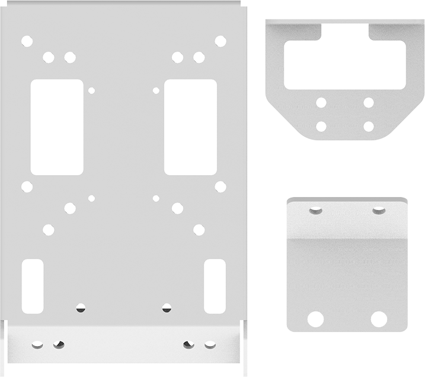
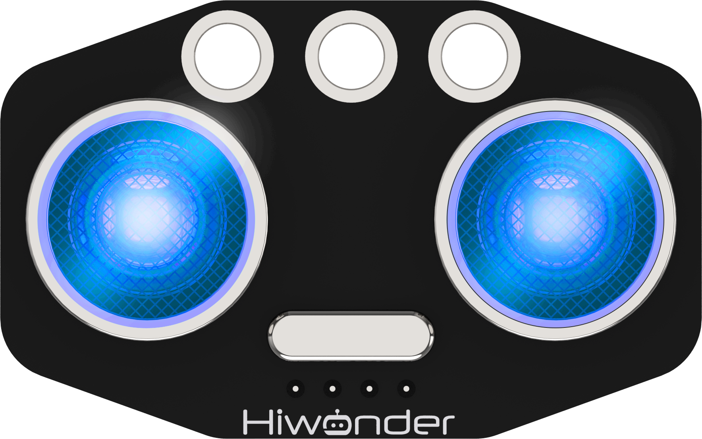
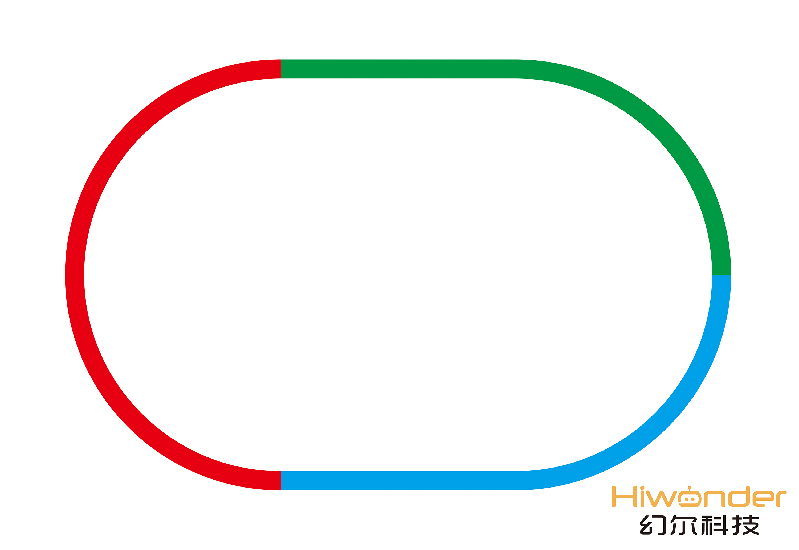
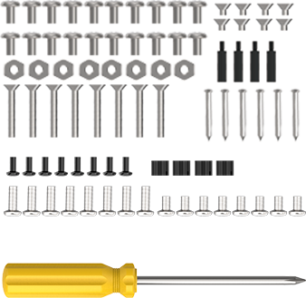
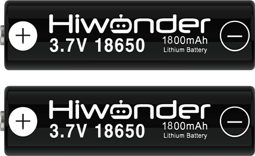
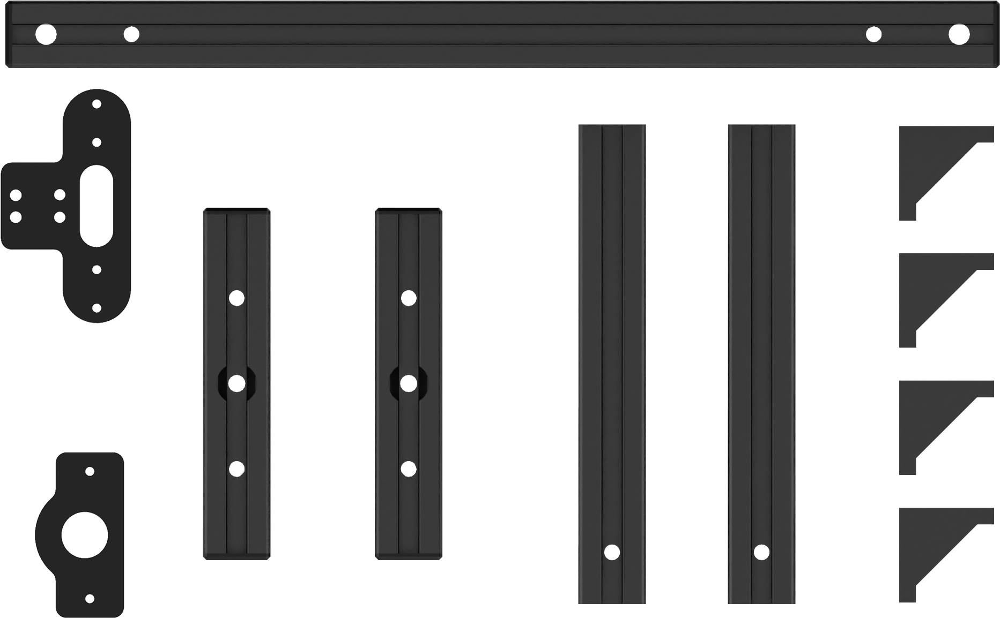
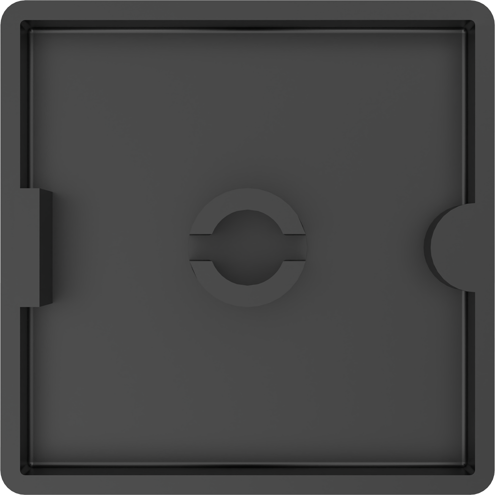
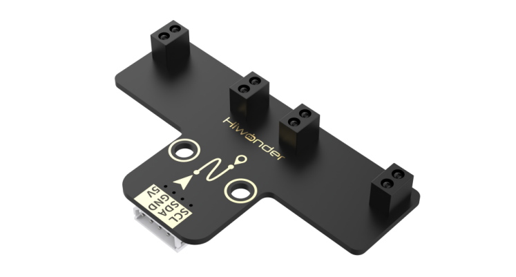
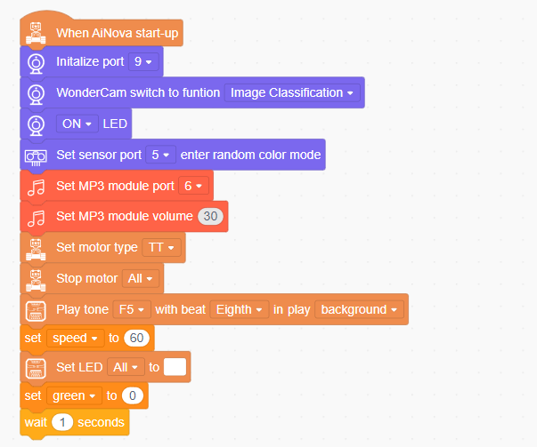

# 9. Autonomous Driving Extension Course

## 9.1 Autonomous Driving Kit

### 9.1.1 Introduction

The AiNova Autonomous Driving Kit is an AI-powered smart traffic demonstration set that includes the AiNova vision robot, an MP3 module, and various smart traffic scenario elements such as maps, traffic lights, and road signs.

The AiNova vision robot is equipped with a WonderCam vision module, an MP3 module, and a programmable CoreX controller. With Scratch-based graphical programming, you can implement features such as traffic light recognition, traffic sign recognition, and voice announcements via the MP3 module.

The traffic light structure is built with durable and aesthetically pleasing aluminum alloy frames. It includes an RGB lighting module and a programmable CoreX controller, allowing users to control the light colors through Scratch programming.

### 9.1.2  Packing List

| **No.** |          **Components**           | **Quantity** |                         **Picture**                          |
| :-----: | :-------------------------------: | :----------: | :----------------------------------------------------------: |
|    1    |          AiNova Brackets          |      3       |  |
|    2    |         CoreX controller          |      1       |  |
|    3    |      Glowy ultrasonic sensor      |      1       |  |
|    4    |        4-ch line follower         |      1       |  |
|    5    |           Encoder motor           |      2       |  |
|    6    |           Battery case            |      1       |  |
|    7    |          Battery charger          |      1       |  |
|    8    |           Silisone tyre           |      2       |  |
|    9    |          Universal wheel          |      1       |  |
|   10    |             USB cable             |      3       |  |
|   11    |            4PIN wires             |      3       |  |
|   12    |         Map + Motor wire          |      3       |   |
|   13    |          Accessory bag1           |      1       |  |
|   14    |           18650 battery           |      4       |  |
|   15    |    WonderCam AI vision module     |      1       |  |
|   16    |      Mental protective shell      |      2       |  |
|   17    |            Waste cards            |      12      |  |
|   18    |           Number cards            |      5       |  |
|   19    |               Tags                |      3       |  |
|   20    |           Traffic signs           |      6       |  |
|   21    |              Manual               |      1       |  |
|   22    |       Traffic light bracket       |      1       |  |
|   23    |             End cover             |      6       |  |
|   24    |            RGB sensor             |      1       |  |
|   25    |             4PIN wire             |      4       |     |
|   26    |           1.2 *0.8m map           |      1       |  |
|   27    |       Turning sign bracket        |      1       |  |
|   28    | MP3 module(128M TF card included) |      1       |  |
|   29    |        MP3 module bracket         |      1       |  |
|   30    |         Double-sided tape         |      1       |     |
|   31    |          Accessory bag2           |      1       |  |

## 9.2 Map Layout and Accessories Assembly Tutorial

### 9.2.1 Traffic Sign Assembly Guide

Step1:

Step2:

Step3:

### 9.2.2 Traffic Light Assembly Guide

Step1:

Step2:

Step3:

Step4:

### 9.2.3 MP3 Module Assembly Guide

## 9.3 Autonomous Driving Program Explanation

### 9.3.1 Project Introduction

This section demonstrates autonomous driving of the car using a four-channel line follower, WonderCam vision module, and MP3 module for voice announcements.

### 9.3.2 Program Procedure

### 9.3.3 Module Introduction

* **4-Channel Line Follower**

The four-channel line follower features four probes, each equipped with an infrared emitter and receiver. Since white surfaces reflect infrared strongly while black surfaces reflect weakly, the module can effectively distinguish between black and white. It offers fast detection and strong adaptability, making it well-suited for line-following applications in smart cars or robots—even when navigating relatively complex routes.

* **WonderCam Vision Module**

WonderCam is an easy-to-use AI vision sensor packed with powerful features such as color detection, face recognition, tag identification, visual line tracking, digit recognition, road sign detection, image classification, and feature learning. It is compatible with a wide range of controllers, including ESP32, micro:bit, Arduino, and Raspberry Pi, making it the perfect tool to bring your AI vision ideas to life with ease.

* **MP3 Module**

The MP3 module is a compact audio playback module that operates with simple commands. It features a 4-pin interface and supports hardware decoding of MP3, WAV, and WMA formats. It also supports TF memory cards and is compatible with FAT16 and FAT32 file systems. Communication is handled via I²C, with a built-in DSP handling digital signal processing, data transmission, and audio decoding—delivering clear and smooth music output.

### 9.3.4 Program Download

(1) Connect both the AiNova and the traffic light module to your computer using USB data cables.

(2) In the WonderCode main interface, click **“Connect”** and select the correct COM port.

:::{Note}

The port number may vary depending on your system. For example, COM4 is used in the image below. Do not select COM1, as it is typically reserved for system communication.

:::

(3) Once connected, drag the corresponding code files into WonderCode, then click the **“Upload”** button on the right under **Upload Mode**.

(4) Wait for the upload to complete.

###  9.3.5 Program Outcome

AiNova will follow the line using its line-tracking function. When the WonderCam vision module detects a road sign, it will control AiNova to turn accordingly and trigger a voice announcement. Upon recognizing a traffic light, the system will control the car to move or stop based on the light color, while the MP3 module plays the corresponding audio prompt.

###  9.3.6 Program Analysis

(1) At program startup, the WonderCam vision module, ultrasonic LED module, and MP3 module are initialized. The buzzer beeps once, and the car's initial speed is set to 60.

(2) In the main loop, the program first runs the left/right turn detection block, switches the vision module to road sign recognition mode, and controls the car to follow the line. Line-following continues until all four probes of the line sensor detect a white line, indicating a fork in the road. At this point, the car exits line-following mode and uses the vision module to identify the road sign ID.

(3) If the detected image ID is 2 or 3, the car will turn left or right accordingly based on the ID.

(4) The program then enters the traffic light detection function, switches the WonderCam to color recognition mode, and resumes line-following. Once all four probes again detect a white line simultaneously, the car exits line-following and stops.

(5) In a loop, the WonderCam detects the color of the traffic light. If red is detected, the car sets its LED to red and plays a corresponding audio message via the MP3 module.

(3) If green is detected, the LED turns green, and the MP3 module plays the appropriate message. The program then exits the color recognition loop and commands the car to move forward.

