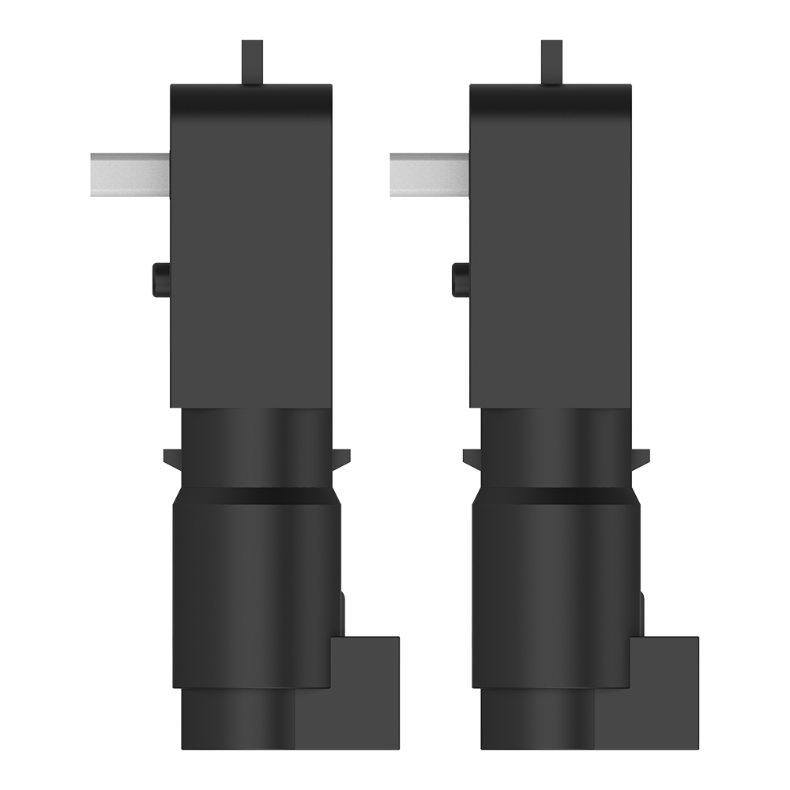
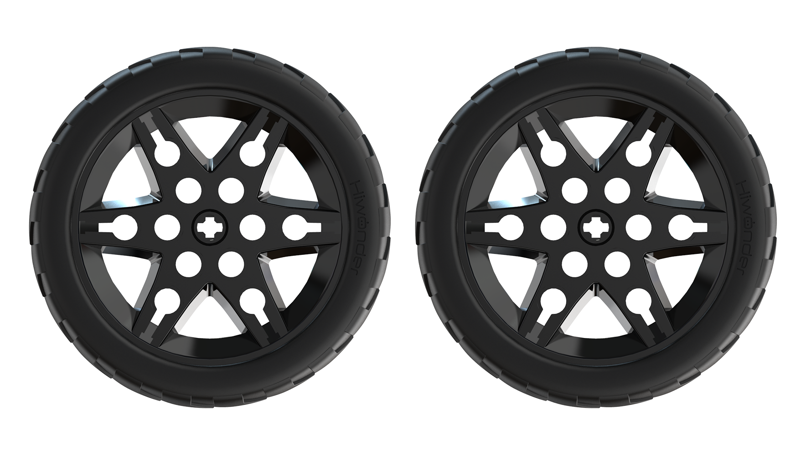
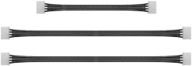
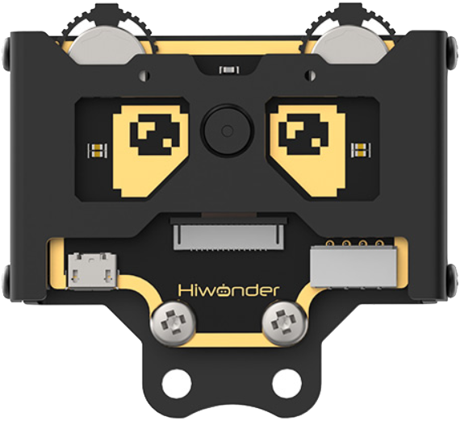
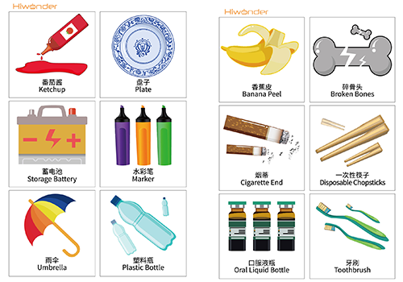
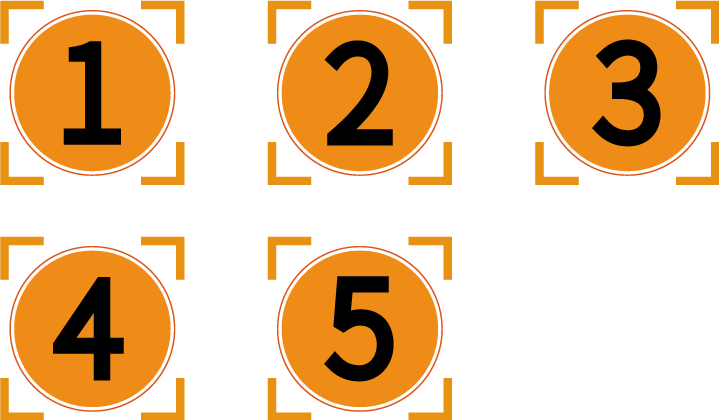
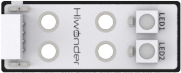
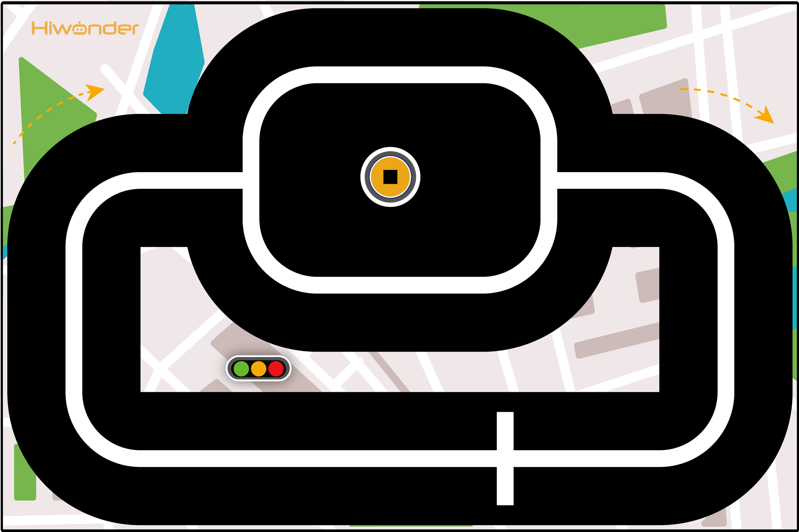
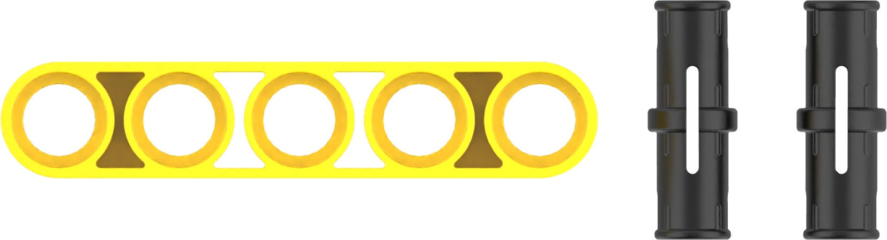

# 9. Autonomous Driving Extension Course

## 9.1 Autonomous Driving Kit

### 9.1.1 Introduction

The AiNova Autonomous Driving Kit is an AI-powered smart traffic demonstration set that includes the AiNova vision robot, an MP3 module, and various smart traffic scenario elements such as maps, traffic lights, and road signs.

The AiNova vision robot is equipped with a WonderCam vision module, an MP3 module, and a programmable CoreX controller. With Scratch-based graphical programming, you can implement features such as traffic light recognition, traffic sign recognition, and voice announcements via the MP3 module.

The traffic light structure is built with durable and aesthetically pleasing aluminum alloy frames. It includes an RGB lighting module and a programmable CoreX controller, allowing users to control the light colors through Scratch programming.

### 9.1.2  Packing List

| **No.** |          **Components**           | **Quantity** |                                                           **Picture**                                                           |
|:-------:|:---------------------------------:|:------------:|:-------------------------------------------------------------------------------------------------------------------------------:|
|    1    |          AiNova Brackets          |      3       |                                                     |
|    2    |         CoreX controller          |      1       |                                                      |
|    4    |        4-ch line follower         |      1       |                                                     |
|    5    |           Encoder motor           |      2       |                                                     |
|    6    |           Battery case            |      1       |                                                     |
|    7    |          Battery charger          |      1       |                                                     |
|    8    |           Silisone tyre           |      2       |                                                     |
|    9    |          Universal wheel          |      1       |                                                     |
|   10    |             USB cable             |      3       |                                                                     |
|   11    |            4PIN wires             |      3       |                                                                     |
|   12    |          Map+Motor wire           |      3       |   |
|   13    |          Accessory bag1           |      1       |                                                    |
|   14    |           18650 battery           |      4       |                                                    |
|   15    |    WonderCam AI vision module     |      1       |                                                    |
|   16    |      Mental protective shell      |      2       |                                                    |
|   17    |            Waste cards            |      12      |                                                    |
|   18    |           Number cards            |      5       |                                                    |
|   19    |               Tags                |      3       |                                                    |
|   20    |           Traffic signs           |      6       |                                                    |
|   21    |              Manual               |      1       |                                                    |
|   22    |       Traffic light bracket       |      1       |                                                    |
|   23    |             End cover             |      6       |                                                    |
|   24    |            RGB sensor             |      1       |                                                    |
|   25    |             4PIN wire             |      4       |                                                                        |
|   26    |           1.2 *0.8m map           |      1       |                                                    |
|   27    |       Turning sign bracket        |      1       |                                                    |
|   28    | MP3 module(128M TF card included) |      1       |                                                    |
|   29    |        MP3 module bracket         |      1       |                                                    |
|   30    |         Double-sided tape         |      1       |                                                                        |
|   31    |          Accessory bag2           |      1       |                                                    |

## 9.2 Map Layout and Accessories Assembly Tutorial

### 9.2.1 Traffic Sign Assembly Guide

Step1:

Step2:

Step3:

### 9.2.2 Traffic Light Assembly Guide

Step1:

Step2:

Step3:

Step4:

### 9.2.3 MP3 Module Assembly Guide

